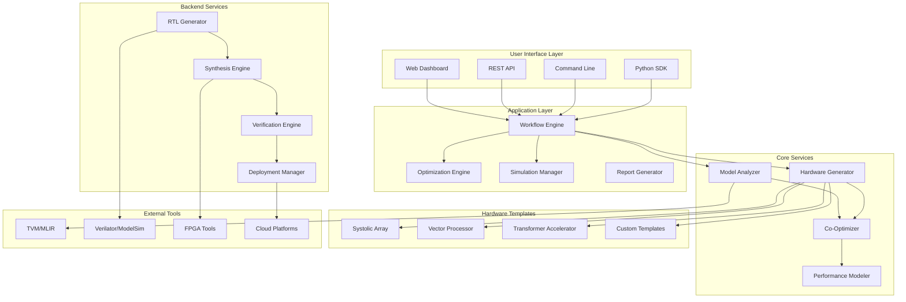
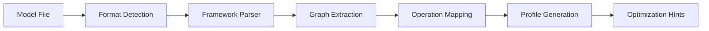
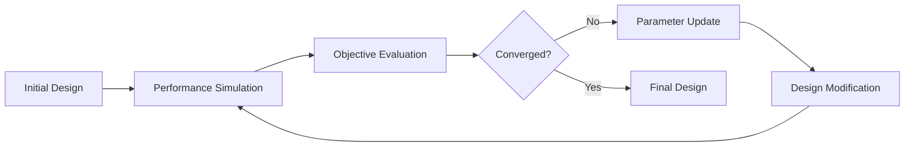

# AI Hardware Co-Design Playground - Architecture

## System Overview

The AI Hardware Co-Design Playground is a modular, extensible platform that enables simultaneous optimization of neural networks and their hardware accelerator implementations. The system follows a layered architecture with clear separation between model analysis, hardware generation, optimization engines, and implementation flows.



## Component Architecture

### 1. User Interface Layer

#### Web Dashboard
- **Technology**: React.js with TypeScript
- **Purpose**: Interactive design environment with visualization
- **Features**: Drag-drop design, real-time simulation results, Pareto frontier plots
- **APIs**: REST API integration, WebSocket for real-time updates

#### Python SDK
- **Technology**: Python 3.9+ with type hints
- **Purpose**: Programmatic access to all platform capabilities
- **Features**: Jupyter notebook integration, object-oriented design API
- **Distribution**: PyPI package with semantic versioning

#### Command Line Interface
- **Technology**: Click framework
- **Purpose**: Batch processing and CI/CD integration
- **Features**: Design automation, regression testing, report generation

### 2. Application Layer

#### Workflow Engine
```python
class WorkflowEngine:
    def __init__(self):
        self.steps: List[WorkflowStep] = []
        self.context: WorkflowContext = WorkflowContext()
        
    def add_step(self, step: WorkflowStep) -> None
    def execute(self) -> WorkflowResult
    def rollback(self, checkpoint: str) -> None
```

**Responsibilities**:
- Orchestrate multi-step design flows
- Handle error recovery and rollback
- Progress tracking and checkpointing
- Resource management and cleanup

#### Optimization Engine
```python
class OptimizationEngine:
    def __init__(self, objectives: List[Objective]):
        self.objectives = objectives
        self.search_space = SearchSpace()
        
    def optimize(self, initial_design: Design) -> OptimizationResult
    def pareto_search(self, population_size: int) -> ParetoFrontier
```

**Algorithms**:
- Multi-objective genetic algorithms (NSGA-II, NSGA-III)
- Bayesian optimization with Gaussian processes
- Simulated annealing for discrete search spaces
- Gradient-based optimization for differentiable objectives

### 3. Core Services

#### Model Analyzer
```python
class ModelAnalyzer:
    def profile_model(self, model: Model) -> ModelProfile
    def extract_graph(self, model: Model) -> ComputationGraph
    def analyze_memory_patterns(self, model: Model) -> MemoryProfile
    def suggest_optimizations(self, profile: ModelProfile) -> List[Optimization]
```

**Capabilities**:
- Framework-agnostic model import (ONNX, PyTorch, TensorFlow)
- Operation-level profiling and characterization
- Memory access pattern analysis
- Data dependency graph extraction
- Hardware mapping recommendations

#### Hardware Generator
```python
class HardwareGenerator:
    def __init__(self, template_library: TemplateLibrary):
        self.templates = template_library
        
    def generate(self, spec: HardwareSpec) -> Hardware
    def customize_template(self, template: Template, params: Dict) -> Hardware
    def validate_design(self, hardware: Hardware) -> ValidationResult
```

**Template System**:
- Parameterizable hardware architectures
- Composable building blocks (compute units, memory hierarchy)
- Custom instruction set extensions
- Interface standardization

### 4. Hardware Templates

#### Systolic Array Template
```python
class SystolicArray(HardwareTemplate):
    def __init__(self, rows: int, cols: int, datawidth: int):
        self.dimensions = (rows, cols)
        self.datawidth = datawidth
        
    def generate_rtl(self) -> str
    def estimate_resources(self) -> ResourceEstimate
    def configure_dataflow(self, pattern: DataflowPattern) -> None
```

**Features**:
- Configurable array dimensions and data widths
- Multiple dataflow patterns (weight/output/row stationary)
- Optimization for different operation types (GEMM, convolution)
- Memory interface customization

#### Vector Processor Template
```python
class VectorProcessor(HardwareTemplate):
    def __init__(self, vector_length: int, num_lanes: int):
        self.vector_length = vector_length
        self.num_lanes = num_lanes
        
    def add_custom_instruction(self, instruction: CustomInstruction) -> None
    def generate_isa(self) -> InstructionSetArchitecture
```

**Features**:
- RISC-V vector extension compatibility
- Custom instruction support
- Multi-lane parallel execution
- Configurable vector register file

### 5. Data Flow Architecture

#### Model Import Pipeline


#### Hardware Generation Pipeline


#### Co-Optimization Loop


## System Integration

### External Tool Integration

#### TVM/MLIR Integration
```python
class TVMIntegration:
    def compile_model(self, model: Model, target: Target) -> CompiledModel
    def optimize_schedule(self, workload: Workload) -> Schedule
    def generate_kernel(self, operation: Operation) -> Kernel
```

#### Simulation Tool Integration
```python
class SimulationManager:
    def __init__(self, simulator: Simulator):
        self.simulator = simulator
        
    def run_cycle_accurate(self, design: Hardware, testbench: Testbench) -> SimulationResult
    def run_performance_model(self, design: Hardware, workload: Workload) -> PerformanceMetrics
```

### Cloud Platform Integration

#### AWS Integration
- EC2 instances for simulation workloads
- F1 instances for FPGA emulation
- S3 for design artifact storage
- Lambda for serverless optimization

#### Azure Integration
- Virtual machines for development environments
- Azure Machine Learning for optimization algorithms
- Blob storage for large simulation data

#### Google Cloud Integration
- Compute Engine for parallel simulations
- TPU integration for model benchmarking
- Cloud Storage for distributed workflows

## Security Architecture

### Authentication & Authorization
```python
class SecurityManager:
    def authenticate_user(self, credentials: Credentials) -> AuthToken
    def authorize_operation(self, user: User, operation: Operation) -> bool
    def audit_log(self, user: User, action: Action) -> None
```

### Data Protection
- Encryption at rest using AES-256
- TLS 1.3 for data in transit
- Key management with hardware security modules
- Regular security audits and penetration testing

### Access Control
- Role-based access control (RBAC)
- Fine-grained permissions for design access
- Multi-tenancy support for organizations
- API rate limiting and throttling

## Performance Architecture

### Scalability Design
- Horizontal scaling with container orchestration
- Distributed simulation using message queues
- Caching layer for frequently accessed designs
- Database sharding for large datasets

### Performance Optimization
- Asynchronous task processing
- Result caching and memoization
- Lazy loading of large artifacts
- Connection pooling for database access

### Monitoring & Observability
- Application performance monitoring (APM)
- Distributed tracing for request flows
- Custom metrics for design operations
- Real-time alerting for system health

## Technology Stack

### Backend Services
- **Language**: Python 3.9+ with type hints
- **Framework**: FastAPI for REST APIs
- **Database**: PostgreSQL for relational data, Redis for caching
- **Message Queue**: RabbitMQ for asynchronous processing
- **Container**: Docker with multi-stage builds

### Frontend
- **Framework**: React.js with TypeScript
- **State Management**: Redux Toolkit
- **Visualization**: D3.js, Plotly.js
- **Build Tool**: Vite with hot reload

### Infrastructure
- **Orchestration**: Kubernetes for container management
- **CI/CD**: GitHub Actions with matrix testing
- **Monitoring**: Prometheus + Grafana
- **Logging**: ELK stack (Elasticsearch, Logstash, Kibana)

### Development Tools
- **Code Quality**: Black, isort, pylint, mypy
- **Testing**: pytest, coverage.py, hypothesis
- **Documentation**: Sphinx with auto-generation
- **Version Control**: Git with conventional commits

## Deployment Architecture

### Development Environment
```yaml
services:
  api:
    build: ./backend
    ports: ["8000:8000"]
    environment:
      - DATABASE_URL=postgresql://localhost/codesign_dev
      
  frontend:
    build: ./frontend
    ports: ["3000:3000"]
    volumes: ["./frontend:/app"]
    
  database:
    image: postgres:14
    environment:
      - POSTGRES_DB=codesign_dev
```

### Production Environment
```yaml
apiVersion: apps/v1
kind: Deployment
metadata:
  name: codesign-api
spec:
  replicas: 3
  selector:
    matchLabels:
      app: codesign-api
  template:
    spec:
      containers:
      - name: api
        image: codesign/api:latest
        resources:
          requests:
            memory: "2Gi"
            cpu: "1000m"
          limits:
            memory: "4Gi"
            cpu: "2000m"
```

## Quality Attributes

### Reliability
- 99.9% uptime SLA
- Automated failover and recovery
- Health checks and circuit breakers
- Graceful degradation under load

### Maintainability
- Modular architecture with clear interfaces
- Comprehensive test coverage (>95%)
- Automated code quality checks
- Living documentation with examples

### Usability
- Intuitive web interface design
- Comprehensive API documentation
- Interactive tutorials and examples
- Responsive customer support

### Performance
- Sub-second response times for API calls
- Real-time collaboration features
- Efficient resource utilization
- Scalable to thousands of concurrent users