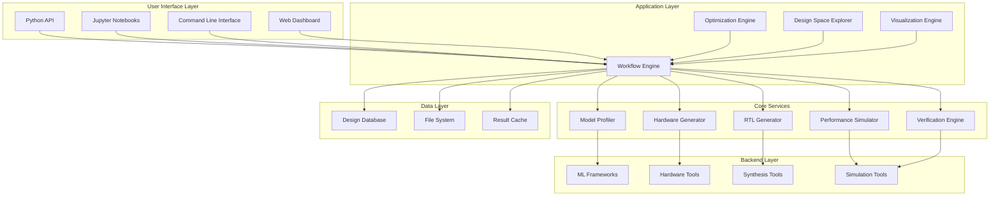
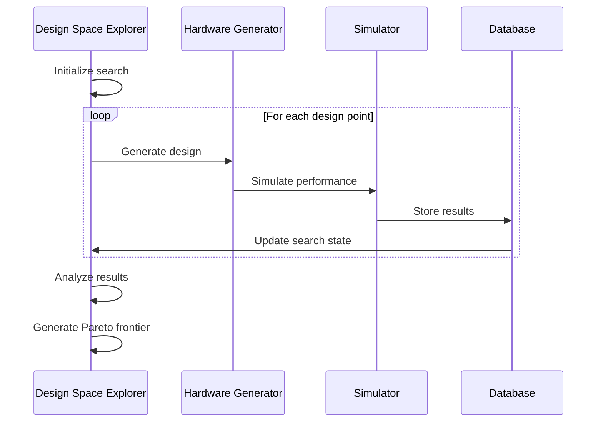

# System Architecture

## Overview

The AI Hardware Co-Design Playground follows a modular, layered architecture that separates concerns while enabling seamless integration between neural network optimization and hardware generation workflows.

## High-Level Architecture



## Component Details

### User Interface Layer

#### Python API
- **Purpose**: Primary programmatic interface for all functionality
- **Key Classes**: `AcceleratorDesigner`, `ModelOptimizer`, `Workflow`
- **Patterns**: Builder pattern for complex configurations, Factory pattern for backend selection

#### Jupyter Notebooks
- **Purpose**: Interactive development and exploration environment
- **Features**: Live visualization, step-by-step tutorials, example galleries
- **Integration**: Embedded widgets for parameter tuning and result visualization

#### Command Line Interface
- **Purpose**: Batch processing and CI/CD integration
- **Commands**: `codesign-playground verify`, `codesign-playground optimize`, `codesign-playground generate`
- **Configuration**: YAML-based configuration files for complex workflows

#### Web Dashboard
- **Purpose**: Team collaboration and result sharing
- **Technology**: FastAPI backend, React frontend
- **Features**: Design browsing, performance comparison, team management

### Application Layer

#### Workflow Engine
- **Purpose**: Orchestrates end-to-end design flows
- **Architecture**: DAG-based execution with dependency management
- **Features**: Checkpoint/restart, parallel execution, resource management
- **State Management**: Redis-based for distributed execution

#### Optimization Engine
- **Purpose**: Multi-objective optimization of model and hardware parameters
- **Algorithms**: Genetic algorithms, Bayesian optimization, gradient-based methods
- **Constraints**: Performance, power, area, accuracy constraints
- **Parallelization**: Ray-based distributed optimization

#### Design Space Explorer
- **Purpose**: Automated exploration of design alternatives
- **Sampling**: Latin hypercube, Sobol sequences, adaptive sampling
- **Analysis**: Pareto frontier extraction, sensitivity analysis
- **Visualization**: Interactive plots, trade-off curves

#### Visualization Engine
- **Purpose**: Generate plots, diagrams, and interactive visualizations
- **Libraries**: Plotly, Matplotlib, Graphviz
- **Outputs**: Performance charts, architecture diagrams, optimization traces

### Core Services

#### Model Profiler
```python
class ModelProfiler:
    def profile_model(self, model: Model, input_shape: Tuple) -> ModelProfile:
        """Analyze computational and memory requirements"""
        pass
    
    def extract_compute_graph(self, model: Model) -> ComputeGraph:
        """Convert model to internal compute graph representation"""
        pass
    
    def analyze_bottlenecks(self, profile: ModelProfile) -> BottleneckAnalysis:
        """Identify performance bottlenecks and optimization opportunities"""
        pass
```

**Key Features**:
- Support for PyTorch, TensorFlow, ONNX models
- Layer-wise compute and memory analysis
- Data flow and dependency analysis
- Quantization-aware profiling

#### Hardware Generator
```python
class HardwareGenerator:
    def generate_accelerator(self, spec: AcceleratorSpec) -> HardwareDesign:
        """Generate hardware design from high-level specification"""
        pass
    
    def apply_template(self, template: str, params: Dict) -> HardwareDesign:
        """Apply parameterized hardware template"""
        pass
    
    def optimize_architecture(self, design: HardwareDesign, 
                            constraints: Constraints) -> HardwareDesign:
        """Optimize hardware architecture for given constraints"""
        pass
```

**Architecture Templates**:
- **Systolic Arrays**: Configurable PE arrays for matrix operations
- **Vector Processors**: SIMD/vector units with custom instructions
- **Dataflow Accelerators**: Stream-based processing elements
- **Memory Subsystems**: Hierarchical memory with scratchpads

#### Performance Simulator
```python
class PerformanceSimulator:
    def simulate_performance(self, design: HardwareDesign, 
                           workload: Workload) -> SimulationResults:
        """Run cycle-accurate performance simulation"""
        pass
    
    def estimate_power(self, design: HardwareDesign, 
                      activity: ActivityProfile) -> PowerReport:
        """Estimate power consumption"""
        pass
    
    def estimate_area(self, design: HardwareDesign, 
                     technology: Technology) -> AreaReport:
        """Estimate chip area requirements"""
        pass
```

**Simulation Models**:
- **Cycle-accurate**: Detailed timing simulation
- **Functional**: High-level performance estimation
- **Analytical**: Mathematical performance models
- **Hybrid**: Combination of above approaches

#### RTL Generator
```python
class RTLGenerator:
    def generate_verilog(self, design: HardwareDesign) -> str:
        """Generate synthesizable Verilog code"""
        pass
    
    def generate_testbench(self, design: HardwareDesign, 
                          test_vectors: TestVectors) -> str:
        """Generate verification testbench"""
        pass
    
    def generate_constraints(self, design: HardwareDesign, 
                           target_freq: float) -> str:
        """Generate synthesis constraints"""
        pass
```

**Code Generation**:
- **Verilog Generation**: Parameterized module generation
- **SystemVerilog**: Advanced verification features
- **VHDL Support**: Alternative HDL backend
- **HLS Integration**: High-level synthesis tool integration

### Backend Layer

#### ML Frameworks Integration
- **TensorFlow**: Model import, optimization, and compilation
- **PyTorch**: JIT compilation and TorchScript integration
- **ONNX**: Universal model format support
- **TVM**: Tensor compilation and optimization

#### Hardware Tools Integration
- **Verilator**: Fast cycle-accurate simulation
- **GHDL**: VHDL simulation and synthesis
- **Yosys**: Open-source synthesis
- **OpenROAD**: Complete ASIC design flow

#### Synthesis Tools Integration
- **Vivado**: Xilinx FPGA synthesis and implementation
- **Quartus**: Intel FPGA tools
- **Design Compiler**: Synopsys ASIC synthesis
- **Genus**: Cadence synthesis platform

## Data Flow Architecture

### Model-to-Hardware Flow
```mermaid
sequenceDiagram
    participant U as User
    participant MP as Model Profiler
    participant HG as Hardware Generator
    participant OPT as Optimizer
    participant SIM as Simulator
    participant RTL as RTL Generator
    
    U->>MP: Import model
    MP->>MP: Profile computation
    MP->>HG: Send requirements
    HG->>HG: Generate initial design
    HG->>OPT: Send design
    OPT->>SIM: Simulate performance
    SIM->>OPT: Return metrics
    OPT->>OPT: Optimize parameters
    OPT->>RTL: Generate final RTL
    RTL->>U: Return implementation
```

### Design Space Exploration Flow


## Technology Stack

### Core Technologies
- **Language**: Python 3.9+
- **Frameworks**: FastAPI, Pydantic, SQLAlchemy
- **Async**: asyncio, Ray for distributed computing
- **ML**: PyTorch, TensorFlow, ONNX, TVM
- **Hardware**: Verilator, Yosys, OpenROAD

### Development Tools
- **Testing**: pytest, hypothesis for property-based testing
- **Documentation**: Sphinx, MkDocs
- **Code Quality**: ruff, mypy, black
- **CI/CD**: GitHub Actions, Docker

### Infrastructure
- **Database**: PostgreSQL for design storage, Redis for caching
- **Containers**: Docker for reproducible environments
- **Cloud**: Support for AWS, GCP, Azure deployment
- **Monitoring**: Prometheus metrics, structured logging

## Security Architecture

### Input Validation
- Model file sanitization before loading
- Parameter validation for all user inputs
- Resource limits for simulation and synthesis

### Code Generation Security
- Template-based code generation (no eval/exec)
- Sandboxed RTL generation environment
- Output validation before file writing

### Data Protection
- Encrypted storage of proprietary models
- Access control for shared designs
- Audit logging for all operations

## Performance Considerations

### Scalability
- **Horizontal**: Ray-based distributed simulation
- **Vertical**: Multi-threading for independent operations
- **Caching**: Aggressive caching of simulation results
- **Streaming**: Large file processing with streaming APIs

### Memory Management
- **Model Partitioning**: Split large models for processing
- **Lazy Loading**: Load data only when needed
- **Result Streaming**: Stream results for large design spaces
- **Garbage Collection**: Explicit cleanup of temporary files

### Optimization Strategies
- **Result Memoization**: Cache expensive computations
- **Parallel Execution**: Utilize all available cores
- **Batch Processing**: Group similar operations
- **Incremental Updates**: Avoid full recomputation

## Deployment Architecture

### Development Environment
```yaml
services:
  app:
    build: .
    ports: ["8000:8000"]
    volumes: ["./:/app"]
    environment:
      - POSTGRES_URL=postgresql://postgres:password@db:5432/codesign
      - REDIS_URL=redis://redis:6379
  
  db:
    image: postgres:14
    environment:
      POSTGRES_DB: codesign
      POSTGRES_PASSWORD: password
  
  redis:
    image: redis:7-alpine
```

### Production Deployment
- **Container Orchestration**: Kubernetes for scalability
- **Load Balancing**: NGINX for web interface
- **Database**: Managed PostgreSQL service
- **Monitoring**: Prometheus + Grafana stack
- **Logging**: ELK stack for centralized logging

## Extension Points

### Plugin Architecture
```python
class AcceleratorPlugin:
    def generate_design(self, spec: AcceleratorSpec) -> HardwareDesign:
        """Plugin interface for custom accelerator generation"""
        raise NotImplementedError
    
    def estimate_performance(self, design: HardwareDesign) -> PerformanceMetrics:
        """Plugin interface for custom performance models"""
        raise NotImplementedError
```

### Custom Backend Integration
- **Simulation Backends**: Interface for new simulators
- **Synthesis Backends**: Integration with proprietary tools
- **ML Framework Backends**: Support for new frameworks
- **Optimization Backends**: Custom optimization algorithms

### Template System
- **Hardware Templates**: Parameterized design templates
- **Workflow Templates**: Pre-configured design flows
- **Analysis Templates**: Custom analysis and visualization
- **Export Templates**: Different output formats