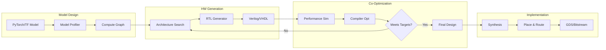

# ai-hardware-codesign-playground

[](https://github.com/your-org/ai-hardware-codesign-playground/actions)
[](LICENSE)
[](https://www.python.org/downloads/)
[](https://github.com/your-org/ai-hardware-codesign-playground)

Interactive environment for co-optimizing neural networks and hardware accelerators. Design custom AI chips alongside the models that run on them, using open-source synthesis tools and performance simulators.

## 🎯 Key Features

- **Unified Design Flow**: Co-optimize models and hardware in the same environment
- **RTL Generation**: Generate Verilog from high-level specifications
- **Performance Modeling**: Accurate cycle-level simulation before tapeout
- **Compiler Integration**: TVM and MLIR for optimal code generation
- **Open Silicon**: Compatible with OpenROAD, Sky130 PDK
- **Pareto Exploration**: Visualize performance/area/power tradeoffs

## 📋 Table of Contents

- [Installation](#installation)
- [Quick Start](#quick-start)
- [Design Flow](#design-flow)
- [Hardware Templates](#hardware-templates)
- [Model Optimization](#model-optimization)
- [Performance Analysis](#performance-analysis)
- [Tape-out Ready](#tape-out-ready)
- [Examples](#examples)
- [API Reference](#api-reference)
- [Contributing](#contributing)

## 🚀 Installation

### Prerequisites

- Python 3.9+
- Verilator 5.0+
- LLVM 14+
- Optional: Vivado/Quartus for FPGA synthesis

### Full Installation

```bash
# Clone repository
git clone --recursive https://github.com/your-org/ai-hardware-codesign-playground
cd ai-hardware-codesign-playground

# Install dependencies
./scripts/install_deps.sh

# Install Python package
pip install -e ".[full]"

# Verify installation
codesign-playground verify
```

### Docker Installation

```bash
# Pull pre-built image with all tools
docker pull your-org/codesign-playground:latest

# Run Jupyter environment
docker run -it -p 8888:8888 -p 6006:6006 \
  -v $(pwd):/workspace \
  your-org/codesign-playground:latest
```

### Google Colab

```python
!pip install ai-hardware-codesign-playground
!apt-get install -y verilator

from codesign_playground import Environment
env = Environment(backend="simulation")
```

## ⚡ Quick Start

### Design Your First Accelerator

```python
from codesign_playground import AcceleratorDesigner, ModelOptimizer

# Define neural network
model = tf.keras.Sequential([
    tf.keras.layers.Conv2D(32, 3, activation='relu'),
    tf.keras.layers.MaxPooling2D(),
    tf.keras.layers.Dense(10)
])

# Design matching hardware
designer = AcceleratorDesigner()

# Analyze model requirements
profile = designer.profile_model(model, input_shape=(32, 32, 3))
print(f"Peak compute: {profile.peak_gflops} GFLOPS")
print(f"Memory bandwidth: {profile.bandwidth_gb_s} GB/s")

# Generate accelerator architecture
accelerator = designer.design(
    compute_units=64,
    memory_hierarchy=["sram_64kb", "dram"],
    dataflow="weight_stationary"
)

# Co-optimize model and hardware
optimizer = ModelOptimizer(model, accelerator)
optimized_model, optimized_hw = optimizer.co_optimize(
    target_fps=30,
    power_budget=5.0  # Watts
)

# Generate RTL
accelerator.generate_rtl("output/accelerator.v")
```

### Explore Design Space

```python
from codesign_playground import DesignSpaceExplorer

explorer = DesignSpaceExplorer()

# Define search space
design_space = {
    "compute_units": [16, 32, 64, 128],
    "memory_size_kb": [32, 64, 128, 256],
    "frequency_mhz": [100, 200, 400],
    "dataflow": ["weight_stationary", "output_stationary"],
    "precision": ["int8", "fp16", "mixed"]
}

# Run exploration
results = explorer.explore(
    model=model,
    design_space=design_space,
    objectives=["latency", "power", "area"],
    num_samples=1000
)

# Visualize Pareto frontier
explorer.plot_pareto(results, save_to="pareto_frontier.html")
```

## 🏗️ Design Flow

### End-to-End Pipeline



### Workflow Example

```python
from codesign_playground import Workflow

# Create design workflow
workflow = Workflow("my_accelerator")

# Step 1: Import model
workflow.import_model(
    "model.onnx",
    input_shapes={"input": (1, 3, 224, 224)}
)

# Step 2: Hardware mapping
workflow.map_to_hardware(
    template="systolic_array",
    size=(16, 16),
    precision="int8"
)

# Step 3: Compile and optimize
workflow.compile(
    optimizer="tvm",
    target="custom_accelerator",
    optimizations=["layer_fusion", "tensorization"]
)

# Step 4: Simulate
metrics = workflow.simulate(
    testbench="testbench/imagenet_subset",
    cycles_limit=1000000
)

print(f"Throughput: {metrics.images_per_second} img/s")
print(f"Power: {metrics.average_power} W")
print(f"Efficiency: {metrics.tops_per_watt} TOPS/W")

# Step 5: Generate final RTL
workflow.generate_rtl(
    output_dir="rtl/",
    include_testbench=True
)
```

## 🔧 Hardware Templates

### Systolic Array

```python
from codesign_playground.templates import SystolicArray

# Create systolic array for matrix multiplication
systolic = SystolicArray(
    rows=16,
    cols=16,
    data_width=8,
    accumulator_width=32
)

# Configure for specific operation
systolic.configure_for_conv2d(
    input_channels=64,
    output_channels=128,
    kernel_size=3
)

# Generate optimized RTL
rtl_code = systolic.generate_rtl()

# Estimate resources
resources = systolic.estimate_resources()
print(f"LUTs: {resources.luts}")
print(f"DSPs: {resources.dsps}")
print(f"BRAM: {resources.bram_kb} KB")
```

### Vector Processor

```python
from codesign_playground.templates import VectorProcessor

# RISC-V vector extension based processor
vector_proc = VectorProcessor(
    vector_length=512,
    num_lanes=8,
    supported_ops=["add", "mul", "mac", "relu"]
)

# Add custom instructions
vector_proc.add_custom_instruction(
    name="conv3x3",
    latency=4,
    throughput=8  # ops/cycle
)

# Generate processor with custom ISA
vector_proc.generate(
    output_dir="vector_proc/",
    include_compiler=True
)
```

### Transformer Accelerator

```python
from codesign_playground.templates import TransformerAccelerator

# Specialized for attention mechanisms
transformer_acc = TransformerAccelerator(
    max_sequence_length=2048,
    embedding_dim=768,
    num_heads=12,
    precision="fp16"
)

# Optimize for specific model
transformer_acc.optimize_for_model("gpt2")

# Generate with different backends
transformer_acc.generate_rtl("rtl/transformer.v")
transformer_acc.generate_hls("hls/transformer.cpp")
```

## 🎯 Model Optimization

### Hardware-Aware Training

```python
from codesign_playground import HardwareAwareTraining

# Define hardware constraints
hw_constraints = {
    "compute_roof": 100,  # GOPS
    "memory_bandwidth": 25.6,  # GB/s
    "on_chip_memory": 2048,  # KB
}

# Train model with hardware awareness
trainer = HardwareAwareTraining(
    model=model,
    hardware=hw_constraints
)

# Custom loss includes hardware efficiency
trainer.compile(
    optimizer='adam',
    loss=['accuracy', 'hardware_efficiency'],
    loss_weights=[1.0, 0.1]
)

trained_model = trainer.fit(
    train_data,
    epochs=50,
    callbacks=[
        "layer_pruning",
        "quantization_aware",
        "operation_fusion"
    ]
)
```

### Quantization Co-Design

```python
from codesign_playground import QuantizationCoDesign

# Jointly optimize quantization and hardware
co_designer = QuantizationCoDesign()

# Search for optimal bit widths
quantization_scheme = co_designer.search(
    model=model,
    hardware_template="integer_
