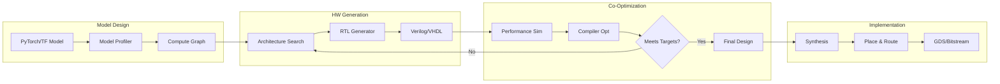

# ai-hardware-codesign-playground

[](https://github.com/your-org/ai-hardware-codesign-playground/actions)
[](LICENSE)
[](https://www.python.org/downloads/)
[](https://github.com/your-org/ai-hardware-codesign-playground)

Interactive environment for co-optimizing neural networks and hardware accelerators. Design custom AI chips alongside the models that run on them, using open-source synthesis tools and performance simulators.

## 🎯 Key Features

- **Unified Design Flow**: Co-optimize models and hardware in the same environment
- **RTL Generation**: Generate Verilog from high-level specifications
- **Performance Modeling**: Accurate cycle-level simulation before tapeout
- **Compiler Integration**: TVM and MLIR for optimal code generation
- **Open Silicon**: Compatible with OpenROAD, Sky130 PDK
- **Pareto Exploration**: Visualize performance/area/power tradeoffs

## 📋 Table of Contents

- [Installation](#installation)
- [Quick Start](#quick-start)
- [Design Flow](#design-flow)
- [Hardware Templates](#hardware-templates)
- [Model Optimization](#model-optimization)
- [Performance Analysis](#performance-analysis)
- [Tape-out Ready](#tape-out-ready)
- [Examples](#examples)
- [API Reference](#api-reference)
- [Contributing](#contributing)

## 🚀 Installation

### Prerequisites

- Python 3.9+
- Verilator 5.0+
- LLVM 14+
- Optional: Vivado/Quartus for FPGA synthesis

### Full Installation

```bash
# Clone repository
git clone --recursive https://github.com/your-org/ai-hardware-codesign-playground
cd ai-hardware-codesign-playground

# Install dependencies
./scripts/install_deps.sh

# Install Python package
pip install -e ".[full]"

# Verify installation
codesign-playground verify
```

### Docker Installation

```bash
# Pull pre-built image with all tools
docker pull your-org/codesign-playground:latest

# Run Jupyter environment
docker run -it -p 8888:8888 -p 6006:6006 \
  -v $(pwd):/workspace \
  your-org/codesign-playground:latest
```

### Google Colab

```python
!pip install ai-hardware-codesign-playground
!apt-get install -y verilator

from codesign_playground import Environment
env = Environment(backend="simulation")
```

## ⚡ Quick Start

### Design Your First Accelerator

```python
from codesign_playground import AcceleratorDesigner, ModelOptimizer

# Define neural network
model = tf.keras.Sequential([
    tf.keras.layers.Conv2D(32, 3, activation='relu'),
    tf.keras.layers.MaxPooling2D(),
    tf.keras.layers.Dense(10)
])

# Design matching hardware
designer = AcceleratorDesigner()

# Analyze model requirements
profile = designer.profile_model(model, input_shape=(32, 32, 3))
print(f"Peak compute: {profile.peak_gflops} GFLOPS")
print(f"Memory bandwidth: {profile.bandwidth_gb_s} GB/s")

# Generate accelerator architecture
accelerator = designer.design(
    compute_units=64,
    memory_hierarchy=["sram_64kb", "dram"],
    dataflow="weight_stationary"
)

# Co-optimize model and hardware
optimizer = ModelOptimizer(model, accelerator)
optimized_model, optimized_hw = optimizer.co_optimize(
    target_fps=30,
    power_budget=5.0  # Watts
)

# Generate RTL
accelerator.generate_rtl("output/accelerator.v")
```

### Explore Design Space

```python
from codesign_playground import DesignSpaceExplorer

explorer = DesignSpaceExplorer()

# Define search space
design_space = {
    "compute_units": [16, 32, 64, 128],
    "memory_size_kb": [32, 64, 128, 256],
    "frequency_mhz": [100, 200, 400],
    "dataflow": ["weight_stationary", "output_stationary"],
    "precision": ["int8", "fp16", "mixed"]
}

# Run exploration
results = explorer.explore(
    model=model,
    design_space=design_space,
    objectives=["latency", "power", "area"],
    num_samples=1000
)

# Visualize Pareto frontier
explorer.plot_pareto(results, save_to="pareto_frontier.html")
```

## 🏗️ Design Flow

### End-to-End Pipeline



### Workflow Example

```python
from codesign_playground import Workflow

# Create design workflow
workflow = Workflow("my_accelerator")

# Step 1: Import model
workflow.import_model(
    "model.onnx",
    input_shapes={"input": (1, 3, 224, 224)}
)

# Step 2: Hardware mapping
workflow.map_to_hardware(
    template="systolic_array",
    size=(16, 16),
    precision="int8"
)

# Step 3: Compile and optimize
workflow.compile(
    optimizer="tvm",
    target="custom_accelerator",
    optimizations=["layer_fusion", "tensorization"]
)

# Step 4: Simulate
metrics = workflow.simulate(
    testbench="testbench/imagenet_subset",
    cycles_limit=1000000
)

print(f"Throughput: {metrics.images_per_second} img/s")
print(f"Power: {metrics.average_power} W")
print(f"Efficiency: {metrics.tops_per_watt} TOPS/W")

# Step 5: Generate final RTL
workflow.generate_rtl(
    output_dir="rtl/",
    include_testbench=True
)
```

## 🔧 Hardware Templates

### Systolic Array

```python
from codesign_playground.templates import SystolicArray

# Create systolic array for matrix multiplication
systolic = SystolicArray(
    rows=16,
    cols=16,
    data_width=8,
    accumulator_width=32
)

# Configure for specific operation
systolic.configure_for_conv2d(
    input_channels=64,
    output_channels=128,
    kernel_size=3
)

# Generate optimized RTL
rtl_code = systolic.generate_rtl()

# Estimate resources
resources = systolic.estimate_resources()
print(f"LUTs: {resources.luts}")
print(f"DSPs: {resources.dsps}")
print(f"BRAM: {resources.bram_kb} KB")
```

### Vector Processor

```python
from codesign_playground.templates import VectorProcessor

# RISC-V vector extension based processor
vector_proc = VectorProcessor(
    vector_length=512,
    num_lanes=8,
    supported_ops=["add", "mul", "mac", "relu"]
)

# Add custom instructions
vector_proc.add_custom_instruction(
    name="conv3x3",
    latency=4,
    throughput=8  # ops/cycle
)

# Generate processor with custom ISA
vector_proc.generate(
    output_dir="vector_proc/",
    include_compiler=True
)
```

### Transformer Accelerator

```python
from codesign_playground.templates import TransformerAccelerator

# Specialized for attention mechanisms
transformer_acc = TransformerAccelerator(
    max_sequence_length=2048,
    embedding_dim=768,
    num_heads=12,
    precision="fp16"
)

# Optimize for specific model
transformer_acc.optimize_for_model("gpt2")

# Generate with different backends
transformer_acc.generate_rtl("rtl/transformer.v")
transformer_acc.generate_hls("hls/transformer.cpp")
```

## 🎯 Model Optimization

### Hardware-Aware Training

```python
from codesign_playground import HardwareAwareTraining

# Define hardware constraints
hw_constraints = {
    "compute_roof": 100,  # GOPS
    "memory_bandwidth": 25.6,  # GB/s
    "on_chip_memory": 2048,  # KB
}

# Train model with hardware awareness
trainer = HardwareAwareTraining(
    model=model,
    hardware=hw_constraints
)

# Custom loss includes hardware efficiency
trainer.compile(
    optimizer='adam',
    loss=['accuracy', 'hardware_efficiency'],
    loss_weights=[1.0, 0.1]
)

trained_model = trainer.fit(
    train_data,
    epochs=50,
    callbacks=[
        "layer_pruning",
        "quantization_aware",
        "operation_fusion"
    ]
)
```

### Quantization Co-Design

```python
from codesign_playground import QuantizationCoDesign

# Jointly optimize quantization and hardware
co_designer = QuantizationCoDesign()

# Search for optimal bit widths
quantization_scheme = co_designer.search(
    model=model,
    hardware_template="integer_datapath",
    target_accuracy=0.95,
    area_budget=10  # mm²
)

print("Optimal bit widths:")
for layer, bits in quantization_scheme.items():
    print(f"{layer}: {bits.weights}b weights, {bits.activations}b activations")

# Generate matching hardware
hardware = co_designer.generate_hardware(quantization_scheme)
```

### Operator Fusion

```python
from codesign_playground import OperatorFusion

# Fuse operations for hardware efficiency
fusion_optimizer = OperatorFusion(hardware_profile="custom_accelerator")

# Analyze fusion opportunities
fusion_graph = fusion_optimizer.analyze(model)
print(f"Fusible patterns found: {len(fusion_graph.patterns)}")

# Apply fusions
fused_model = fusion_optimizer.apply_fusions(
    model,
    patterns=["conv_bn_relu", "matmul_add", "attention_block"]
)

# Generate fused kernels
fusion_optimizer.generate_kernels(
    output_dir="kernels/",
    backend="cuda"  # or "metal", "vulkan", "custom"
)
```

## 📊 Performance Analysis

### Cycle-Accurate Simulation

```python
from codesign_playground import CycleAccurateSimulator

# Create simulator
simulator = CycleAccurateSimulator(
    rtl_file="accelerator.v",
    testbench="testbench.sv"
)

# Run simulation
trace = simulator.run(
    input_data=test_inputs,
    max_cycles=1_000_000,
    save_waveform=True
)

# Analyze performance
analyzer = trace.analyze()
print(f"Cycles: {analyzer.total_cycles}")
print(f"Utilization: {analyzer.compute_utilization:.1%}")
print(f"Memory stalls: {analyzer.memory_stall_cycles}")

# Generate detailed report
analyzer.generate_report("performance_report.html")
```

### Power Analysis

```python
from codesign_playground import PowerAnalyzer

# Setup power analysis
power = PowerAnalyzer(
    design="accelerator.v",
    technology="tsmc_28nm",  # or "sky130"
    activity_file="simulation.vcd"
)

# Run power analysis
power_report = power.analyze(
    frequency_mhz=200,
    voltage=0.9,
    temperature=25
)

print(f"Dynamic power: {power_report.dynamic_mw} mW")
print(f"Static power: {power_report.static_mw} mW")
print(f"Peak power: {power_report.peak_mw} mW")

# Power optimization suggestions
suggestions = power.suggest_optimizations()
for opt in suggestions:
    print(f"- {opt.description}: save {opt.power_savings_mw} mW")
```

### Area Estimation

```python
from codesign_playground import AreaEstimator

# Estimate chip area
area = AreaEstimator(technology="sky130")

area_report = area.estimate(
    design="accelerator.v",
    target_frequency=200  # MHz
)

print(f"Total area: {area_report.total_mm2:.2f} mm²")
print(f"Logic: {area_report.logic_mm2:.2f} mm²")
print(f"Memory: {area_report.memory_mm2:.2f} mm²")
print(f"IO: {area_report.io_mm2:.2f} mm²")

# Floorplan visualization
area.visualize_floorplan("floorplan.svg")
```

## 🏭 Tape-out Ready

### ASIC Flow

```python
from codesign_playground import ASICFlow

# Setup for Sky130 PDK
flow = ASICFlow(
    pdk="sky130",
    design="accelerator"
)

# Run synthesis
synthesis_report = flow.synthesize(
    constraints={
        "clock_period": 5.0,  # ns
        "max_area": 1000000  # μm²
    }
)

# Place and route
pnr_report = flow.place_and_route(
    utilization=0.7,
    aspect_ratio=1.0
)

# Generate final GDS
flow.generate_gds(
    output="accelerator.gds",
    include_fill=True
)

# Run DRC and LVS checks
checks = flow.run_checks()
print(f"DRC violations: {checks.drc_violations}")
print(f"LVS status: {'PASS' if checks.lvs_clean else 'FAIL'}")
```

### FPGA Flow

```python
from codesign_playground import FPGAFlow

# Target specific FPGA
flow = FPGAFlow(
    device="xilinx_vcu118",  # or "intel_stratix10"
    design="accelerator"
)

# Run implementation
impl_report = flow.implement(
    optimization_goal="performance",  # or "area", "power"
    timing_constraints="constraints.xdc"
)

print(f"Max frequency: {impl_report.fmax} MHz")
print(f"Resource usage: {impl_report.utilization}%")

# Generate bitstream
bitstream = flow.generate_bitstream()

# Program FPGA (if connected)
flow.program_device(bitstream)
```

### Emulation Platform

```python
from codesign_playground import EmulationPlatform

# Setup hardware emulation
emulator = EmulationPlatform(
    platform="aws_f1",  # or "azure_np", "gcp_tpu"
    design="accelerator"
)

# Deploy to cloud
deployment = emulator.deploy(
    instance_type="f1.2xlarge",
    region="us-west-2"
)

# Run benchmarks
benchmark_results = emulator.run_benchmarks(
    workload="resnet50_imagenet",
    duration_minutes=60
)

# Cost analysis
cost = emulator.analyze_cost(benchmark_results)
print(f"Performance: {benchmark_results.throughput} img/s")
print(f"Cost per million inferences: ${cost.per_million:.2f}")
```

## 💡 Examples

### End-to-End: Vision Accelerator

```python
from codesign_playground import Project

# Create new project
project = Project("vision_accelerator")

# Import pre-trained model
project.import_model("efficientnet_b0.onnx")

# Profile on different datasets
profile = project.profile_workload([
    "imagenet_224x224",
    "coco_640x640",
    "custom_1920x1080"
])

# Design accelerator based on profile
accelerator = project.design_accelerator(
    target_fps=60,
    target_power=10,  # Watts
    optimization="balanced"
)

# Iterate on design
for iteration in range(5):
    # Simulate performance
    perf = project.simulate(accelerator)
    
    # Check if targets met
    if perf.meets_requirements():
        break
        
    # Refine design
    accelerator = project.refine_design(
        accelerator,
        bottleneck=perf.bottleneck
    )

# Generate final deliverables
project.generate_deliverables(
    include_rtl=True,
    include_drivers=True,
    include_compiler=True,
    include_sdk=True
)
```

### Research: Novel Dataflow

```python
from codesign_playground import ResearchTools

# Define custom dataflow
class SpatialTemporalDataflow:
    def __init__(self, spatial_dims, temporal_steps):
        self.spatial = spatial_dims
        self.temporal = temporal_steps
    
    def map_computation(self, layer):
        # Custom mapping algorithm
        pass

# Evaluate against baselines
evaluator = ResearchTools.DataflowEvaluator()

results = evaluator.compare([
    SpatialTemporalDataflow(16, 4),
    "weight_stationary",
    "output_stationary",
    "row_stationary"
])

# Generate paper-ready plots
evaluator.generate_figures(
    results,
    output_dir="figures/",
    style="ieee"  # or "acm", "neurips"
)
```

## 📚 API Reference

### Core Classes

```python
class AcceleratorDesigner:
    def profile_model(model, input_shape) -> ModelProfile
    def design(compute_units, memory_hierarchy, dataflow) -> Accelerator
    def optimize(accelerator, objectives) -> Accelerator

class ModelOptimizer:
    def co_optimize(target_fps, power_budget) -> Tuple[Model, Accelerator]
    def apply_hardware_constraints(model, constraints) -> Model

class PerformanceSimulator:
    def run(design, workload) -> SimulationResults
    def profile_bottlenecks() -> BottleneckAnalysis
```

### Workflow API

```python
class Workflow:
    def import_model(path, input_shapes) -> None
    def map_to_hardware(template, **params) -> None
    def compile(optimizer, target, optimizations) -> None
    def simulate(testbench, **params) -> Metrics
    def generate_rtl(output_dir, **options) -> None
```

### Analysis Tools

```python
class PowerAnalyzer:
    def analyze(frequency_mhz, voltage, temperature) -> PowerReport
    def suggest_optimizations() -> List[Optimization]

class AreaEstimator:
    def estimate(design, target_frequency) -> AreaReport
    def visualize_floorplan(output_path) -> None
```

## 🤝 Contributing

We welcome contributions! Priority areas:
- New hardware templates
- Backend integrations (FPGA vendors, PDKs)
- Performance models
- Optimization algorithms

See [CONTRIBUTING.md](CONTRIBUTING.md) for guidelines.

### Development Setup

```bash
# Clone with submodules
git clone --recursive https://github.com/your-org/ai-hardware-codesign-playground
cd ai-hardware-codesign-playground

# Setup development environment
./scripts/setup_dev.sh

# Run tests
pytest tests/
make test-rtl  # Requires Verilator

# Build documentation
mkdocs build
```

## 📄 License

This project is licensed under the Apache License 2.0 - see the [LICENSE](LICENSE) file for details.

## 🔗 Related Projects

- [TVM](https://tvm.apache.org/) - Tensor compiler stack
- [MLIR](https://mlir.llvm.org/) - Multi-level IR
- [OpenROAD](https://theopenroadproject.org/) - Open-source ASIC tools
- [LiteX](https://github.com/enjoy-digital/litex) - SoC builder
- [Chipyard](https://chipyard.readthedocs.io/) - RISC-V SoC framework

## 📞 Support

- 📧 Email: codesign@your-org.com
- 💬 Discord: [Join our community](https://discord.gg/your-org)
- 📖 Documentation: [Full docs](https://docs.your-org.com/codesign)
- 🎓 Course: [AI Hardware Design](https://learn.your-org.com/ai-hardware)
- 📺 YouTube: [Video tutorials](https://youtube.com/@your-org)

## 📚 References

- [Hardware/Software Co-Design](https://arxiv.org/abs/2010.11840) - Survey paper
- [Gemmini](https://github.com/ucb-bar/gemmini) - Berkeley accelerator generator
- [VTA](https://tvm.apache.org/docs/topic/vta) - Versatile tensor accelerator
- [NVDLA](http://nvdla.org/) - NVIDIA deep learning accelerator
