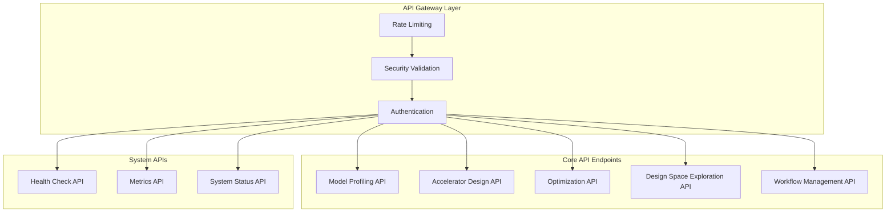

# AI Hardware Co-Design Playground - Complete API Reference

## Overview

The AI Hardware Co-Design Playground provides a comprehensive REST API for neural network analysis, hardware accelerator design, and co-optimization workflows. The API is built with FastAPI and includes enterprise-grade security, rate limiting, and monitoring.

**Base URL**: `http://localhost:8000/api/v1`  
**Authentication**: Bearer token (optional for development)  
**Rate Limits**: 60 requests/minute, 1000 requests/hour per IP  

## API Architecture



## Authentication

### Bearer Token Authentication (Optional)

```http
Authorization: Bearer <your-api-token>
```

**Development Mode**: Authentication is optional for local development  
**Production Mode**: API key required for all endpoints

### Rate Limiting

All endpoints are subject to rate limiting:
- **Per Minute**: 60 requests per IP address
- **Per Hour**: 1000 requests per IP address
- **Blocked Duration**: 15 minutes for rate limit violations

## Core API Endpoints

### 1. Model Profiling API

#### Profile Neural Network Model

**Endpoint**: `POST /api/v1/profile`

Analyzes neural network characteristics and computational requirements.

**Request Body:**
```json
{
  "model_data": {
    "layers": [
      {
        "type": "conv2d",
        "input_shape": [224, 224, 3],
        "output_shape": [224, 224, 32],
        "kernel_size": 3,
        "stride": 1,
        "parameters": 864
      },
      {
        "type": "maxpool2d", 
        "input_shape": [224, 224, 32],
        "output_shape": [112, 112, 32],
        "kernel_size": 2,
        "stride": 2,
        "parameters": 0
      },
      {
        "type": "dense",
        "input_shape": [401408],
        "output_shape": [10],
        "parameters": 4014090
      }
    ],
    "input_shape": [224, 224, 3],
    "framework": "tensorflow"
  },
  "analysis_options": {
    "include_memory_analysis": true,
    "include_compute_intensity": true,
    "target_batch_size": 1
  }
}
```

**Response:**
```json
{
  "profile": {
    "peak_gflops": 0.017,
    "bandwidth_gb_s": 2.4,
    "operations": {
      "conv2d": 2,
      "maxpool2d": 1,
      "dense": 1
    },
    "parameters": 4014954,
    "memory_mb": 15.3,
    "compute_intensity": 0.0071,
    "layer_types": ["conv2d", "maxpool2d", "dense"],
    "model_size_mb": 15.3
  },
  "analysis": {
    "bottlenecks": ["memory_bandwidth"],
    "recommendations": [
      "Consider quantization to reduce memory requirements",
      "Optimize dense layer with sparse matrices"
    ],
    "estimated_inference_time_ms": 12.5
  },
  "metadata": {
    "request_id": "req_abc123",
    "timestamp": "2024-01-15T10:30:00Z",
    "processing_time_ms": 45
  }
}
```

**Example cURL:**
```bash
curl -X POST "http://localhost:8000/api/v1/profile" \
  -H "Content-Type: application/json" \
  -H "Authorization: Bearer <token>" \
  -d @model_profile_request.json
```

**Python Example:**
```python
import requests

model_data = {
    "model_data": {
        "layers": [
            {
                "type": "conv2d",
                "input_shape": [224, 224, 3],
                "output_shape": [224, 224, 32],
                "kernel_size": 3,
                "stride": 1,
                "parameters": 864
            }
        ],
        "input_shape": [224, 224, 3],
        "framework": "tensorflow"
    },
    "analysis_options": {
        "include_memory_analysis": True,
        "include_compute_intensity": True,
        "target_batch_size": 1
    }
}

response = requests.post(
    "http://localhost:8000/api/v1/profile",
    json=model_data,
    headers={"Authorization": "Bearer <token>"}
)

profile = response.json()
print(f"Peak GFLOPS: {profile['profile']['peak_gflops']}")
```

### 2. Accelerator Design API

#### Design Hardware Accelerator

**Endpoint**: `POST /api/v1/design`

Generates hardware accelerator architecture based on requirements.

**Request Body:**
```json
{
  "design_requirements": {
    "compute_units": 64,
    "memory_hierarchy": ["sram_64kb", "dram"],
    "dataflow": "weight_stationary",
    "precision": "int8",
    "target_frequency_mhz": 200,
    "power_budget_watts": 5.0
  },
  "model_profile": {
    "peak_gflops": 0.017,
    "bandwidth_gb_s": 2.4,
    "parameters": 4014954,
    "memory_mb": 15.3
  },
  "optimization_goals": {
    "primary": "performance",
    "secondary": "power_efficiency", 
    "constraints": {
      "max_area_mm2": 10.0,
      "max_power_watts": 5.0
    }
  }
}
```

**Response:**
```json
{
  "accelerator": {
    "config": {
      "compute_units": 64,
      "memory_hierarchy": ["sram_64kb", "dram"],
      "dataflow": "weight_stationary",
      "precision": "int8",
      "frequency_mhz": 200,
      "area_mm2": 8.5,
      "power_watts": 4.2
    },
    "performance": {
      "throughput_gops": 12.8,
      "latency_ms": 1.33,
      "efficiency_gops_per_watt": 3.05,
      "utilization_percent": 87.5
    },
    "architecture": {
      "systolic_array_size": [8, 8],
      "memory_banks": 16,
      "buffer_sizes": {
        "input_buffer_kb": 32,
        "weight_buffer_kb": 64,
        "output_buffer_kb": 16
      },
      "interconnect": "mesh_2d"
    }
  },
  "rtl_info": {
    "generated": true,
    "files": ["accelerator.v", "memory_controller.v", "datapath.v"],
    "size_loc": 15420,
    "estimated_synthesis_time_hours": 2.5
  },
  "validation": {
    "meets_requirements": true,
    "constraint_violations": [],
    "optimization_score": 0.92
  },
  "metadata": {
    "request_id": "req_def456",
    "timestamp": "2024-01-15T10:35:00Z",
    "processing_time_ms": 1250
  }
}
```

**Python Example:**
```python
import requests

design_request = {
    "design_requirements": {
        "compute_units": 64,
        "memory_hierarchy": ["sram_64kb", "dram"],
        "dataflow": "weight_stationary",
        "precision": "int8",
        "target_frequency_mhz": 200,
        "power_budget_watts": 5.0
    },
    "model_profile": {
        "peak_gflops": 0.017,
        "bandwidth_gb_s": 2.4,
        "parameters": 4014954,
        "memory_mb": 15.3
    },
    "optimization_goals": {
        "primary": "performance",
        "secondary": "power_efficiency",
        "constraints": {
            "max_area_mm2": 10.0,
            "max_power_watts": 5.0
        }
    }
}

response = requests.post(
    "http://localhost:8000/api/v1/design",
    json=design_request
)

accelerator = response.json()
print(f"Throughput: {accelerator['accelerator']['performance']['throughput_gops']} GOPS")
```

### 3. Co-Optimization API

#### Co-optimize Model and Hardware

**Endpoint**: `POST /api/v1/co-optimize`

Jointly optimizes neural network model and hardware accelerator for target metrics.

**Request Body:**
```json
{
  "model_data": {
    "layers": [...],
    "input_shape": [224, 224, 3],
    "framework": "tensorflow"
  },
  "optimization_targets": {
    "target_fps": 30,
    "target_latency_ms": 33.3,
    "power_budget_watts": 5.0,
    "accuracy_threshold": 0.95
  },
  "hardware_constraints": {
    "max_area_mm2": 10.0,
    "technology_node": "28nm",
    "memory_budget_mb": 16
  },
  "optimization_options": {
    "enable_quantization": true,
    "enable_pruning": true,
    "enable_layer_fusion": true,
    "max_iterations": 50,
    "convergence_threshold": 0.01
  }
}
```

**Response:**
```json
{
  "optimization_result": {
    "converged": true,
    "iterations": 23,
    "final_score": 0.94,
    "optimization_time_seconds": 145.7
  },
  "optimized_model": {
    "quantization": {
      "weights": "int8",
      "activations": "int8",
      "compression_ratio": 4.1
    },
    "pruning": {
      "sparsity_ratio": 0.65,
      "structured_pruning": true
    },
    "performance": {
      "estimated_accuracy": 0.951,
      "model_size_mb": 3.8,
      "inference_time_ms": 28.5
    }
  },
  "optimized_hardware": {
    "config": {
      "compute_units": 48,
      "memory_hierarchy": ["sram_32kb", "dram"],
      "dataflow": "output_stationary",
      "frequency_mhz": 250
    },
    "performance": {
      "throughput_fps": 35.1,
      "latency_ms": 28.5,
      "power_watts": 4.8,
      "area_mm2": 9.2
    }
  },
  "co_optimization_metrics": {
    "pareto_efficiency": 0.89,
    "energy_per_inference_mj": 137.1,
    "throughput_per_area": 3.8,
    "cost_effectiveness_score": 0.92
  },
  "metadata": {
    "request_id": "req_ghi789",
    "timestamp": "2024-01-15T10:40:00Z",
    "processing_time_ms": 145700
  }
}
```

### 4. Design Space Exploration API

#### Explore Design Space

**Endpoint**: `POST /api/v1/explore`

Explores design space with multiple configurations and objectives.

**Request Body:**
```json
{
  "design_space": {
    "compute_units": [16, 32, 64, 128],
    "memory_size_kb": [32, 64, 128, 256],
    "frequency_mhz": [100, 200, 400],
    "dataflow": ["weight_stationary", "output_stationary"],
    "precision": ["int8", "fp16", "mixed"]
  },
  "objectives": ["latency", "power", "area", "throughput"],
  "constraints": {
    "max_power_watts": 10.0,
    "max_area_mm2": 20.0,
    "min_throughput_gops": 5.0
  },
  "exploration_options": {
    "num_samples": 1000,
    "exploration_method": "multi_objective_genetic",
    "parallel_workers": 8,
    "convergence_criteria": {
      "max_generations": 100,
      "convergence_threshold": 0.001
    }
  }
}
```

**Response:**
```json
{
  "exploration_results": {
    "total_designs_evaluated": 1000,
    "pareto_optimal_designs": 45,
    "exploration_time_seconds": 89.3,
    "convergence_achieved": true
  },
  "pareto_frontier": [
    {
      "design_id": "design_001",
      "config": {
        "compute_units": 64,
        "memory_size_kb": 128,
        "frequency_mhz": 200,
        "dataflow": "weight_stationary",
        "precision": "int8"
      },
      "objectives": {
        "latency_ms": 15.2,
        "power_watts": 3.8,
        "area_mm2": 7.5,
        "throughput_gops": 8.4
      },
      "pareto_rank": 1,
      "domination_count": 0
    }
  ],
  "design_recommendations": [
    {
      "use_case": "high_performance",
      "recommended_design": "design_001",
      "rationale": "Optimal balance of throughput and efficiency",
      "trade_offs": {
        "benefits": ["High throughput", "Good power efficiency"],
        "costs": ["Moderate area", "Medium latency"]
      }
    }
  ],
  "visualization": {
    "pareto_plot_url": "/api/v1/visualize/pareto/req_jkl012",
    "scatter_matrix_url": "/api/v1/visualize/scatter/req_jkl012",
    "design_space_heatmap_url": "/api/v1/visualize/heatmap/req_jkl012"
  },
  "metadata": {
    "request_id": "req_jkl012",
    "timestamp": "2024-01-15T10:45:00Z",
    "processing_time_ms": 89300
  }
}
```

### 5. Workflow Management API

#### Create Design Workflow

**Endpoint**: `POST /api/v1/workflow`

Creates and manages end-to-end design workflows.

**Request Body:**
```json
{
  "workflow_config": {
    "name": "efficientnet_accelerator",
    "description": "Design accelerator for EfficientNet inference",
    "steps": [
      {
        "step": "import_model",
        "config": {
          "model_path": "models/efficientnet_b0.onnx",
          "input_shapes": {"input": [1, 3, 224, 224]}
        }
      },
      {
        "step": "profile_model",
        "config": {
          "analysis_depth": "comprehensive",
          "include_layer_analysis": true
        }
      },
      {
        "step": "design_hardware",
        "config": {
          "template": "systolic_array",
          "size": [16, 16],
          "precision": "int8"
        }
      },
      {
        "step": "co_optimize",
        "config": {
          "target_fps": 30,
          "power_budget": 5.0,
          "max_iterations": 100
        }
      },
      {
        "step": "generate_rtl",
        "config": {
          "output_format": "verilog",
          "include_testbench": true,
          "optimization_level": "high"
        }
      }
    ]
  },
  "execution_options": {
    "parallel_execution": true,
    "checkpoint_interval": 5,
    "error_handling": "continue_on_non_critical"
  }
}
```

**Response:**
```json
{
  "workflow": {
    "id": "workflow_789abc",
    "name": "efficientnet_accelerator",
    "status": "running",
    "created_at": "2024-01-15T10:50:00Z",
    "estimated_completion": "2024-01-15T11:15:00Z"
  },
  "execution": {
    "current_step": 2,
    "total_steps": 5,
    "progress_percent": 40,
    "step_status": {
      "import_model": "completed",
      "profile_model": "running",
      "design_hardware": "pending",
      "co_optimize": "pending",
      "generate_rtl": "pending"
    }
  },
  "intermediate_results": {
    "model_profile": {
      "peak_gflops": 0.394,
      "parameters": 5330000,
      "memory_mb": 20.3
    }
  },
  "metadata": {
    "request_id": "req_mno345",
    "timestamp": "2024-01-15T10:50:00Z"
  }
}
```

#### Get Workflow Status

**Endpoint**: `GET /api/v1/workflow/{workflow_id}`

**Response:**
```json
{
  "workflow": {
    "id": "workflow_789abc",
    "name": "efficientnet_accelerator",
    "status": "completed",
    "created_at": "2024-01-15T10:50:00Z",
    "completed_at": "2024-01-15T11:12:35Z",
    "total_duration_seconds": 1355
  },
  "results": {
    "final_design": {
      "accelerator_config": {...},
      "performance_metrics": {...},
      "rtl_files": ["accelerator.v", "testbench.sv"]
    },
    "optimization_history": [
      {
        "iteration": 1,
        "score": 0.67,
        "config": {...}
      }
    ]
  }
}
```

## System APIs

### 1. Health Check API

#### Basic Health Check

**Endpoint**: `GET /health`

**Response:**
```json
{
  "status": "healthy",
  "timestamp": "2024-01-15T10:55:00Z",
  "uptime_seconds": 3600,
  "version": "0.1.0"
}
```

#### Detailed Health Check

**Endpoint**: `GET /health/detail`

**Response:**
```json
{
  "status": "healthy",
  "timestamp": "2024-01-15T10:55:00Z",
  "components": {
    "database": {
      "status": "healthy",
      "response_time_ms": 12,
      "connection_pool": {
        "active": 5,
        "idle": 15,
        "max": 20
      }
    },
    "cache": {
      "status": "healthy",
      "hit_rate": 0.94,
      "memory_usage_percent": 65
    },
    "external_services": {
      "status": "healthy",
      "services": {
        "model_repository": "healthy",
        "hardware_tools": "healthy"
      }
    }
  },
  "system_metrics": {
    "cpu_usage_percent": 45,
    "memory_usage_percent": 67,
    "disk_usage_percent": 34,
    "active_workers": 8
  }
}
```

### 2. Metrics API

#### Get System Metrics

**Endpoint**: `GET /api/v1/metrics`

**Response:**
```json
{
  "metrics": {
    "requests": {
      "total": 15420,
      "success_rate": 0.998,
      "average_response_time_ms": 245,
      "requests_per_second": 12.5
    },
    "performance": {
      "designs_generated": 1250,
      "average_design_time_ms": 850,
      "cache_hit_rate": 0.94,
      "worker_utilization": 0.78
    },
    "resources": {
      "cpu_usage": 0.45,
      "memory_usage": 0.67,
      "disk_usage": 0.34,
      "active_connections": 45
    }
  },
  "timestamp": "2024-01-15T10:55:00Z",
  "collection_interval_seconds": 60
}
```

### 3. System Status API

#### Get System Status

**Endpoint**: `GET /api/v1/status`

**Response:**
```json
{
  "system": {
    "status": "operational",
    "mode": "production",
    "version": "0.1.0",
    "build": "abc123def",
    "deployment": "kubernetes"
  },
  "features": {
    "auto_scaling": {
      "enabled": true,
      "mode": "balanced",
      "current_workers": 8,
      "min_workers": 2,
      "max_workers": 32
    },
    "security": {
      "rate_limiting": true,
      "input_validation": true,
      "authentication": "optional"
    },
    "monitoring": {
      "metrics_collection": true,
      "health_checks": true,
      "performance_tracking": true
    }
  },
  "capacity": {
    "concurrent_requests": 100,
    "queue_depth": 5,
    "processing_capacity": "95%"
  }
}
```

## Error Handling

### Standard Error Response Format

```json
{
  "error": {
    "code": "VALIDATION_ERROR",
    "message": "Invalid input parameters",
    "details": {
      "field": "compute_units",
      "value": -1,
      "constraint": "must be positive integer"
    },
    "suggestions": [
      "Provide a positive integer value for compute_units",
      "Valid range is 1-1024"
    ],
    "request_id": "req_pqr678",
    "timestamp": "2024-01-15T11:00:00Z"
  }
}
```

### HTTP Status Codes

| Code | Description | Usage |
|------|-------------|-------|
| 200 | OK | Successful request |
| 201 | Created | Resource created successfully |
| 400 | Bad Request | Invalid request parameters |
| 401 | Unauthorized | Authentication required |
| 403 | Forbidden | Insufficient permissions |
| 404 | Not Found | Resource not found |
| 409 | Conflict | Resource conflict |
| 422 | Unprocessable Entity | Validation error |
| 429 | Too Many Requests | Rate limit exceeded |
| 500 | Internal Server Error | Server error |
| 503 | Service Unavailable | Service temporarily unavailable |

### Error Categories

#### Validation Errors (400, 422)
```json
{
  "error": {
    "code": "VALIDATION_ERROR",
    "message": "Input validation failed",
    "details": {
      "field": "memory_hierarchy",
      "reason": "unsupported_memory_type"
    }
  }
}
```

#### Security Errors (400, 403)
```json
{
  "error": {
    "code": "SECURITY_ERROR", 
    "message": "Potentially malicious input detected",
    "details": {
      "threat_type": "path_traversal",
      "blocked_input": "../../etc/passwd"
    }
  }
}
```

#### Rate Limit Errors (429)
```json
{
  "error": {
    "code": "RATE_LIMIT_EXCEEDED",
    "message": "Too many requests",
    "details": {
      "limit": "60 requests per minute",
      "reset_time": "2024-01-15T11:05:00Z",
      "retry_after_seconds": 45
    }
  }
}
```

## SDK Integration

### Python SDK Usage

```python
from codesign_playground import CodesignClient

# Initialize client
client = CodesignClient(
    base_url="http://localhost:8000",
    api_key="your-api-key"  # Optional for development
)

# Profile a model
profile = client.profile_model(model_data={
    "layers": [...],
    "input_shape": [224, 224, 3],
    "framework": "tensorflow"
})

# Design accelerator
accelerator = client.design_accelerator(
    design_requirements={
        "compute_units": 64,
        "memory_hierarchy": ["sram_64kb", "dram"],
        "dataflow": "weight_stationary"
    },
    model_profile=profile
)

# Co-optimize model and hardware
result = client.co_optimize(
    model_data=model_data,
    optimization_targets={
        "target_fps": 30,
        "power_budget_watts": 5.0
    }
)

# Explore design space
exploration = client.explore_design_space(
    design_space={
        "compute_units": [16, 32, 64, 128],
        "memory_size_kb": [32, 64, 128, 256]
    },
    objectives=["latency", "power", "area"]
)

# Create workflow
workflow = client.create_workflow(
    name="my_accelerator_design",
    steps=[
        {"step": "import_model", "config": {...}},
        {"step": "design_hardware", "config": {...}},
        {"step": "generate_rtl", "config": {...}}
    ]
)

# Monitor workflow
status = client.get_workflow_status(workflow.id)
results = client.get_workflow_results(workflow.id)
```

### JavaScript/TypeScript SDK

```typescript
import { CodesignClient } from '@codesign-playground/sdk';

const client = new CodesignClient({
  baseUrl: 'http://localhost:8000',
  apiKey: 'your-api-key'
});

// Profile model
const profile = await client.profileModel({
  modelData: {
    layers: [...],
    inputShape: [224, 224, 3],
    framework: 'tensorflow'
  }
});

// Design accelerator
const accelerator = await client.designAccelerator({
  designRequirements: {
    computeUnits: 64,
    memoryHierarchy: ['sram_64kb', 'dram'],
    dataflow: 'weight_stationary'
  },
  modelProfile: profile
});
```

## Monitoring and Analytics

### Request Tracking

All API requests are tracked with:
- Unique request ID
- Response time
- Resource usage
- Success/failure status
- User analytics (if authenticated)

### Performance Metrics

The API exposes performance metrics:
- Request latency percentiles (P50, P95, P99)
- Throughput (requests per second)
- Error rates by endpoint
- Resource utilization
- Cache performance

### Health Monitoring

Continuous health monitoring includes:
- Database connectivity
- Cache system status
- External service dependencies
- Resource utilization alerts
- Performance degradation detection

## Best Practices

### 1. Request Optimization

**Batch Processing**: Use batch endpoints when processing multiple items
```python
# Instead of multiple single requests
for model in models:
    client.profile_model(model)

# Use batch processing
client.batch_profile_models(models)
```

**Caching**: Leverage response caching for repeated requests
```python
# Enable client-side caching
client = CodesignClient(enable_cache=True, cache_ttl=3600)
```

### 2. Error Handling

**Implement Retry Logic**: Handle transient errors with exponential backoff
```python
import time
from requests.exceptions import RequestException

def make_request_with_retry(func, max_retries=3):
    for attempt in range(max_retries):
        try:
            return func()
        except RequestException as e:
            if attempt == max_retries - 1:
                raise
            time.sleep(2 ** attempt)
```

**Validate Inputs**: Always validate inputs before API calls
```python
def validate_design_requirements(requirements):
    assert requirements.get('compute_units', 0) > 0
    assert requirements.get('power_budget_watts', 0) > 0
    # Additional validations...
```

### 3. Performance Optimization

**Use Async Clients**: For high-throughput applications
```python
import asyncio
import aiohttp

async def async_profile_models(models):
    async with aiohttp.ClientSession() as session:
        tasks = [profile_model_async(session, model) for model in models]
        return await asyncio.gather(*tasks)
```

**Monitor Rate Limits**: Track usage to avoid rate limiting
```python
class RateLimitTracker:
    def __init__(self):
        self.requests = []
        
    def can_make_request(self):
        now = time.time()
        minute_ago = now - 60
        self.requests = [req for req in self.requests if req > minute_ago]
        return len(self.requests) < 60
```

## API Versioning

The API uses semantic versioning with URL-based versioning:

- **Current Version**: v1
- **Base Path**: `/api/v1`
- **Deprecation Policy**: 6-month notice before version retirement
- **Backward Compatibility**: Maintained within major versions

### Version Migration

When upgrading API versions:
1. Review migration guide for breaking changes
2. Update client SDK to compatible version
3. Test with new API version in staging
4. Gradually migrate production traffic
5. Monitor for issues and performance changes

## Conclusion

The AI Hardware Co-Design Playground API provides comprehensive functionality for neural network analysis, hardware design, and co-optimization workflows. The API is designed for scalability, security, and ease of integration, making it suitable for both research and production environments.

For additional support:
- **Documentation**: [https://docs.codesign-playground.com](https://docs.codesign-playground.com)
- **GitHub Issues**: [https://github.com/your-org/ai-hardware-codesign-playground/issues](https://github.com/your-org/ai-hardware-codesign-playground/issues)
- **Community Discord**: [https://discord.gg/codesign-playground](https://discord.gg/codesign-playground)