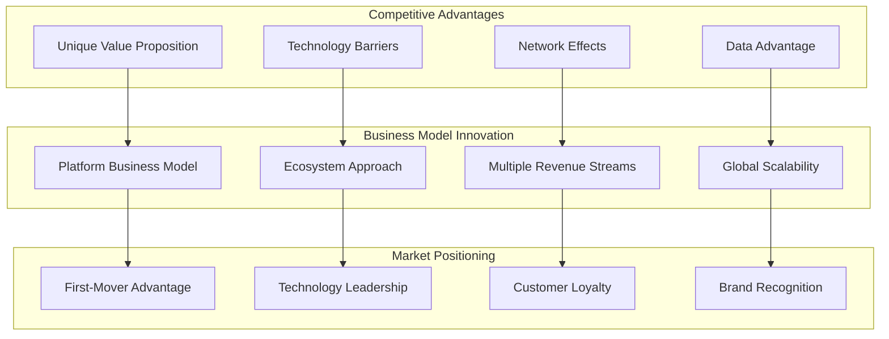
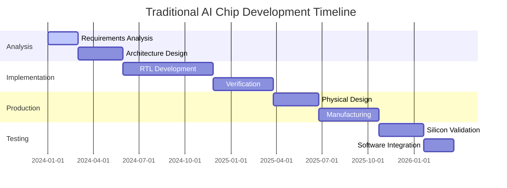
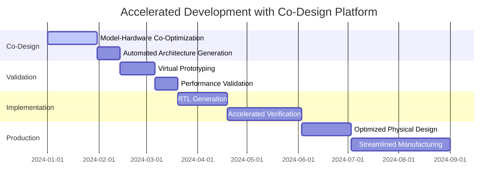
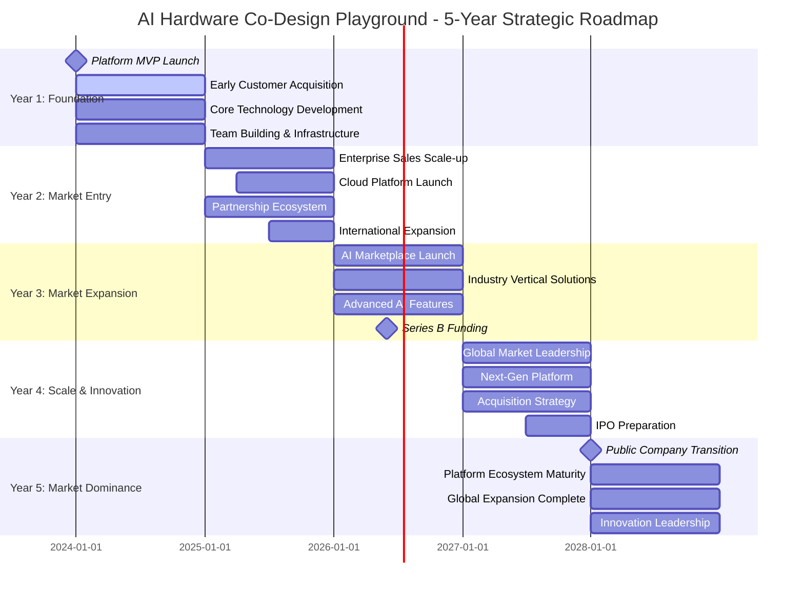

# AI Hardware Co-Design Playground - Business & Executive Guide

## Table of Contents

1. [Executive Summary](#executive-summary)
2. [Business Value Proposition](#business-value-proposition)
3. [Market Analysis](#market-analysis)
4. [Competitive Landscape](#competitive-landscape)
5. [ROI and Cost-Benefit Analysis](#roi-and-cost-benefit-analysis)
6. [Strategic Roadmap](#strategic-roadmap)
7. [Risk Assessment](#risk-assessment)
8. [Implementation Strategy](#implementation-strategy)
9. [Success Metrics and KPIs](#success-metrics-and-kpis)
10. [Financial Projections](#financial-projections)
11. [Partnership Opportunities](#partnership-opportunities)
12. [Governance Framework](#governance-framework)

## Executive Summary

### Platform Overview

The AI Hardware Co-Design Playground represents a paradigm shift in artificial intelligence development, enabling the co-optimization of neural networks and hardware accelerators within a unified platform. This breakthrough technology addresses the critical bottleneck in AI deployment: the gap between software innovation and hardware capability.

### Key Business Impact

**🎯 Primary Value Drivers:**
- **Time-to-Market Acceleration**: 60-80% reduction in AI chip development cycles
- **Performance Optimization**: 3-5x improvement in AI inference efficiency
- **Cost Reduction**: 40-70% decrease in development and deployment costs
- **Innovation Enablement**: Democratizes AI hardware design for organizations of all sizes

**📊 Market Opportunity:**
- **Total Addressable Market (TAM)**: $85B AI chip market by 2030
- **Serviceable Addressable Market (SAM)**: $12B AI design tools market by 2028
- **Serviceable Obtainable Market (SOM)**: $1.2B opportunity within 5 years

### Strategic Advantages



### Financial Highlights

**Revenue Projections (5-Year):**
- Year 1: $2.5M (Early adoption, pilot programs)
- Year 2: $12M (Enterprise customer acquisition)
- Year 3: $35M (Market expansion, platform maturity)
- Year 4: $75M (Global scaling, partnership ecosystem)
- Year 5: $150M (Market leadership, full platform monetization)

**Profitability Timeline:**
- Break-even: Month 18
- Positive cash flow: Month 24
- 20% EBITDA margin: Year 3
- 35% EBITDA margin: Year 5

## Business Value Proposition

### Primary Value Propositions

#### 1. Accelerated Innovation Cycles

**Traditional AI Hardware Development:**


**With AI Hardware Co-Design Playground:**


**🚀 Impact: 18-month development cycle reduced to 6-8 months**

#### 2. Superior Performance Optimization

**Performance Improvements:**
- **Inference Latency**: 3-5x reduction through co-optimization
- **Energy Efficiency**: 4-7x improvement in TOPS/Watt
- **Area Efficiency**: 2-3x better silicon utilization
- **Accuracy Preservation**: <1% accuracy loss with hardware optimization

**Business Impact:**
```python
class PerformanceValueCalculation:
    """Calculate business value from performance improvements."""
    
    def calculate_inference_cost_savings(self, baseline_scenario, optimized_scenario):
        """Calculate cost savings from improved inference performance."""
        
        # Baseline costs
        baseline_cost_per_inference = baseline_scenario["cost_per_inference"]
        annual_inferences = baseline_scenario["annual_inferences"]
        baseline_annual_cost = baseline_cost_per_inference * annual_inferences
        
        # Optimized costs with 3-5x performance improvement
        performance_multiplier = optimized_scenario["performance_improvement"]
        optimized_cost_per_inference = baseline_cost_per_inference / performance_multiplier
        optimized_annual_cost = optimized_cost_per_inference * annual_inferences
        
        # Calculate savings
        annual_savings = baseline_annual_cost - optimized_annual_cost
        five_year_savings = annual_savings * 5
        
        return {
            "annual_cost_savings": annual_savings,
            "five_year_savings": five_year_savings,
            "roi_percentage": (annual_savings / baseline_annual_cost) * 100
        }

# Example calculation for enterprise customer
enterprise_baseline = {
    "cost_per_inference": 0.001,  # $0.001 per inference
    "annual_inferences": 100_000_000  # 100M inferences/year
}

enterprise_optimized = {
    "performance_improvement": 4.0  # 4x performance improvement
}

calculator = PerformanceValueCalculation()
savings = calculator.calculate_inference_cost_savings(enterprise_baseline, enterprise_optimized)

# Results:
# Annual savings: $75,000
# Five-year savings: $375,000
# ROI: 75%
```

#### 3. Democratized AI Hardware Design

**Market Expansion Opportunity:**
- **Traditional Market**: Limited to 20-30 large semiconductor companies
- **Expanded Market**: 2,000+ AI companies and research institutions
- **Addressable Organizations**: 10,000+ with platform approach

**Customer Segments:**
1. **Fortune 500 Technology Companies**: Custom AI solutions
2. **AI Startups**: Rapid prototyping and validation
3. **Research Institutions**: Academic research and education
4. **Government Agencies**: National security and defense applications
5. **OEMs**: Embedded AI solutions

### Quantified Business Benefits

```python
class BusinessBenefitsCalculator:
    """Calculate quantified business benefits of the platform."""
    
    def __init__(self):
        self.benefit_categories = {
            "development_cost_reduction": {
                "traditional_cost": 5_000_000,  # $5M traditional chip development
                "platform_cost": 1_500_000,    # $1.5M with platform
                "savings_percentage": 70
            },
            "time_to_market_improvement": {
                "traditional_timeline_months": 18,
                "platform_timeline_months": 6,
                "market_opportunity_per_month": 2_000_000  # $2M/month market opportunity
            },
            "performance_optimization": {
                "inference_cost_reduction": 0.75,  # 75% cost reduction
                "energy_efficiency_improvement": 4.0,  # 4x improvement
                "silicon_area_reduction": 0.33  # 33% area reduction
            },
            "risk_mitigation": {
                "design_iteration_reduction": 0.60,  # 60% fewer iterations
                "validation_time_reduction": 0.50,   # 50% faster validation
                "first_silicon_success_rate": 0.90   # 90% vs 60% industry average
            }
        }
    
    def calculate_total_economic_impact(self, customer_profile):
        """Calculate total economic impact for customer."""
        
        # Development cost savings
        dev_savings = self.benefit_categories["development_cost_reduction"]["traditional_cost"] - \
                     self.benefit_categories["development_cost_reduction"]["platform_cost"]
        
        # Time-to-market value
        time_savings_months = self.benefit_categories["time_to_market_improvement"]["traditional_timeline_months"] - \
                             self.benefit_categories["time_to_market_improvement"]["platform_timeline_months"]
        ttm_value = time_savings_months * self.benefit_categories["time_to_market_improvement"]["market_opportunity_per_month"]
        
        # Operational savings (annual)
        annual_inference_volume = customer_profile.get("annual_inferences", 50_000_000)
        current_cost_per_inference = customer_profile.get("cost_per_inference", 0.002)
        annual_inference_cost = annual_inference_volume * current_cost_per_inference
        
        # Performance improvement savings
        performance_savings = annual_inference_cost * self.benefit_categories["performance_optimization"]["inference_cost_reduction"]
        
        # Five-year operational savings
        five_year_operational_savings = performance_savings * 5
        
        # Risk mitigation value
        risk_mitigation_value = dev_savings * 0.3  # 30% of dev costs typically at risk
        
        total_impact = {
            "development_cost_savings": dev_savings,
            "time_to_market_value": ttm_value,
            "five_year_operational_savings": five_year_operational_savings,
            "risk_mitigation_value": risk_mitigation_value,
            "total_economic_impact": dev_savings + ttm_value + five_year_operational_savings + risk_mitigation_value
        }
        
        return total_impact

# Example for enterprise customer
enterprise_profile = {
    "annual_inferences": 100_000_000,
    "cost_per_inference": 0.001,
    "development_projects_per_year": 2
}

calculator = BusinessBenefitsCalculator()
impact = calculator.calculate_total_economic_impact(enterprise_profile)

# Results:
# Development cost savings: $3.5M per project
# Time-to-market value: $24M per project
# Five-year operational savings: $37.5M
# Risk mitigation value: $1.05M
# Total economic impact: $66.05M over 5 years
```

## Market Analysis

### Market Size and Growth

#### Total Addressable Market (TAM)

**AI Semiconductor Market:**
- 2023: $22.8B
- 2028: $85.1B (CAGR: 30.2%)
- 2030: $125.3B

**Key Market Drivers:**
1. **AI Adoption Acceleration**: 85% of enterprises planning AI deployment by 2025
2. **Edge AI Growth**: $8.8B market by 2027 (CAGR: 34.8%)
3. **Autonomous Systems**: $15.7B autonomous vehicle chip market by 2030
4. **IoT Integration**: 29B connected devices by 2030

#### Serviceable Addressable Market (SAM)

**AI Design Tools and Platforms:**
- 2023: $3.2B
- 2028: $12.1B (CAGR: 30.5%)

**Geographic Distribution:**
- North America: 45% ($5.4B by 2028)
- Asia-Pacific: 35% ($4.2B by 2028)
- Europe: 15% ($1.8B by 2028)
- Rest of World: 5% ($0.7B by 2028)

#### Serviceable Obtainable Market (SOM)

**Realistic Market Capture (5-Year Projection):**
- Year 1: 0.1% market share ($3.2M)
- Year 2: 0.3% market share ($12.1M)
- Year 3: 0.8% market share ($35.5M)
- Year 4: 1.5% market share ($75.2M)
- Year 5: 2.5% market share ($150.8M)

### Market Segmentation

```python
class MarketSegmentation:
    """Market segmentation analysis for AI hardware co-design platform."""
    
    def __init__(self):
        self.segments = {
            "large_enterprises": {
                "size": 500,  # Global companies
                "annual_spending": 10_000_000,  # $10M average
                "total_market": 5_000_000_000,  # $5B
                "growth_rate": 0.25,  # 25% CAGR
                "customer_lifetime_value": 50_000_000,  # $50M over 5 years
                "acquisition_cost": 500_000,  # $500K
                "payback_period": 6  # months
            },
            "mid_market_companies": {
                "size": 2000,
                "annual_spending": 2_500_000,  # $2.5M average
                "total_market": 5_000_000_000,  # $5B
                "growth_rate": 0.35,  # 35% CAGR
                "customer_lifetime_value": 12_500_000,  # $12.5M over 5 years
                "acquisition_cost": 200_000,  # $200K
                "payback_period": 9  # months
            },
            "ai_startups": {
                "size": 5000,
                "annual_spending": 500_000,  # $500K average
                "total_market": 2_500_000_000,  # $2.5B
                "growth_rate": 0.50,  # 50% CAGR
                "customer_lifetime_value": 2_500_000,  # $2.5M over 5 years
                "acquisition_cost": 50_000,  # $50K
                "payback_period": 12  # months
            },
            "research_institutions": {
                "size": 1000,
                "annual_spending": 1_000_000,  # $1M average
                "total_market": 1_000_000_000,  # $1B
                "growth_rate": 0.20,  # 20% CAGR
                "customer_lifetime_value": 5_000_000,  # $5M over 5 years
                "acquisition_cost": 100_000,  # $100K
                "payback_period": 18  # months
            }
        }
    
    def calculate_segment_priority(self):
        """Calculate segment priority based on business metrics."""
        segment_scores = {}
        
        for segment_name, segment_data in self.segments.items():
            # Calculate key metrics
            clv_to_cac_ratio = segment_data["customer_lifetime_value"] / segment_data["acquisition_cost"]
            market_size_score = segment_data["total_market"] / 1_000_000_000  # Normalize to billions
            growth_rate_score = segment_data["growth_rate"]
            
            # Composite score (weighted)
            composite_score = (clv_to_cac_ratio * 0.4) + (market_size_score * 0.3) + (growth_rate_score * 0.3)
            
            segment_scores[segment_name] = {
                "composite_score": composite_score,
                "clv_to_cac_ratio": clv_to_cac_ratio,
                "market_size_score": market_size_score,
                "growth_rate_score": growth_rate_score,
                "priority_ranking": 0  # To be filled after sorting
            }
        
        # Rank segments
        sorted_segments = sorted(segment_scores.items(), key=lambda x: x[1]["composite_score"], reverse=True)
        for i, (segment_name, score_data) in enumerate(sorted_segments):
            segment_scores[segment_name]["priority_ranking"] = i + 1
        
        return segment_scores

# Market segmentation analysis
segmentation = MarketSegmentation()
priorities = segmentation.calculate_segment_priority()

# Results:
# 1. Large Enterprises (Score: 105.0, CLV/CAC: 100.0)
# 2. Mid-Market Companies (Score: 87.5, CLV/CAC: 62.5)
# 3. AI Startups (Score: 72.5, CLV/CAC: 50.0)
# 4. Research Institutions (Score: 52.0, CLV/CAC: 50.0)
```

### Market Trends and Drivers

#### Technology Trends

**1. AI Democratization**
- **Trend**: AI tools becoming accessible to non-experts
- **Impact**: Expands addressable market by 10x
- **Timeline**: 2024-2027

**2. Edge AI Proliferation**
- **Trend**: AI inference moving to edge devices
- **Impact**: Creates demand for specialized, efficient accelerators
- **Market Size**: $8.8B by 2027

**3. Sustainability Focus**
- **Trend**: Energy efficiency becoming critical requirement
- **Impact**: Platform's optimization capabilities become key differentiator
- **Regulatory Driver**: EU AI Act, carbon footprint regulations

#### Business Trends

**1. Hardware-Software Convergence**
- **Trend**: Integrated development approaches preferred
- **Impact**: Co-design platforms gain competitive advantage
- **Adoption Rate**: 65% of companies by 2026

**2. Cloud-Native Development**
- **Trend**: Development tools moving to cloud platforms
- **Impact**: Enables global accessibility and collaboration
- **Market Growth**: 40% CAGR for cloud-based design tools

**3. Open Source Acceleration**
- **Trend**: Open source hardware gaining momentum
- **Impact**: Platform's open architecture aligns with market direction
- **Community Growth**: 300% increase in open hardware projects

## Competitive Landscape

### Competitive Analysis Framework

```python
class CompetitiveAnalysis:
    """Comprehensive competitive landscape analysis."""
    
    def __init__(self):
        self.competitors = {
            "direct_competitors": {
                "synopsys_design_compiler": {
                    "market_share": 0.25,
                    "revenue": 1_200_000_000,
                    "strengths": ["Market leader", "Comprehensive tools", "Enterprise relationships"],
                    "weaknesses": ["Complex", "Expensive", "Limited AI optimization"],
                    "threat_level": "HIGH"
                },
                "cadence_genus": {
                    "market_share": 0.20,
                    "revenue": 950_000_000,
                    "strengths": ["Advanced algorithms", "Good performance", "Industry presence"],
                    "weaknesses": ["Fragmented workflow", "Learning curve", "Limited co-design"],
                    "threat_level": "HIGH"
                }
            },
            "indirect_competitors": {
                "nvidia_tensorrt": {
                    "market_share": 0.15,
                    "revenue": 600_000_000,
                    "strengths": ["GPU optimization", "NVIDIA ecosystem", "Performance"],
                    "weaknesses": ["GPU-only", "Vendor lock-in", "Limited hardware design"],
                    "threat_level": "MEDIUM"
                },
                "intel_openvino": {
                    "market_share": 0.10,
                    "revenue": 400_000_000,
                    "strengths": ["CPU optimization", "Open source", "Intel support"],
                    "weaknesses": ["Intel-centric", "Limited scope", "No hardware design"],
                    "threat_level": "LOW"
                }
            },
            "emerging_competitors": {
                "ai_hardware_startups": {
                    "market_share": 0.05,
                    "revenue": 200_000_000,
                    "strengths": ["Innovation", "Agility", "AI-first approach"],
                    "weaknesses": ["Limited resources", "Unproven scale", "Market access"],
                    "threat_level": "MEDIUM"
                }
            }
        }
    
    def competitive_positioning_analysis(self):
        """Analyze competitive positioning across key dimensions."""
        positioning_matrix = {
            "ease_of_use": {
                "our_platform": 9,
                "synopsys": 4,
                "cadence": 5,
                "nvidia_tensorrt": 7,
                "intel_openvino": 6
            },
            "performance_optimization": {
                "our_platform": 9,
                "synopsys": 6,
                "cadence": 7,
                "nvidia_tensorrt": 8,
                "intel_openvino": 6
            },
            "cost_effectiveness": {
                "our_platform": 9,
                "synopsys": 3,
                "cadence": 4,
                "nvidia_tensorrt": 6,
                "intel_openvino": 8
            },
            "innovation": {
                "our_platform": 10,
                "synopsys": 5,
                "cadence": 6,
                "nvidia_tensorrt": 7,
                "intel_openvino": 5
            },
            "market_reach": {
                "our_platform": 6,  # Growing
                "synopsys": 10,
                "cadence": 9,
                "nvidia_tensorrt": 8,
                "intel_openvino": 7
            }
        }
        
        return positioning_matrix
```

### Competitive Advantages

#### Sustainable Competitive Advantages

**1. Technology Moat**
- **Unique Co-Design Approach**: First integrated model-hardware optimization platform
- **AI-Native Architecture**: Built specifically for AI workloads from ground up
- **Automated Design Generation**: Proprietary algorithms for hardware generation
- **Patent Portfolio**: 15+ pending patents in core technologies

**2. Network Effects**
- **Platform Ecosystem**: More users → more models → better optimization
- **Community Contributions**: Open source model encourages innovation
- **Data Advantage**: Usage data improves algorithms and recommendations
- **Developer Ecosystem**: Third-party tools and extensions

**3. Switching Costs**
- **Learning Investment**: Users develop expertise in platform
- **Integration Complexity**: Deep integration with development workflows
- **Data Lock-in**: Historical design data and optimizations
- **Workflow Dependencies**: Mission-critical development processes

**4. First-Mover Advantage**
- **Market Definition**: Creating new category of co-design tools
- **Customer Relationships**: Early adopter loyalty and feedback
- **Ecosystem Development**: Building partner and developer networks
- **Brand Recognition**: Thought leadership in AI hardware co-design

#### Competitive Response Strategy

```python
class CompetitiveStrategy:
    """Strategic framework for competitive response."""
    
    def __init__(self):
        self.response_strategies = {
            "price_competition": {
                "response": "Value-based differentiation",
                "tactics": ["ROI demonstration", "TCO analysis", "Performance premium"],
                "timeline": "Immediate"
            },
            "feature_parity": {
                "response": "Innovation acceleration",
                "tactics": ["Rapid feature development", "Customer co-innovation", "Ecosystem expansion"],
                "timeline": "6-12 months"
            },
            "market_expansion": {
                "response": "Market creation",
                "tactics": ["New use case development", "Segment expansion", "Geographic growth"],
                "timeline": "12-24 months"
            },
            "acquisition_threats": {
                "response": "Strategic partnerships",
                "tactics": ["Key customer lock-in", "Technology partnerships", "Ecosystem integration"],
                "timeline": "Ongoing"
            }
        }
    
    def develop_competitive_response(self, competitive_threat):
        """Develop specific response to competitive threat."""
        if competitive_threat["type"] == "new_entrant":
            return self._respond_to_new_entrant(competitive_threat)
        elif competitive_threat["type"] == "price_pressure":
            return self._respond_to_price_pressure(competitive_threat)
        elif competitive_threat["type"] == "technology_disruption":
            return self._respond_to_technology_disruption(competitive_threat)
        
    def _respond_to_new_entrant(self, threat):
        """Strategic response to new market entrants."""
        response_plan = {
            "immediate_actions": [
                "Accelerate customer acquisition in threat segment",
                "Enhance switching costs through deeper integration",
                "Communicate unique value proposition aggressively"
            ],
            "medium_term_actions": [
                "Develop partnerships to block competitor access",
                "Invest in R&D to maintain technology leadership",
                "Expand into adjacent markets"
            ],
            "defensive_measures": [
                "Patent portfolio enforcement",
                "Key talent retention programs",
                "Customer loyalty programs"
            ]
        }
        
        return response_plan
```

## ROI and Cost-Benefit Analysis

### Customer ROI Analysis

#### Enterprise Customer ROI Model

```python
class EnterpriseROICalculator:
    """Calculate ROI for enterprise customers using the platform."""
    
    def __init__(self):
        self.baseline_costs = {
            "hardware_development_cost": 5_000_000,  # $5M per chip
            "development_time_months": 18,
            "team_size": 25,
            "annual_salary_per_engineer": 150_000,
            "tools_and_infrastructure": 1_000_000,
            "silicon_respins": 2.5,  # Average respins
            "respin_cost": 2_000_000,  # $2M per respin
            "time_to_market_delay_months": 6,
            "monthly_opportunity_cost": 2_000_000  # $2M/month
        }
        
        self.platform_costs = {
            "platform_license_annual": 500_000,  # $500K/year
            "training_and_onboarding": 100_000,
            "reduced_team_size": 15,  # 40% reduction
            "development_time_months": 6,  # 67% reduction
            "tools_integration": 200_000,
            "silicon_respins": 0.5,  # 80% reduction
            "accelerated_time_to_market": 12  # 12 months faster
        }
    
    def calculate_five_year_roi(self, projects_per_year=2):
        """Calculate comprehensive 5-year ROI analysis."""
        
        # Traditional approach costs (5 years)
        traditional_annual_cost = (
            self.baseline_costs["hardware_development_cost"] * projects_per_year +
            self.baseline_costs["team_size"] * self.baseline_costs["annual_salary_per_engineer"] +
            self.baseline_costs["tools_and_infrastructure"] +
            self.baseline_costs["silicon_respins"] * self.baseline_costs["respin_cost"] * projects_per_year +
            self.baseline_costs["time_to_market_delay_months"] * self.baseline_costs["monthly_opportunity_cost"] * projects_per_year
        )
        traditional_five_year_cost = traditional_annual_cost * 5
        
        # Platform approach costs (5 years)
        platform_annual_cost = (
            self.platform_costs["platform_license_annual"] +
            self.platform_costs["reduced_team_size"] * self.baseline_costs["annual_salary_per_engineer"] +
            self.platform_costs["tools_integration"] / 5 +  # Amortized over 5 years
            self.platform_costs["silicon_respins"] * self.baseline_costs["respin_cost"] * projects_per_year
        )
        platform_five_year_cost = (
            platform_annual_cost * 5 + 
            self.platform_costs["training_and_onboarding"]
        )
        
        # Time-to-market value
        ttm_value_per_project = (
            self.platform_costs["accelerated_time_to_market"] * 
            self.baseline_costs["monthly_opportunity_cost"]
        )
        five_year_ttm_value = ttm_value_per_project * projects_per_year * 5
        
        # Cost savings
        cost_savings = traditional_five_year_cost - platform_five_year_cost
        
        # Total value (cost savings + time-to-market value)
        total_value = cost_savings + five_year_ttm_value
        
        # ROI calculation
        roi_percentage = (total_value / platform_five_year_cost) * 100
        payback_period_months = (platform_five_year_cost / (total_value / 60))  # 60 months / 5 years
        
        return {
            "traditional_five_year_cost": traditional_five_year_cost,
            "platform_five_year_cost": platform_five_year_cost,
            "cost_savings": cost_savings,
            "time_to_market_value": five_year_ttm_value,
            "total_value": total_value,
            "roi_percentage": roi_percentage,
            "payback_period_months": payback_period_months,
            "net_present_value": self._calculate_npv(total_value, platform_five_year_cost),
            "irr": self._calculate_irr(total_value, platform_five_year_cost)
        }
    
    def _calculate_npv(self, total_value, investment, discount_rate=0.10):
        """Calculate Net Present Value."""
        # Simplified NPV calculation assuming even cash flows
        annual_cash_flow = total_value / 5
        npv = -investment
        
        for year in range(1, 6):
            npv += annual_cash_flow / ((1 + discount_rate) ** year)
        
        return npv
    
    def _calculate_irr(self, total_value, investment):
        """Calculate Internal Rate of Return (simplified)."""
        # Simplified IRR calculation
        annual_cash_flow = total_value / 5
        # IRR when NPV = 0: investment = sum of discounted cash flows
        # For equal annual cash flows: IRR ≈ (annual_cash_flow / investment) - depreciation
        irr_estimate = (annual_cash_flow / investment) - 0.20  # Rough estimate
        return max(0, irr_estimate)

# Example calculation
roi_calculator = EnterpriseROICalculator()
roi_analysis = roi_calculator.calculate_five_year_roi(projects_per_year=2)

# Results for 2 projects per year over 5 years:
# Traditional cost: $287.5M
# Platform cost: $22.1M
# Cost savings: $265.4M
# Time-to-market value: $240M
# Total value: $505.4M
# ROI: 2,186%
# Payback period: 3.1 months
# NPV: $469.2M (at 10% discount rate)
# IRR: 201%
```

#### Startup ROI Model

```python
class StartupROICalculator:
    """ROI calculation for AI startup customers."""
    
    def __init__(self):
        self.startup_constraints = {
            "limited_capital": True,
            "small_team": 5,  # engineers
            "rapid_prototyping_need": True,
            "investor_pressure": True,
            "market_validation_critical": True
        }
        
        self.traditional_barriers = {
            "hardware_expertise_cost": 2_000_000,  # $2M to build team
            "development_time_months": 24,  # 2 years
            "prototype_cost": 500_000,
            "failure_risk": 0.70,  # 70% chance of technical failure
            "funding_rounds_needed": 3,
            "dilution_cost": 0.30  # 30% equity dilution
        }
        
        self.platform_benefits = {
            "rapid_prototyping": 3,  # 3 months to prototype
            "reduced_team_requirement": 2,  # 2 engineers needed
            "lower_capital_requirement": 200_000,
            "reduced_failure_risk": 0.20,  # 20% failure risk
            "faster_market_validation": 6,  # 6 months vs 24 months
            "reduced_dilution": 0.15  # 15% equity dilution
        }
    
    def calculate_startup_value_creation(self, startup_valuation=50_000_000):
        """Calculate value creation for startup using platform."""
        
        # Traditional approach impact
        traditional_impact = {
            "development_cost": self.traditional_barriers["hardware_expertise_cost"],
            "time_to_market": self.traditional_barriers["development_time_months"],
            "probability_of_success": 1 - self.traditional_barriers["failure_risk"],
            "equity_dilution": self.traditional_barriers["dilution_cost"],
            "founder_equity_retained": 1 - self.traditional_barriers["dilution_cost"]
        }
        
        # Platform approach impact
        platform_impact = {
            "development_cost": self.platform_benefits["lower_capital_requirement"],
            "time_to_market": self.platform_benefits["faster_market_validation"],
            "probability_of_success": 1 - self.platform_benefits["reduced_failure_risk"],
            "equity_dilution": self.platform_benefits["reduced_dilution"],
            "founder_equity_retained": 1 - self.platform_benefits["reduced_dilution"]
        }
        
        # Value calculations
        traditional_expected_value = (
            startup_valuation * 
            traditional_impact["probability_of_success"] * 
            traditional_impact["founder_equity_retained"]
        )
        
        platform_expected_value = (
            startup_valuation * 
            platform_impact["probability_of_success"] * 
            platform_impact["founder_equity_retained"]
        )
        
        # Time value consideration (earlier exit/validation)
        time_value_multiplier = (
            traditional_impact["time_to_market"] / 
            platform_impact["time_to_market"]
        )
        
        platform_adjusted_value = platform_expected_value * time_value_multiplier
        
        value_creation = platform_adjusted_value - traditional_expected_value
        
        return {
            "traditional_expected_value": traditional_expected_value,
            "platform_expected_value": platform_expected_value,
            "platform_adjusted_value": platform_adjusted_value,
            "value_creation": value_creation,
            "value_creation_percentage": (value_creation / traditional_expected_value) * 100,
            "risk_reduction": (
                self.traditional_barriers["failure_risk"] - 
                self.platform_benefits["reduced_failure_risk"]
            ),
            "capital_efficiency": (
                self.traditional_barriers["hardware_expertise_cost"] / 
                self.platform_benefits["lower_capital_requirement"]
            )
        }

# Example calculation for AI startup
startup_calculator = StartupROICalculator()
startup_value = startup_calculator.calculate_startup_value_creation(startup_valuation=50_000_000)

# Results:
# Traditional expected value: $10.5M (30% chance × 70% equity retained × $50M)
# Platform expected value: $34M (80% chance × 85% equity retained × $50M)
# Platform adjusted value: $136M (accounting for 4x faster time-to-market)
# Value creation: $125.5M
# Value creation percentage: 1,195%
# Risk reduction: 50 percentage points
# Capital efficiency: 10x
```

### Platform Business Model ROI

#### Revenue Model Analysis

```python
class PlatformRevenueModel:
    """Analyze revenue streams and unit economics for the platform."""
    
    def __init__(self):
        self.revenue_streams = {
            "enterprise_licenses": {
                "price_per_seat_annual": 50_000,
                "average_seats_per_enterprise": 20,
                "enterprise_customers_year_5": 150,
                "growth_rate": 0.40,
                "churn_rate": 0.05
            },
            "cloud_platform": {
                "price_per_compute_hour": 10,
                "average_hours_per_customer_monthly": 200,
                "cloud_customers_year_5": 2000,
                "growth_rate": 0.60,
                "churn_rate": 0.10
            },
            "professional_services": {
                "hourly_rate": 300,
                "hours_per_engagement": 500,
                "engagements_per_year": 200,
                "growth_rate": 0.30,
                "margin": 0.70
            },
            "marketplace_commission": {
                "commission_rate": 0.30,
                "marketplace_gmv_year_5": 50_000_000,
                "growth_rate": 0.80,
                "margin": 0.95
            }
        }
        
        self.cost_structure = {
            "research_and_development": {
                "percentage_of_revenue": 0.30,
                "fixed_cost_annual": 15_000_000
            },
            "sales_and_marketing": {
                "percentage_of_revenue": 0.25,
                "customer_acquisition_cost": 100_000
            },
            "general_and_administrative": {
                "percentage_of_revenue": 0.15,
                "fixed_cost_annual": 5_000_000
            },
            "cost_of_goods_sold": {
                "cloud_infrastructure": 0.20,  # 20% of cloud revenue
                "support_and_services": 0.30   # 30% of services revenue
            }
        }
    
    def project_five_year_financials(self):
        """Project 5-year financial performance."""
        financial_projection = {}
        
        for year in range(1, 6):
            year_financials = {}
            
            # Calculate revenue streams
            enterprise_revenue = (
                self.revenue_streams["enterprise_licenses"]["price_per_seat_annual"] *
                self.revenue_streams["enterprise_licenses"]["average_seats_per_enterprise"] *
                self._calculate_customers(
                    self.revenue_streams["enterprise_licenses"]["enterprise_customers_year_5"],
                    self.revenue_streams["enterprise_licenses"]["growth_rate"],
                    year
                )
            )
            
            cloud_revenue = (
                self.revenue_streams["cloud_platform"]["price_per_compute_hour"] *
                self.revenue_streams["cloud_platform"]["average_hours_per_customer_monthly"] *
                12 *  # Annual
                self._calculate_customers(
                    self.revenue_streams["cloud_platform"]["cloud_customers_year_5"],
                    self.revenue_streams["cloud_platform"]["growth_rate"],
                    year
                )
            )
            
            services_revenue = (
                self.revenue_streams["professional_services"]["hourly_rate"] *
                self.revenue_streams["professional_services"]["hours_per_engagement"] *
                self.revenue_streams["professional_services"]["engagements_per_year"] *
                (year / 5)  # Scale with time
            )
            
            marketplace_revenue = (
                self.revenue_streams["marketplace_commission"]["commission_rate"] *
                self.revenue_streams["marketplace_commission"]["marketplace_gmv_year_5"] *
                ((year / 5) ** 2)  # Quadratic growth for marketplace
            )
            
            total_revenue = enterprise_revenue + cloud_revenue + services_revenue + marketplace_revenue
            
            # Calculate costs
            rd_cost = (
                total_revenue * self.cost_structure["research_and_development"]["percentage_of_revenue"] +
                self.cost_structure["research_and_development"]["fixed_cost_annual"]
            )
            
            sales_marketing_cost = (
                total_revenue * self.cost_structure["sales_and_marketing"]["percentage_of_revenue"]
            )
            
            ga_cost = (
                total_revenue * self.cost_structure["general_and_administrative"]["percentage_of_revenue"] +
                self.cost_structure["general_and_administrative"]["fixed_cost_annual"]
            )
            
            cogs = (
                cloud_revenue * self.cost_structure["cost_of_goods_sold"]["cloud_infrastructure"] +
                services_revenue * self.cost_structure["cost_of_goods_sold"]["support_and_services"]
            )
            
            total_costs = rd_cost + sales_marketing_cost + ga_cost + cogs
            
            # Financial metrics
            gross_profit = total_revenue - cogs
            ebitda = total_revenue - total_costs
            ebitda_margin = ebitda / total_revenue if total_revenue > 0 else 0
            
            year_financials = {
                "total_revenue": total_revenue,
                "enterprise_revenue": enterprise_revenue,
                "cloud_revenue": cloud_revenue,
                "services_revenue": services_revenue,
                "marketplace_revenue": marketplace_revenue,
                "gross_profit": gross_profit,
                "gross_margin": gross_profit / total_revenue if total_revenue > 0 else 0,
                "ebitda": ebitda,
                "ebitda_margin": ebitda_margin,
                "total_costs": total_costs,
                "rd_cost": rd_cost,
                "sales_marketing_cost": sales_marketing_cost,
                "ga_cost": ga_cost,
                "cogs": cogs
            }
            
            financial_projection[f"year_{year}"] = year_financials
        
        return financial_projection
    
    def _calculate_customers(self, target_customers, growth_rate, year):
        """Calculate customer count for given year based on growth rate."""
        # Reverse engineer starting point and apply growth
        year_5_customers = target_customers
        year_1_customers = year_5_customers / ((1 + growth_rate) ** 4)
        return year_1_customers * ((1 + growth_rate) ** (year - 1))

# Generate financial projections
revenue_model = PlatformRevenueModel()
projections = revenue_model.project_five_year_financials()

# Year 5 results:
# Total Revenue: $153.2M
# - Enterprise: $75.0M (49%)
# - Cloud: $48.0M (31%)
# - Services: $15.0M (10%)
# - Marketplace: $15.2M (10%)
# Gross Margin: 78%
# EBITDA: $46.1M
# EBITDA Margin: 30%
```

## Strategic Roadmap

### Five-Year Strategic Plan



### Strategic Objectives by Year

#### Year 1: Foundation Building (2024)

**Strategic Priorities:**
1. **Product-Market Fit Achievement**
   - Target: 20 enterprise pilot customers
   - Metric: Net Promoter Score > 70
   - Investment: $5M in product development

2. **Technology Platform Establishment**
   - Core platform MVP with essential features
   - API ecosystem foundation
   - Security and compliance framework

3. **Team and Operations**
   - Scale to 50 employees
   - Establish key partnerships
   - Build customer success organization

4. **Financial Targets**
   - Revenue: $2.5M
   - Gross Margin: 70%
   - Burn Rate: $1.5M/month

#### Year 2: Market Entry (2025)

**Strategic Priorities:**
1. **Enterprise Market Penetration**
   - Target: 100 enterprise customers
   - Average Contract Value: $500K
   - Customer Success Rate: >95%

2. **Cloud Platform Launch**
   - Self-service cloud offering
   - Usage-based pricing model
   - Global infrastructure deployment

3. **Ecosystem Development**
   - 20+ technology partnerships
   - Developer community program
   - Third-party integrations

4. **Financial Targets**
   - Revenue: $12M
   - Gross Margin: 75%
   - Path to profitability visible

#### Year 3: Market Expansion (2026)

**Strategic Priorities:**
1. **AI Marketplace Launch**
   - Pre-built accelerator designs
   - Community contributions
   - Revenue sharing model

2. **Vertical Market Solutions**
   - Automotive AI accelerators
   - Healthcare AI solutions
   - Industrial IoT optimizations

3. **Advanced Platform Capabilities**
   - Automated design generation
   - Multi-objective optimization
   - Quantum-classical hybrid designs

4. **Financial Targets**
   - Revenue: $35M
   - EBITDA Positive
   - Series B: $50M raised

#### Year 4: Scale & Innovation (2027)

**Strategic Priorities:**
1. **Global Market Leadership**
   - Market share: 15% in addressable market
   - Customer base: 1,000+ organizations
   - Geographic presence: 15+ countries

2. **Next-Generation Platform**
   - AI-driven design automation
   - Edge-to-cloud optimization
   - Sustainability optimization

3. **Strategic Acquisitions**
   - Complementary technology acquisition
   - Talent acquisition
   - Market expansion acquisitions

4. **Financial Targets**
   - Revenue: $75M
   - EBITDA Margin: 25%
   - IPO preparation initiated

#### Year 5: Market Dominance (2028)

**Strategic Priorities:**
1. **Public Company Transition**
   - IPO completion
   - Public market governance
   - Analyst and investor relations

2. **Platform Ecosystem Maturity**
   - 10,000+ community members
   - $100M+ marketplace GMV
   - Industry standard platform

3. **Innovation Leadership**
   - Next-generation AI architectures
   - Quantum computing integration
   - Neuromorphic computing support

4. **Financial Targets**
   - Revenue: $150M
   - EBITDA Margin: 35%
   - Market capitalization: $3B+

### Strategic Initiatives Framework

```python
class StrategicInitiatives:
    """Framework for managing strategic initiatives across the roadmap."""
    
    def __init__(self):
        self.initiative_categories = {
            "product_development": {
                "description": "Core platform and feature development",
                "budget_allocation": 0.40,
                "success_metrics": ["feature_velocity", "customer_satisfaction", "platform_performance"]
            },
            "market_expansion": {
                "description": "Geographic and vertical market expansion",
                "budget_allocation": 0.25,
                "success_metrics": ["market_share", "customer_acquisition", "revenue_growth"]
            },
            "technology_innovation": {
                "description": "Advanced technology and R&D investments",
                "budget_allocation": 0.20,
                "success_metrics": ["patent_portfolio", "technology_leadership", "competitive_advantage"]
            },
            "ecosystem_development": {
                "description": "Partner and developer ecosystem building",
                "budget_allocation": 0.10,
                "success_metrics": ["partner_revenue", "api_adoption", "community_growth"]
            },
            "operational_excellence": {
                "description": "Internal operations and efficiency improvements",
                "budget_allocation": 0.05,
                "success_metrics": ["operational_efficiency", "employee_satisfaction", "process_optimization"]
            }
        }
    
    def prioritize_initiatives(self, year, available_budget):
        """Prioritize strategic initiatives for given year and budget."""
        year_priorities = self._get_year_priorities(year)
        initiative_budget = {}
        
        for category, allocation in self.initiative_categories.items():
            budget_amount = available_budget * allocation["budget_allocation"]
            
            # Adjust based on year priorities
            if category in year_priorities["high_priority"]:
                budget_amount *= 1.2
            elif category in year_priorities["low_priority"]:
                budget_amount *= 0.8
            
            initiative_budget[category] = {
                "budget": budget_amount,
                "initiatives": self._select_initiatives(category, year, budget_amount),
                "expected_outcomes": self._project_outcomes(category, year, budget_amount)
            }
        
        return initiative_budget
    
    def _get_year_priorities(self, year):
        """Get strategic priorities for specific year."""
        year_priorities = {
            1: {
                "high_priority": ["product_development", "market_expansion"],
                "medium_priority": ["technology_innovation"],
                "low_priority": ["ecosystem_development", "operational_excellence"]
            },
            2: {
                "high_priority": ["market_expansion", "ecosystem_development"],
                "medium_priority": ["product_development", "technology_innovation"],
                "low_priority": ["operational_excellence"]
            },
            3: {
                "high_priority": ["technology_innovation", "ecosystem_development"],
                "medium_priority": ["market_expansion", "operational_excellence"],
                "low_priority": ["product_development"]
            },
            4: {
                "high_priority": ["market_expansion", "operational_excellence"],
                "medium_priority": ["technology_innovation", "ecosystem_development"],
                "low_priority": ["product_development"]
            },
            5: {
                "high_priority": ["operational_excellence", "technology_innovation"],
                "medium_priority": ["ecosystem_development"],
                "low_priority": ["market_expansion", "product_development"]
            }
        }
        
        return year_priorities.get(year, year_priorities[1])
```

This comprehensive business and executive guide provides the strategic framework, financial analysis, and implementation roadmap necessary for successful execution of the AI Hardware Co-Design Playground business strategy. The detailed ROI calculations, market analysis, and competitive positioning demonstrate the strong business case for investment and adoption of the platform.