# AI Hardware Co-Design Playground - Compliance & Legal Guide

## Table of Contents

1. [Compliance Overview](#compliance-overview)
2. [Data Privacy Regulations](#data-privacy-regulations)
3. [Security Compliance](#security-compliance)
4. [Intellectual Property](#intellectual-property)
5. [Export Control](#export-control)
6. [Industry Standards](#industry-standards)
7. [Audit and Documentation](#audit-and-documentation)
8. [Risk Assessment](#risk-assessment)
9. [Legal Framework](#legal-framework)
10. [International Compliance](#international-compliance)
11. [Incident Response](#incident-response)
12. [Training and Awareness](#training-and-awareness)

## Compliance Overview

The AI Hardware Co-Design Playground implements comprehensive compliance measures to meet international regulatory requirements, industry standards, and legal obligations across multiple jurisdictions.

### Compliance Framework

```mermaid
graph TB
    subgraph "Regulatory Compliance"
        GDPR[GDPR - EU Data Protection]
        CCPA[CCPA - California Privacy]
        PDPA[PDPA - Singapore Privacy]
        PIPEDA[PIPEDA - Canada Privacy]
    end
    
    subgraph "Security Standards"
        ISO27001[ISO 27001 - Information Security]
        SOC2[SOC 2 - Service Organization Controls]
        NIST[NIST Cybersecurity Framework]
        FedRAMP[FedRAMP - Federal Risk Management]
    end
    
    subgraph "Industry Standards"
        IEEE[IEEE Standards]
        IEC[IEC International Standards]
        ANSI[ANSI American Standards]
        ISO9001[ISO 9001 - Quality Management]
    end
    
    subgraph "Legal Compliance"
        IPLaw[Intellectual Property Law]
        ExportControl[Export Control Regulations]
        ContractLaw[Contract Law]
        LiabilityLaw[Product Liability Law]
    end
    
    GDPR --> DataProtection[Data Protection Framework]
    CCPA --> DataProtection
    PDPA --> DataProtection
    PIPEDA --> DataProtection
    
    ISO27001 --> SecurityFramework[Security Management Framework]
    SOC2 --> SecurityFramework
    NIST --> SecurityFramework
    FedRAMP --> SecurityFramework
    
    IEEE --> TechnicalCompliance[Technical Standards Framework]
    IEC --> TechnicalCompliance
    ANSI --> TechnicalCompliance
    ISO9001 --> TechnicalCompliance
    
    IPLaw --> LegalCompliance[Legal Compliance Framework]
    ExportControl --> LegalCompliance
    ContractLaw --> LegalCompliance
    LiabilityLaw --> LegalCompliance
```



### Compliance Monitoring System

```python
class ComplianceMonitor:
    """Comprehensive compliance monitoring system."""
    
    def __init__(self):
        self.compliance_frameworks = {
            "gdpr": GDPRCompliance(),
            "ccpa": CCPACompliance(),
            "pdpa": PDPACompliance(),
            "iso27001": ISO27001Compliance(),
            "soc2": SOC2Compliance(),
            "nist": NISTCompliance()
        }
        
        self.audit_logger = AuditLogger()
        self.risk_assessor = RiskAssessment()
    
    def check_compliance_status(self) -> Dict[str, ComplianceStatus]:
        """Check compliance status across all frameworks."""
        compliance_status = {}
        
        for framework_name, framework in self.compliance_frameworks.items():
            try:
                status = framework.assess_compliance()
                compliance_status[framework_name] = status
                
                # Log compliance check
                self.audit_logger.log_compliance_check(
                    framework=framework_name,
                    status=status,
                    timestamp=datetime.utcnow()
                )
                
            except Exception as e:
                compliance_status[framework_name] = ComplianceStatus(
                    compliant=False,
                    issues=[f"Assessment failed: {str(e)}"],
                    risk_level="HIGH"
                )
        
        return compliance_status
    
    def generate_compliance_report(self) -> ComplianceReport:
        """Generate comprehensive compliance report."""
        status = self.check_compliance_status()
        
        report = ComplianceReport(
            assessment_date=datetime.utcnow(),
            overall_status=self._calculate_overall_status(status),
            framework_status=status,
            risk_assessment=self.risk_assessor.assess_compliance_risks(status),
            recommendations=self._generate_recommendations(status)
        )
        
        return report
```

## Data Privacy Regulations

### GDPR Compliance (EU General Data Protection Regulation)

#### Data Processing Framework

```python
class GDPRCompliance:
    """GDPR compliance implementation for EU data protection."""
    
    def __init__(self):
        self.legal_bases = {
            "consent": "Article 6(1)(a) - Consent",
            "contract": "Article 6(1)(b) - Contract performance",
            "legal_obligation": "Article 6(1)(c) - Legal obligation",
            "vital_interests": "Article 6(1)(d) - Vital interests",
            "public_task": "Article 6(1)(e) - Public task",
            "legitimate_interests": "Article 6(1)(f) - Legitimate interests"
        }
        
        self.data_categories = {
            "personal_data": "Any information relating to identified/identifiable person",
            "special_categories": "Article 9 - Sensitive personal data",
            "pseudonymized_data": "Data processed to prevent identification without additional information",
            "anonymized_data": "Data that cannot be linked to a data subject"
        }
    
    def classify_data_processing(self, data_type: str, purpose: str) -> DataProcessingClassification:
        """Classify data processing according to GDPR requirements."""
        classification = DataProcessingClassification()
        
        # Determine legal basis
        classification.legal_basis = self._determine_legal_basis(data_type, purpose)
        
        # Assess privacy impact
        classification.privacy_impact = self._assess_privacy_impact(data_type, purpose)
        
        # Determine data subject rights applicability
        classification.data_subject_rights = self._applicable_rights(data_type)
        
        # Assess international transfer requirements
        classification.transfer_requirements = self._assess_transfer_requirements()
        
        return classification
    
    def implement_data_subject_rights(self):
        """Implement data subject rights under GDPR."""
        return {
            "right_to_information": {
                "articles": ["Article 13", "Article 14"],
                "implementation": self.provide_privacy_notice,
                "response_time": "At time of collection"
            },
            "right_of_access": {
                "articles": ["Article 15"],
                "implementation": self.provide_data_access,
                "response_time": "1 month"
            },
            "right_to_rectification": {
                "articles": ["Article 16"],
                "implementation": self.rectify_personal_data,
                "response_time": "1 month"
            },
            "right_to_erasure": {
                "articles": ["Article 17"],
                "implementation": self.erase_personal_data,
                "response_time": "1 month"
            },
            "right_to_restrict_processing": {
                "articles": ["Article 18"],
                "implementation": self.restrict_processing,
                "response_time": "1 month"
            },
            "right_to_data_portability": {
                "articles": ["Article 20"],
                "implementation": self.provide_data_portability,
                "response_time": "1 month"
            },
            "right_to_object": {
                "articles": ["Article 21"],
                "implementation": self.process_objection,
                "response_time": "1 month"
            }
        }
    
    def conduct_dpia(self, processing_activity: ProcessingActivity) -> DPIA:
        """Conduct Data Protection Impact Assessment."""
        dpia = DPIA(processing_activity)
        
        # Step 1: Describe processing
        dpia.describe_processing(
            purpose=processing_activity.purpose,
            categories_of_data=processing_activity.data_categories,
            categories_of_data_subjects=processing_activity.data_subject_categories,
            retention_period=processing_activity.retention_period
        )
        
        # Step 2: Assess necessity and proportionality
        dpia.assess_necessity_proportionality(
            necessity_justification=processing_activity.necessity_justification,
            proportionality_assessment=processing_activity.proportionality_assessment
        )
        
        # Step 3: Identify and assess risks
        risks = self._identify_privacy_risks(processing_activity)
        dpia.assess_risks(risks)
        
        # Step 4: Identify measures to mitigate risks
        mitigation_measures = self._design_mitigation_measures(risks)
        dpia.apply_mitigation_measures(mitigation_measures)
        
        # Step 5: Document outcomes
        dpia.document_outcomes()
        
        return dpia
```

#### Privacy by Design Implementation

```python
class PrivacyByDesign:
    """Privacy by Design implementation framework."""
    
    def __init__(self):
        self.principles = {
            "proactive_not_reactive": "Anticipate and prevent privacy invasions",
            "privacy_as_default": "Maximum privacy protection without action required",
            "full_functionality": "Accommodate user interests and business functionality",
            "end_to_end_security": "Secure data throughout entire lifecycle",
            "visibility_transparency": "Ensure all stakeholders can verify privacy practices",
            "respect_for_user_privacy": "Keep user interests paramount",
            "privacy_embedded_into_design": "Make privacy priority in system design"
        }
    
    def implement_privacy_controls(self) -> Dict[str, PrivacyControl]:
        """Implement comprehensive privacy controls."""
        controls = {}
        
        # Data Minimization
        controls["data_minimization"] = PrivacyControl(
            name="Data Minimization",
            description="Collect only necessary personal data",
            implementation=self.implement_data_minimization,
            verification=self.verify_data_minimization
        )
        
        # Purpose Limitation
        controls["purpose_limitation"] = PrivacyControl(
            name="Purpose Limitation",
            description="Use data only for specified purposes",
            implementation=self.implement_purpose_limitation,
            verification=self.verify_purpose_limitation
        )
        
        # Storage Limitation
        controls["storage_limitation"] = PrivacyControl(
            name="Storage Limitation",
            description="Retain data only as long as necessary",
            implementation=self.implement_storage_limitation,
            verification=self.verify_storage_limitation
        )
        
        # Accuracy
        controls["accuracy"] = PrivacyControl(
            name="Accuracy",
            description="Keep personal data accurate and up to date",
            implementation=self.implement_accuracy_controls,
            verification=self.verify_accuracy_controls
        )
        
        return controls
    
    def implement_pseudonymization(self, data: PersonalData) -> PseudonymizedData:
        """Implement pseudonymization as privacy-enhancing technology."""
        pseudonymization_config = {
            "algorithm": "HMAC-SHA256",
            "key_management": "Hardware Security Module",
            "identifier_replacement": "Cryptographic hash",
            "reversibility": "Controlled via separate key store"
        }
        
        # Generate pseudonymous identifier
        pseudo_id = self._generate_pseudo_id(data.identifier, pseudonymization_config)
        
        # Replace direct identifiers
        pseudonymized_data = PseudonymizedData(
            pseudo_id=pseudo_id,
            data_attributes=data.attributes,
            pseudonymization_metadata={
                "timestamp": datetime.utcnow(),
                "algorithm": pseudonymization_config["algorithm"],
                "data_controller": "AI Hardware Co-Design Playground"
            }
        )
        
        # Log pseudonymization activity
        self._log_pseudonymization_activity(data.identifier, pseudo_id)
        
        return pseudonymized_data
```

### CCPA Compliance (California Consumer Privacy Act)

```python
class CCPACompliance:
    """CCPA compliance implementation for California residents."""
    
    def __init__(self):
        self.consumer_rights = {
            "right_to_know": "Categories and specific pieces of personal information collected",
            "right_to_delete": "Deletion of personal information",
            "right_to_opt_out": "Opt-out of sale of personal information",
            "right_to_non_discrimination": "Equal service and price regardless of privacy choices"
        }
        
        self.personal_information_categories = {
            "identifiers": "Real name, alias, postal address, unique personal identifier, online identifier, Internet Protocol address, email address, account name, social security number, driver's license number, passport number, or other similar identifiers",
            "commercial_information": "Records of personal property, products or services purchased, obtained, or considered, or other purchasing or consuming histories or tendencies",
            "biometric_information": "Genetic, physiological, behavioral, and biological characteristics",
            "internet_activity": "Browsing history, search history, and information on a consumer's interaction with a website, application, or advertisement",
            "geolocation_data": "Physical location or movements",
            "professional_information": "Current or past job history or performance evaluations"
        }
    
    def implement_consumer_rights(self) -> Dict[str, ConsumerRight]:
        """Implement CCPA consumer rights."""
        rights_implementation = {}
        
        # Right to Know
        rights_implementation["right_to_know"] = ConsumerRight(
            name="Right to Know",
            description="Consumer right to know about personal information collection and use",
            request_process=self.process_right_to_know_request,
            verification_process=self.verify_consumer_identity,
            response_timeline="45 days (extendable to 90 days)",
            fee_structure="Free (reasonable requests)"
        )
        
        # Right to Delete
        rights_implementation["right_to_delete"] = ConsumerRight(
            name="Right to Delete",
            description="Consumer right to request deletion of personal information",
            request_process=self.process_deletion_request,
            verification_process=self.verify_consumer_identity,
            response_timeline="45 days (extendable to 90 days)",
            exceptions=["Legal compliance", "Security purposes", "Fraud prevention"]
        )
        
        # Right to Opt-Out
        rights_implementation["right_to_opt_out"] = ConsumerRight(
            name="Right to Opt-Out",
            description="Consumer right to opt-out of sale of personal information",
            request_process=self.process_opt_out_request,
            implementation="Do Not Sell My Personal Information link",
            response_timeline="Immediate",
            verification_required=False
        )
        
        return rights_implementation
    
    def privacy_policy_requirements(self) -> PrivacyPolicy:
        """Generate CCPA-compliant privacy policy requirements."""
        policy_requirements = PrivacyPolicy()
        
        # Required disclosures
        policy_requirements.add_section(
            "categories_of_information_collected",
            "Categories of personal information collected in the preceding 12 months"
        )
        
        policy_requirements.add_section(
            "categories_of_sources",
            "Categories of sources from which personal information is collected"
        )
        
        policy_requirements.add_section(
            "business_purposes",
            "Business or commercial purposes for collecting personal information"
        )
        
        policy_requirements.add_section(
            "categories_shared",
            "Categories of personal information disclosed for business purposes"
        )
        
        policy_requirements.add_section(
            "consumer_rights",
            "Description of consumer rights under CCPA"
        )
        
        policy_requirements.add_section(
            "request_process",
            "Process for submitting consumer rights requests"
        )
        
        return policy_requirements
```

### PDPA Compliance (Singapore Personal Data Protection Act)

```python
class PDPACompliance:
    """PDPA compliance implementation for Singapore jurisdiction."""
    
    def __init__(self):
        self.consent_obligations = {
            "notification": "Notify individuals of purposes for collection",
            "consent": "Obtain consent before collecting personal data",
            "withdrawal": "Provide reasonable means to withdraw consent"
        }
        
        self.data_protection_obligations = {
            "purpose_limitation": "Use personal data only for notified purposes",
            "accuracy": "Make reasonable effort to ensure accuracy",
            "protection": "Make reasonable security arrangements",
            "retention_limitation": "Cease retention when purposes cease",
            "transfer_limitation": "Ensure adequate level of protection for transfers"
        }
    
    def implement_consent_management(self) -> ConsentManagement:
        """Implement PDPA consent management."""
        consent_manager = ConsentManagement()
        
        # Consent collection
        consent_manager.add_mechanism(
            "explicit_consent",
            ConsentMechanism(
                type="explicit",
                method="checkbox_with_clear_statement",
                record_keeping="timestamp_and_method",
                withdrawal_process="same_ease_as_giving_consent"
            )
        )
        
        # Deemed consent
        consent_manager.add_mechanism(
            "deemed_consent",
            ConsentMechanism(
                type="deemed",
                conditions=[
                    "reasonable_person_would_expect_collection",
                    "individual_voluntarily_provided_data",
                    "notification_given_when_reasonable"
                ],
                documentation_required=True
            )
        )
        
        # Consent withdrawal
        consent_manager.implement_withdrawal_process(
            notification_period="reasonable_period",
            cessation_requirements="stop_collection_use_disclosure",
            exceptions=["legal_obligations", "legitimate_interests"]
        )
        
        return consent_manager
```

## Security Compliance

### ISO 27001 Information Security Management

```python
class ISO27001Compliance:
    """ISO 27001 Information Security Management System implementation."""
    
    def __init__(self):
        self.security_controls = {
            "A.5": "Information Security Policies",
            "A.6": "Organization of Information Security",
            "A.7": "Human Resource Security",
            "A.8": "Asset Management",
            "A.9": "Access Control",
            "A.10": "Cryptography",
            "A.11": "Physical and Environmental Security",
            "A.12": "Operations Security",
            "A.13": "Communications Security",
            "A.14": "System Acquisition, Development and Maintenance",
            "A.15": "Supplier Relationships",
            "A.16": "Information Security Incident Management",
            "A.17": "Information Security Aspects of Business Continuity Management",
            "A.18": "Compliance"
        }
    
    def implement_isms(self) -> ISMS:
        """Implement Information Security Management System."""
        isms = ISMS()
        
        # PLAN phase
        isms.plan_phase = {
            "establish_scope": self.establish_isms_scope(),
            "security_policy": self.develop_security_policy(),
            "risk_assessment": self.conduct_risk_assessment(),
            "risk_treatment": self.develop_risk_treatment_plan(),
            "statement_of_applicability": self.create_soa()
        }
        
        # DO phase
        isms.do_phase = {
            "implement_controls": self.implement_security_controls(),
            "security_awareness": self.conduct_security_training(),
            "resource_allocation": self.allocate_security_resources(),
            "document_procedures": self.document_security_procedures()
        }
        
        # CHECK phase
        isms.check_phase = {
            "monitor_controls": self.monitor_security_controls(),
            "internal_audit": self.conduct_internal_audit(),
            "management_review": self.conduct_management_review(),
            "performance_measurement": self.measure_security_performance()
        }
        
        # ACT phase
        isms.act_phase = {
            "corrective_actions": self.implement_corrective_actions(),
            "preventive_actions": self.implement_preventive_actions(),
            "continuous_improvement": self.drive_continuous_improvement()
        }
        
        return isms
    
    def assess_control_implementation(self, control_id: str) -> ControlAssessment:
        """Assess implementation status of specific ISO 27001 control."""
        control_assessment = ControlAssessment(control_id)
        
        # Get control requirements
        control_requirements = self._get_control_requirements(control_id)
        
        # Assess implementation
        for requirement in control_requirements:
            implementation_status = self._assess_requirement_implementation(requirement)
            control_assessment.add_requirement_assessment(requirement, implementation_status)
        
        # Calculate overall control maturity
        control_assessment.maturity_level = self._calculate_control_maturity(control_assessment)
        
        # Identify gaps and recommendations
        control_assessment.gaps = self._identify_control_gaps(control_assessment)
        control_assessment.recommendations = self._generate_control_recommendations(control_assessment)
        
        return control_assessment
```

### SOC 2 Type II Compliance

```python
class SOC2Compliance:
    """SOC 2 Type II compliance implementation."""
    
    def __init__(self):
        self.trust_service_criteria = {
            "security": {
                "description": "Information and systems are protected against unauthorized access",
                "common_criteria": [
                    "CC6.1", "CC6.2", "CC6.3", "CC6.4", "CC6.5", 
                    "CC6.6", "CC6.7", "CC6.8"
                ]
            },
            "availability": {
                "description": "Information and systems are available for operation and use",
                "criteria": ["A1.1", "A1.2", "A1.3"]
            },
            "processing_integrity": {
                "description": "System processing is complete, valid, accurate, timely, and authorized",
                "criteria": ["PI1.1", "PI1.2", "PI1.3"]
            },
            "confidentiality": {
                "description": "Information designated as confidential is protected",
                "criteria": ["C1.1", "C1.2"]
            },
            "privacy": {
                "description": "Personal information is collected, used, retained, disclosed, and disposed in accordance with privacy policy",
                "criteria": ["P1.1", "P2.1", "P3.1", "P3.2", "P4.1", "P4.2", "P4.3", "P5.1", "P5.2", "P6.1", "P6.2", "P6.3", "P6.4", "P6.5", "P6.6", "P6.7", "P7.1", "P8.1"]
            }
        }
    
    def implement_trust_services_criteria(self) -> Dict[str, CriteriaImplementation]:
        """Implement SOC 2 Trust Services Criteria."""
        implementations = {}
        
        for category, details in self.trust_service_criteria.items():
            implementation = CriteriaImplementation(category)
            
            # Implement controls for each criterion
            criteria_list = details.get("criteria", details.get("common_criteria", []))
            for criterion in criteria_list:
                control_implementation = self._implement_criterion_control(criterion)
                implementation.add_control(criterion, control_implementation)
            
            # Design testing procedures
            implementation.testing_procedures = self._design_testing_procedures(category)
            
            # Establish monitoring and reporting
            implementation.monitoring = self._establish_monitoring(category)
            
            implementations[category] = implementation
        
        return implementations
    
    def conduct_continuous_monitoring(self) -> ContinuousMonitoring:
        """Implement continuous monitoring for SOC 2 compliance."""
        monitoring = ContinuousMonitoring()
        
        # Security monitoring
        monitoring.add_security_monitoring(
            log_analysis=True,
            intrusion_detection=True,
            vulnerability_scanning=True,
            access_monitoring=True
        )
        
        # Availability monitoring
        monitoring.add_availability_monitoring(
            uptime_monitoring=True,
            performance_monitoring=True,
            capacity_monitoring=True,
            incident_tracking=True
        )
        
        # Processing integrity monitoring
        monitoring.add_processing_integrity_monitoring(
            data_validation=True,
            error_handling=True,
            transaction_completeness=True,
            accuracy_checks=True
        )
        
        # Automated reporting
        monitoring.implement_automated_reporting(
            frequency="daily",
            recipients=["security_team", "compliance_team", "management"],
            escalation_procedures=True
        )
        
        return monitoring
```

## Intellectual Property

### Copyright Protection

```python
class CopyrightCompliance:
    """Copyright protection and compliance management."""
    
    def __init__(self):
        self.protected_works = {
            "software_code": "Original source code and algorithms",
            "documentation": "Technical documentation and user guides",
            "research_papers": "Academic publications and research outputs",
            "datasets": "Original datasets and data compilations",
            "hardware_designs": "Original hardware architectures and designs",
            "training_materials": "Educational content and tutorials"
        }
    
    def establish_copyright_protection(self) -> CopyrightProtection:
        """Establish comprehensive copyright protection."""
        protection = CopyrightProtection()
        
        # Copyright notices
        protection.add_copyright_notices(
            format="Copyright © {year} AI Hardware Co-Design Playground Contributors",
            placement=["source_files", "documentation", "user_interfaces", "publications"],
            automated_insertion=True
        )
        
        # License management
        protection.implement_license_management(
            primary_license="Apache License 2.0",
            compatible_licenses=["MIT", "BSD-3-Clause", "Apache-2.0"],
            license_compatibility_checking=True,
            license_header_enforcement=True
        )
        
        # Third-party content management
        protection.manage_third_party_content(
            inventory_maintenance=True,
            license_compliance_verification=True,
            attribution_requirements=True,
            approval_process=True
        )
        
        return protection
    
    def manage_open_source_compliance(self) -> OpenSourceCompliance:
        """Manage open source license compliance."""
        compliance = OpenSourceCompliance()
        
        # License scanning
        compliance.implement_license_scanning(
            automated_scanning=True,
            scan_frequency="on_every_commit",
            tools=["FOSSA", "WhiteSource", "Black Duck"],
            policy_enforcement=True
        )
        
        # License obligations tracking
        compliance.track_license_obligations(
            copyleft_obligations=True,
            attribution_requirements=True,
            source_code_disclosure=True,
            modification_tracking=True
        )
        
        # Compliance reporting
        compliance.generate_compliance_reports(
            software_bill_of_materials=True,
            license_obligation_matrix=True,
            risk_assessment=True,
            remediation_recommendations=True
        )
        
        return compliance
```

### Patent Considerations

```python
class PatentCompliance:
    """Patent compliance and intellectual property management."""
    
    def __init__(self):
        self.patent_categories = {
            "hardware_architectures": "Novel accelerator architectures and designs",
            "optimization_algorithms": "Novel optimization and search algorithms",
            "codesign_methodologies": "Hardware-software co-design methodologies",
            "performance_modeling": "Novel performance modeling techniques",
            "automated_design": "Automated hardware design systems"
        }
    
    def conduct_patent_landscape_analysis(self, technology_area: str) -> PatentLandscape:
        """Conduct patent landscape analysis for specific technology area."""
        landscape = PatentLandscape(technology_area)
        
        # Prior art search
        landscape.conduct_prior_art_search(
            search_databases=["USPTO", "EPO", "WIPO", "Google Patents"],
            search_strategy="comprehensive_keyword_and_classification",
            time_horizon="20_years",
            geographic_scope="worldwide"
        )
        
        # Patent freedom to operate analysis
        landscape.analyze_freedom_to_operate(
            claim_analysis=True,
            infringement_risk_assessment=True,
            design_around_opportunities=True,
            licensing_opportunities=True
        )
        
        # Competitive intelligence
        landscape.gather_competitive_intelligence(
            competitor_patent_portfolios=True,
            filing_trends=True,
            emerging_technologies=True,
            white_space_identification=True
        )
        
        return landscape
    
    def establish_invention_disclosure_process(self) -> InventionDisclosure:
        """Establish invention disclosure and evaluation process."""
        disclosure_process = InventionDisclosure()
        
        # Disclosure submission
        disclosure_process.implement_submission_system(
            online_portal=True,
            guided_questionnaire=True,
            automatic_routing=True,
            confidentiality_protection=True
        )
        
        # Evaluation criteria
        disclosure_process.establish_evaluation_criteria(
            novelty_assessment=True,
            non_obviousness_evaluation=True,
            utility_determination=True,
            commercial_potential=True,
            strategic_value=True
        )
        
        # Decision making process
        disclosure_process.implement_decision_process(
            invention_committee=True,
            patent_attorney_review=True,
            prior_art_search=True,
            cost_benefit_analysis=True,
            filing_strategy_determination=True
        )
        
        return disclosure_process
```

## Export Control

### International Traffic in Arms Regulations (ITAR)

```python
class ITARCompliance:
    """ITAR compliance for defense-related technologies."""
    
    def __init__(self):
        self.usml_categories = {
            "category_xi": "Military Electronics",
            "category_xii": "Fire Control, Laser, Imaging and Guidance Equipment"
        }
        
        self.fundamental_research_exemption = {
            "definition": "Basic and applied research in science and engineering where the resulting information is ordinarily published and shared broadly within the scientific community",
            "requirements": [
                "research_conducted_at_university",
                "results_ordinarily_published",
                "no_restrictions_on_publication",
                "no_foreign_government_sponsorship"
            ]
        }
    
    def classify_technology(self, technology_description: str) -> ITARClassification:
        """Classify technology for ITAR applicability."""
        classification = ITARClassification()
        
        # Technical analysis
        classification.technical_analysis = self._analyze_technical_characteristics(technology_description)
        
        # USML category determination
        classification.usml_category = self._determine_usml_category(classification.technical_analysis)
        
        # Exemption analysis
        classification.exemptions = self._analyze_exemptions(technology_description)
        
        # Export control determination
        classification.export_controlled = self._determine_export_control_status(
            classification.usml_category,
            classification.exemptions
        )
        
        return classification
    
    def implement_export_controls(self) -> ExportControlProgram:
        """Implement comprehensive export control program."""
        program = ExportControlProgram()
        
        # Technology classification
        program.technology_classification = TechnologyClassification(
            classification_process=True,
            periodic_review=True,
            change_management=True,
            documentation_requirements=True
        )
        
        # Access controls
        program.access_controls = AccessControls(
            need_to_know_principle=True,
            foreign_national_screening=True,
            facility_access_controls=True,
            information_system_controls=True
        )
        
        # Export licensing
        program.export_licensing = ExportLicensing(
            license_determination=True,
            application_preparation=True,
            license_tracking=True,
            compliance_monitoring=True
        )
        
        # Training and awareness
        program.training = ExportControlTraining(
            initial_training=True,
            periodic_refresher=True,
            role_specific_training=True,
            compliance_awareness=True
        )
        
        return program
```

### Export Administration Regulations (EAR)

```python
class EARCompliance:
    """EAR compliance for dual-use technologies."""
    
    def __init__(self):
        self.ccl_categories = {
            "category_3": "Electronics",
            "category_4": "Computers",
            "category_5": "Telecommunications and Information Security"
        }
        
        self.license_exceptions = {
            "tmp": "Temporary imports, exports, reexports, and transfers",
            "enc": "Encryption commodities, software, and technology",
            "tsu": "Technology and software - unrestricted"
        }
    
    def determine_eccn(self, product_description: str) -> ECCNDetermination:
        """Determine Export Control Classification Number."""
        determination = ECCNDetermination()
        
        # Technical analysis
        determination.technical_specifications = self._extract_technical_specs(product_description)
        
        # CCL category analysis
        determination.ccl_category = self._analyze_ccl_categories(determination.technical_specifications)
        
        # Control parameters assessment
        determination.control_parameters = self._assess_control_parameters(determination.technical_specifications)
        
        # ECCN assignment
        determination.eccn = self._assign_eccn(
            determination.ccl_category,
            determination.control_parameters
        )
        
        # License requirement determination
        determination.license_requirements = self._determine_license_requirements(
            determination.eccn,
            destination_countries=["all"],
            end_users=["all"]
        )
        
        return determination
    
    def implement_ear_compliance_program(self) -> EARComplianceProgram:
        """Implement EAR compliance program."""
        program = EARComplianceProgram()
        
        # Classification management
        program.classification_management = ClassificationManagement(
            product_classification=True,
            technology_classification=True,
            software_classification=True,
            classification_database=True
        )
        
        # Screening procedures
        program.screening_procedures = ScreeningProcedures(
            end_user_screening=True,
            denied_persons_screening=True,
            entity_list_screening=True,
            red_flag_indicators=True
        )
        
        # License management
        program.license_management = LicenseManagement(
            license_determination=True,
            application_submission=True,
            license_conditions_compliance=True,
            record_keeping=True
        )
        
        return program
```

## Industry Standards

### IEEE Standards Compliance

```python
class IEEEStandardsCompliance:
    """IEEE standards compliance for technical systems."""
    
    def __init__(self):
        self.applicable_standards = {
            "ieee_830": "IEEE 830-1998 - Software Requirements Specifications",
            "ieee_1471": "IEEE 1471-2000 - Software Architecture Description",
            "ieee_829": "IEEE 829-2008 - Software and System Test Documentation",
            "ieee_1012": "IEEE 1012-2016 - System, Software, and Hardware Verification and Validation",
            "ieee_2857": "IEEE 2857-2021 - Privacy Engineering for System Life Cycle Processes"
        }
    
    def assess_standards_compliance(self, standard_id: str) -> StandardsCompliance:
        """Assess compliance with specific IEEE standard."""
        compliance = StandardsCompliance(standard_id)
        
        # Get standard requirements
        requirements = self._get_standard_requirements(standard_id)
        
        # Assess implementation
        for requirement in requirements:
            implementation_status = self._assess_requirement_implementation(requirement)
            compliance.add_requirement_assessment(requirement, implementation_status)
        
        # Generate compliance report
        compliance.generate_report(
            compliance_level=self._calculate_compliance_level(compliance),
            gaps=self._identify_compliance_gaps(compliance),
            recommendations=self._generate_compliance_recommendations(compliance)
        )
        
        return compliance
```

## Audit and Documentation

### Compliance Audit Framework

```python
class ComplianceAudit:
    """Comprehensive compliance audit framework."""
    
    def __init__(self):
        self.audit_types = {
            "internal_audit": "Self-assessment of compliance status",
            "external_audit": "Third-party compliance assessment",
            "regulatory_audit": "Government regulatory examination",
            "certification_audit": "Standards certification assessment"
        }
    
    def conduct_compliance_audit(self, audit_scope: AuditScope) -> AuditReport:
        """Conduct comprehensive compliance audit."""
        audit = ComplianceAuditExecution(audit_scope)
        
        # Planning phase
        audit.planning_phase = AuditPlanning(
            scope_definition=audit_scope,
            risk_assessment=self._conduct_audit_risk_assessment(audit_scope),
            audit_program=self._develop_audit_program(audit_scope),
            resource_allocation=self._allocate_audit_resources(audit_scope)
        )
        
        # Execution phase
        audit.execution_phase = AuditExecution(
            evidence_collection=self._collect_audit_evidence(audit.planning_phase),
            control_testing=self._test_compliance_controls(audit.planning_phase),
            interviews=self._conduct_audit_interviews(audit.planning_phase),
            documentation_review=self._review_compliance_documentation(audit.planning_phase)
        )
        
        # Reporting phase
        audit.reporting_phase = AuditReporting(
            findings_analysis=self._analyze_audit_findings(audit.execution_phase),
            report_preparation=self._prepare_audit_report(audit.execution_phase),
            management_response=self._obtain_management_response(audit.execution_phase),
            action_plan=self._develop_corrective_action_plan(audit.execution_phase)
        )
        
        return audit.generate_final_report()
    
    def establish_continuous_auditing(self) -> ContinuousAuditing:
        """Establish continuous auditing capabilities."""
        continuous_auditing = ContinuousAuditing()
        
        # Automated monitoring
        continuous_auditing.automated_monitoring = AutomatedMonitoring(
            control_testing=True,
            exception_monitoring=True,
            trend_analysis=True,
            real_time_alerting=True
        )
        
        # Risk-based sampling
        continuous_auditing.risk_based_sampling = RiskBasedSampling(
            risk_indicators=True,
            statistical_sampling=True,
            intelligent_selection=True,
            coverage_optimization=True
        )
        
        # Reporting and analytics
        continuous_auditing.reporting_analytics = ReportingAnalytics(
            dashboard_reporting=True,
            trend_analysis=True,
            predictive_analytics=True,
            executive_reporting=True
        )
        
        return continuous_auditing
```

### Documentation Management

```python
class ComplianceDocumentation:
    """Compliance documentation management system."""
    
    def __init__(self):
        self.document_categories = {
            "policies": "High-level governance documents",
            "procedures": "Detailed implementation instructions",
            "work_instructions": "Step-by-step operational guidance",
            "records": "Evidence of compliance activities",
            "evidence": "Supporting documentation for compliance claims"
        }
    
    def establish_document_control(self) -> DocumentControl:
        """Establish comprehensive document control system."""
        document_control = DocumentControl()
        
        # Document lifecycle management
        document_control.lifecycle_management = DocumentLifecycle(
            creation_approval=True,
            version_control=True,
            periodic_review=True,
            obsolescence_management=True,
            retention_management=True
        )
        
        # Access controls
        document_control.access_controls = DocumentAccessControls(
            role_based_access=True,
            confidentiality_classification=True,
            distribution_controls=True,
            audit_trail=True
        )
        
        # Quality assurance
        document_control.quality_assurance = DocumentQualityAssurance(
            template_standardization=True,
            review_approval_process=True,
            accuracy_verification=True,
            completeness_checking=True
        )
        
        return document_control
    
    def generate_compliance_evidence_package(self, compliance_framework: str) -> EvidencePackage:
        """Generate comprehensive compliance evidence package."""
        evidence_package = EvidencePackage(compliance_framework)
        
        # Policy evidence
        evidence_package.add_policy_evidence(
            policies=self._collect_applicable_policies(compliance_framework),
            approval_records=self._collect_policy_approvals(compliance_framework),
            communication_records=self._collect_policy_communications(compliance_framework)
        )
        
        # Implementation evidence
        evidence_package.add_implementation_evidence(
            procedures=self._collect_implementation_procedures(compliance_framework),
            training_records=self._collect_training_evidence(compliance_framework),
            system_configurations=self._collect_system_configurations(compliance_framework)
        )
        
        # Monitoring evidence
        evidence_package.add_monitoring_evidence(
            audit_reports=self._collect_audit_reports(compliance_framework),
            monitoring_reports=self._collect_monitoring_reports(compliance_framework),
            incident_reports=self._collect_incident_reports(compliance_framework)
        )
        
        # Continuous improvement evidence
        evidence_package.add_improvement_evidence(
            corrective_actions=self._collect_corrective_actions(compliance_framework),
            process_improvements=self._collect_process_improvements(compliance_framework),
            effectiveness_reviews=self._collect_effectiveness_reviews(compliance_framework)
        )
        
        return evidence_package
```

This comprehensive compliance and legal guide ensures that the AI Hardware Co-Design Playground meets all applicable regulatory requirements, industry standards, and legal obligations across multiple jurisdictions. The framework provides automated compliance monitoring, risk assessment, and documentation management to maintain continuous compliance posture.