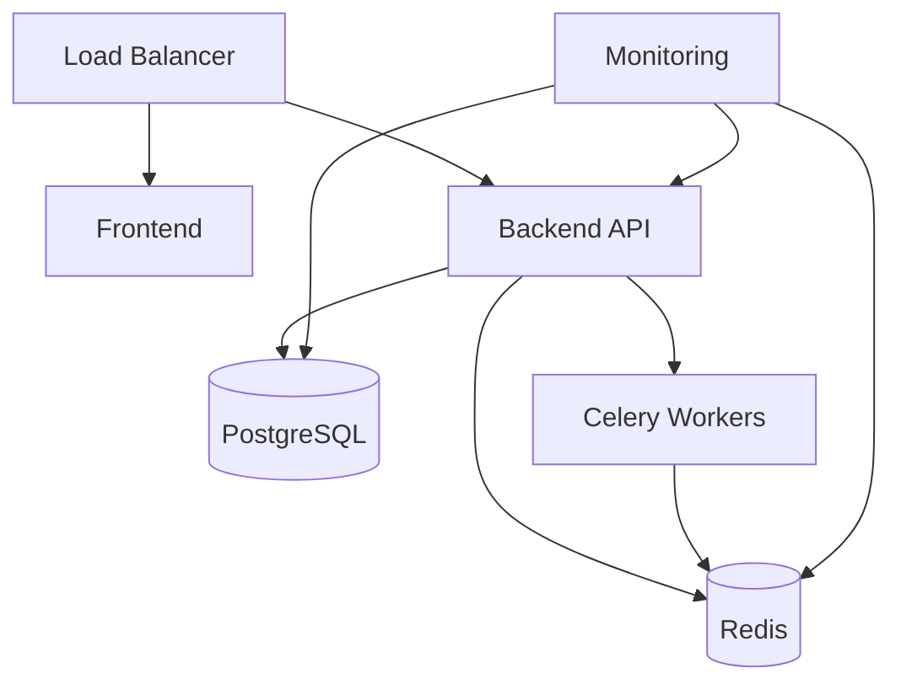

# Deployment Guide

This document outlines deployment strategies and procedures for the AI Hardware Co-Design Playground platform.

## Overview

The platform supports multiple deployment strategies based on environment needs:

- **Development**: Local development with hot-reload
- **Staging**: Pre-production testing environment
- **Production**: Scalable production deployment
- **Research**: High-performance computing clusters

## Quick Start

### Local Development
```bash
# Start all services with hot-reload
docker-compose -f docker-compose.dev.yml up --build

# Access services
# Frontend: http://localhost:3000
# Backend API: http://localhost:8000
# Jupyter: http://localhost:8888
# Grafana: http://localhost:3001
```

### Production Deployment
```bash
# Deploy with production configuration
docker-compose -f docker-compose.yml up -d --build

# Verify deployment
./scripts/health-check.sh
```

## Architecture Overview



## Environment Configuration

### Required Environment Variables

| Variable | Description | Default | Required |
|----------|-------------|---------|----------|
| `DATABASE_URL` | PostgreSQL connection string | - | Yes |
| `REDIS_URL` | Redis connection string | - | Yes |
| `SECRET_KEY` | Application secret key | - | Yes |
| `ENVIRONMENT` | Deployment environment | development | No |
| `DEBUG` | Enable debug mode | false | No |
| `CORS_ORIGINS` | Allowed CORS origins | * | No |

### Hardware-Specific Variables

| Variable | Description | Default | Required |
|----------|-------------|---------|----------|
| `VERILATOR_ROOT` | Verilator installation path | /usr/local | No |
| `VIVADO_PATH` | Xilinx Vivado installation path | - | No |
| `TVM_HOME` | TVM installation path | - | No |
| `MLIR_HOME` | MLIR installation path | - | No |

## Deployment Strategies

### 1. Container Orchestration (Recommended)

#### Docker Compose
```yaml
# Production docker-compose.yml
version: '3.8'

services:
  frontend:
    build:
      context: .
      dockerfile: Dockerfile
      target: frontend-prod
    ports:
      - "3000:3000"
    environment:
      - NODE_ENV=production

  backend:
    build:
      context: .
      dockerfile: Dockerfile
      target: backend-prod
    ports:
      - "8000:8000"
    environment:
      - DATABASE_URL=${DATABASE_URL}
      - REDIS_URL=${REDIS_URL}
      - SECRET_KEY=${SECRET_KEY}
    depends_on:
      - postgres
      - redis

  postgres:
    image: postgres:15
    environment:
      - POSTGRES_DB=codesign_db
      - POSTGRES_USER=codesign
      - POSTGRES_PASSWORD=${DB_PASSWORD}
    volumes:
      - postgres_data:/var/lib/postgresql/data

  redis:
    image: redis:7
    volumes:
      - redis_data:/data

volumes:
  postgres_data:
  redis_data:
```

#### Kubernetes
```yaml
# k8s/deployment.yaml
apiVersion: apps/v1
kind: Deployment
metadata:
  name: codesign-backend
spec:
  replicas: 3
  selector:
    matchLabels:
      app: codesign-backend
  template:
    metadata:
      labels:
        app: codesign-backend
    spec:
      containers:
      - name: backend
        image: ghcr.io/terragon-labs/ai-hardware-codesign-playground:latest
        ports:
        - containerPort: 8000
        env:
        - name: DATABASE_URL
          valueFrom:
            secretKeyRef:
              name: codesign-secrets
              key: database-url
        resources:
          requests:
            memory: "512Mi"
            cpu: "250m"
          limits:
            memory: "1Gi"
            cpu: "500m"
```

### 2. Cloud Platforms

#### AWS Deployment
```bash
# Using AWS ECS with Fargate
aws ecs create-cluster --cluster-name codesign-cluster

# Deploy service
aws ecs create-service \
  --cluster codesign-cluster \
  --service-name codesign-service \
  --task-definition codesign-task:1 \
  --desired-count 2 \
  --launch-type FARGATE
```

#### Google Cloud Run
```bash
# Build and deploy to Cloud Run
gcloud builds submit --tag gcr.io/PROJECT-ID/codesign-playground
gcloud run deploy --image gcr.io/PROJECT-ID/codesign-playground \
  --platform managed \
  --region us-central1 \
  --allow-unauthenticated
```

#### Azure Container Instances
```bash
# Deploy to ACI
az container create \
  --resource-group codesign-rg \
  --name codesign-app \
  --image ghcr.io/terragon-labs/ai-hardware-codesign-playground:latest \
  --ports 8000 \
  --environment-variables DATABASE_URL=$DATABASE_URL
```

### 3. High-Performance Computing

#### Slurm Cluster
```bash
#!/bin/bash
#SBATCH --job-name=codesign-playground
#SBATCH --nodes=4
#SBATCH --ntasks-per-node=8
#SBATCH --time=24:00:00
#SBATCH --partition=gpu

module load singularity
singularity run --nv codesign-playground.sif
```

## Monitoring and Observability

### Health Checks
```python
# Health check endpoints
GET /health          # Basic health check
GET /health/db       # Database connectivity
GET /health/redis    # Redis connectivity
GET /health/workers  # Celery worker status
GET /health/storage  # File system health
```

### Metrics Collection
```yaml
# Prometheus configuration
scrape_configs:
  - job_name: 'codesign-backend'
    static_configs:
      - targets: ['backend:8000']
    metrics_path: '/metrics'
    scrape_interval: 15s

  - job_name: 'postgres'
    static_configs:
      - targets: ['postgres:5432']
```

### Logging
```python
# Structured logging configuration
import logging
import structlog

logging.basicConfig(
    format="%(message)s",
    stream=sys.stdout,
    level=logging.INFO,
)

structlog.configure(
    processors=[
        structlog.stdlib.filter_by_level,
        structlog.stdlib.add_logger_name,
        structlog.stdlib.add_log_level,
        structlog.processors.JSONRenderer()
    ],
    wrapper_class=structlog.stdlib.BoundLogger,
    logger_factory=structlog.stdlib.LoggerFactory(),
    cache_logger_on_first_use=True,
)
```

## Security Considerations

### SSL/TLS Configuration
```nginx
# Nginx SSL configuration
server {
    listen 443 ssl http2;
    server_name codesign.terragon-labs.com;

    ssl_certificate /etc/ssl/certs/codesign.crt;
    ssl_certificate_key /etc/ssl/private/codesign.key;
    ssl_protocols TLSv1.2 TLSv1.3;
    ssl_ciphers HIGH:!aNULL:!MD5;

    location / {
        proxy_pass http://backend:8000;
        proxy_set_header Host $host;
        proxy_set_header X-Real-IP $remote_addr;
        proxy_set_header X-Forwarded-For $proxy_add_x_forwarded_for;
        proxy_set_header X-Forwarded-Proto $scheme;
    }
}
```

### Secret Management
```bash
# Using HashiCorp Vault
vault kv put secret/codesign \
  database_url="postgresql://user:pass@db:5432/codesign" \
  secret_key="your-secret-key" \
  redis_url="redis://redis:6379/0"

# Using AWS Systems Manager
aws ssm put-parameter \
  --name "/codesign/database-url" \
  --value "postgresql://user:pass@db:5432/codesign" \
  --type "SecureString"
```

## Performance Optimization

### Database Optimization
```sql
-- Recommended PostgreSQL settings
shared_buffers = 256MB
effective_cache_size = 1GB
maintenance_work_mem = 64MB
checkpoint_completion_target = 0.9
wal_buffers = 16MB
default_statistics_target = 100
random_page_cost = 1.1
```

### Caching Strategy
```python
# Redis caching configuration
CACHES = {
    'default': {
        'BACKEND': 'redis_cache.RedisCache',
        'LOCATION': 'redis://redis:6379/1',
        'OPTIONS': {
            'CLIENT_CLASS': 'redis_cache.client.DefaultClient',
            'CONNECTION_POOL_KWARGS': {
                'max_connections': 50,
                'retry_on_timeout': True,
            }
        }
    }
}
```

### Load Balancing
```yaml
# HAProxy configuration
backend codesign_backend
    balance roundrobin
    option httpchk GET /health
    server backend1 backend1:8000 check
    server backend2 backend2:8000 check
    server backend3 backend3:8000 check
```

## Disaster Recovery

### Backup Strategy
```bash
#!/bin/bash
# Database backup script
pg_dump $DATABASE_URL | gzip > "backup-$(date +%Y%m%d-%H%M%S).sql.gz"

# Upload to S3
aws s3 cp backup-*.sql.gz s3://codesign-backups/database/

# Redis backup
redis-cli --rdb backup.rdb
aws s3 cp backup.rdb s3://codesign-backups/redis/
```

### Recovery Procedures
```bash
# Database recovery
gunzip -c backup-20231215-120000.sql.gz | psql $DATABASE_URL

# Redis recovery
redis-cli --rdb < backup.rdb
```

## Troubleshooting

### Common Issues

#### Database Connection Issues
```bash
# Check database connectivity
pg_isready -h postgres -p 5432 -U codesign

# View connection logs
docker logs codesign-postgres
```

#### Memory Issues
```bash
# Monitor memory usage
docker stats codesign-backend

# Check for memory leaks
valgrind --tool=massif python -m codesign_playground.main
```

#### Performance Issues
```bash
# Profile application
py-spy top --pid $(pgrep -f "codesign_playground")

# Database query analysis
EXPLAIN ANALYZE SELECT * FROM models WHERE created_at > NOW() - INTERVAL '1 day';
```

### Support Channels
- **GitHub Issues**: Technical issues and bug reports
- **Discord**: Community support and discussions
- **Email**: codesign-support@terragon-labs.com
- **Documentation**: https://docs.terragon-labs.com/codesign

## Release Management

### Deployment Pipeline
1. **Build**: Automated builds on push to main
2. **Test**: Comprehensive test suite execution
3. **Security**: Security scanning and compliance checks
4. **Deploy**: Automated deployment to staging
5. **Validation**: Smoke tests and health checks
6. **Production**: Manual approval and production deployment

### Rollback Procedures
```bash
# Quick rollback using Docker
docker-compose down
docker-compose up -d --scale backend=0
docker tag codesign-backend:previous codesign-backend:latest
docker-compose up -d

# Database rollback
pg_restore --clean --dbname=$DATABASE_URL backup-previous.sql
```