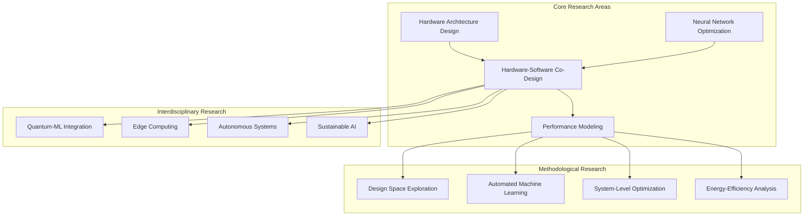

# AI Hardware Co-Design Playground - Research & Academic Guide

## Table of Contents

1. [Research Overview](#research-overview)
2. [Academic Applications](#academic-applications)
3. [Research Methodology](#research-methodology)
4. [Experimental Design](#experimental-design)
5. [Statistical Validation](#statistical-validation)
6. [Publication Guidelines](#publication-guidelines)
7. [Reproducible Research](#reproducible-research)
8. [Benchmarking Protocols](#benchmarking-protocols)
9. [Dataset Management](#dataset-management)
10. [Collaboration Framework](#collaboration-framework)
11. [Citation Guidelines](#citation-guidelines)
12. [Educational Resources](#educational-resources)

## Research Overview

The AI Hardware Co-Design Playground serves as a comprehensive research platform for investigating the intersection of artificial intelligence, computer architecture, and electronic design automation. This guide provides researchers and academics with the methodologies, tools, and best practices for conducting rigorous scientific investigations.

### Research Domains



### Research Capabilities

**Accelerator Architecture Research:**
- Custom systolic array design and optimization
- Vector processor architecture exploration
- Dataflow analysis and optimization
- Memory hierarchy design
- Interconnect topology investigation

**Neural Network Co-Design:**
- Hardware-aware neural architecture search
- Quantization and pruning co-optimization
- Operator fusion strategies
- Mapping optimization algorithms
- Performance-accuracy trade-off analysis

**System-Level Research:**
- End-to-end design space exploration
- Multi-objective optimization
- Pareto frontier analysis
- Workload characterization
- Power-performance modeling

## Academic Applications

### Course Integration

#### Undergraduate Courses

**Computer Architecture (CS/EE 3xx):**
```python
# Lab Exercise: Design Simple Accelerator
from codesign_playground import AcceleratorDesigner

def architecture_lab():
    """Undergraduate lab: Basic accelerator design."""
    # Students design accelerators for different workloads
    designer = AcceleratorDesigner()
    
    # Exercise 1: Matrix multiplication accelerator
    matrix_workload = load_matrix_workload()
    accelerator = designer.design(
        compute_units=16,
        dataflow="systolic_array",
        memory_hierarchy=["sram_32kb", "dram"]
    )
    
    # Analyze performance vs. area trade-offs
    performance = accelerator.estimate_performance(matrix_workload)
    area = accelerator.estimate_area()
    
    return performance, area

# Grading rubric based on design efficiency
def grade_design(performance, area, power):
    efficiency_score = performance / (area * power)
    return min(100, efficiency_score * 10)
```

**Machine Learning Systems (CS 4xx):**
```python
# Lab Exercise: Neural Network Acceleration
from codesign_playground import ModelOptimizer, QuantizationCoDesign

def ml_systems_lab():
    """ML Systems lab: Hardware-aware optimization."""
    # Load student's trained model
    model = load_student_model()
    
    # Exercise 1: Quantization analysis
    quantizer = QuantizationCoDesign()
    quantized_model = quantizer.optimize(
        model=model,
        target_accuracy=0.95,
        hardware_constraints={"power_budget": 2.0}
    )
    
    # Exercise 2: Hardware mapping
    optimizer = ModelOptimizer()
    mapping = optimizer.find_optimal_mapping(
        model=quantized_model,
        hardware_template="systolic_array"
    )
    
    return quantized_model, mapping
```

#### Graduate Courses

**Advanced Computer Architecture (CS/EE 6xx):**
```python
# Research Project: Novel Dataflow Investigation
class NovelDataflowResearch:
    """Graduate research project template."""
    
    def __init__(self):
        self.designer = AcceleratorDesigner()
        self.evaluator = PerformanceEvaluator()
    
    def investigate_custom_dataflow(self):
        """Research novel dataflow patterns."""
        # Define custom dataflow
        custom_dataflow = self.define_custom_dataflow()
        
        # Implement in simulator
        simulator = self.create_dataflow_simulator(custom_dataflow)
        
        # Benchmark against existing dataflows
        baselines = ["weight_stationary", "output_stationary", "row_stationary"]
        results = self.compare_dataflows(custom_dataflow, baselines)
        
        # Statistical analysis
        significance = self.statistical_analysis(results)
        
        return results, significance
    
    def publication_ready_analysis(self):
        """Generate publication-ready results."""
        # Comprehensive evaluation
        results = self.run_comprehensive_evaluation()
        
        # Statistical validation
        stats = self.validate_results(results)
        
        # Generate figures and tables
        figures = self.generate_publication_figures(results)
        
        return results, stats, figures
```

**Deep Learning Hardware (CS/EE 7xx):**
```python
# PhD Research: Automated Co-Design Framework
class AutomatedCoDesignFramework:
    """PhD-level research framework."""
    
    def __init__(self):
        self.codesign_engine = CoDesignEngine()
        self.search_algorithm = EvolutionarySearch()
        
    def research_automated_codesign(self):
        """Investigate automated co-design methodologies."""
        # Define search space
        search_space = self.define_joint_search_space()
        
        # Implement novel search algorithm
        optimizer = self.implement_novel_optimizer()
        
        # Large-scale evaluation
        results = self.large_scale_evaluation(
            models=self.get_benchmark_models(),
            search_iterations=10000,
            evaluation_metrics=["latency", "power", "area", "accuracy"]
        )
        
        # Theoretical analysis
        theory = self.theoretical_analysis(optimizer)
        
        return results, theory
```

### Research Project Templates

#### Undergraduate Research Projects

**Project 1: Energy-Efficient Accelerator Design**
```python
class EnergyEfficiencyProject:
    """Undergraduate research project on energy efficiency."""
    
    def __init__(self):
        self.power_analyzer = PowerAnalyzer()
        self.design_explorer = DesignSpaceExplorer()
    
    def research_question(self):
        """How does accelerator architecture affect energy efficiency?"""
        return "Investigate the relationship between hardware design choices and energy consumption in AI accelerators."
    
    def methodology(self):
        """Research methodology."""
        return {
            "models": ["CNN", "RNN", "Transformer"],
            "architectures": ["Systolic Array", "Vector Processor", "Dataflow"],
            "metrics": ["Energy per Inference", "Performance per Watt"],
            "statistical_tests": ["ANOVA", "Regression Analysis"]
        }
    
    def expected_outcomes(self):
        """Expected research outcomes."""
        return [
            "Energy efficiency characterization across architectures",
            "Design guidelines for low-power accelerators",
            "Trade-off analysis between performance and energy",
            "Undergraduate thesis or conference paper"
        ]
```

**Project 2: Quantization Impact Analysis**
```python
class QuantizationImpactProject:
    """Research project on quantization effects."""
    
    def research_scope(self):
        """Define research scope and objectives."""
        return {
            "objective": "Analyze impact of quantization on hardware complexity and model accuracy",
            "variables": {
                "independent": ["bit_width", "quantization_method", "layer_type"],
                "dependent": ["accuracy_degradation", "hardware_area", "power_consumption"]
            },
            "hypothesis": "Lower bit-width quantization reduces hardware complexity but impacts accuracy non-linearly"
        }
    
    def experimental_design(self):
        """Design controlled experiments."""
        experiments = []
        
        for model in ["ResNet50", "BERT", "MobileNet"]:
            for bit_width in [2, 4, 8, 16]:
                for method in ["uniform", "non_uniform", "mixed_precision"]:
                    experiment = {
                        "model": model,
                        "quantization": {"bits": bit_width, "method": method},
                        "replications": 10,
                        "metrics": ["accuracy", "area", "power", "latency"]
                    }
                    experiments.append(experiment)
        
        return experiments
```

#### Graduate Research Projects

**Project 1: Multi-Objective Co-Design Optimization**
```python
class MultiObjectiveCoDesignResearch:
    """Graduate research on multi-objective optimization."""
    
    def __init__(self):
        self.problem_formulation = self.formulate_research_problem()
        self.algorithm_development = self.develop_novel_algorithm()
        
    def formulate_research_problem(self):
        """Formulate multi-objective optimization problem."""
        return {
            "objectives": [
                "minimize_latency",
                "minimize_power",
                "minimize_area",
                "maximize_accuracy"
            ],
            "constraints": [
                "hardware_resources",
                "memory_bandwidth",
                "thermal_limits"
            ],
            "variables": {
                "model_variables": ["architecture", "quantization", "pruning"],
                "hardware_variables": ["compute_units", "memory_hierarchy", "dataflow"]
            }
        }
    
    def develop_novel_algorithm(self):
        """Develop novel optimization algorithm."""
        class AdaptiveCoDesignOptimizer:
            """Novel optimization algorithm for co-design."""
            
            def __init__(self):
                self.population_size = 100
                self.generations = 500
                self.adaptation_rate = 0.1
            
            def optimize(self, problem_definition):
                """Main optimization loop."""
                # Initialize population
                population = self.initialize_population(problem_definition)
                
                # Evolutionary loop with adaptation
                for generation in range(self.generations):
                    # Evaluate population
                    fitness = self.evaluate_population(population)
                    
                    # Adaptive selection and crossover
                    parents = self.adaptive_selection(population, fitness)
                    offspring = self.adaptive_crossover(parents)
                    
                    # Mutation with learning
                    offspring = self.adaptive_mutation(offspring, generation)
                    
                    # Environmental selection
                    population = self.environmental_selection(
                        population + offspring, problem_definition
                    )
                
                return self.extract_pareto_front(population)
        
        return AdaptiveCoDesignOptimizer()
    
    def theoretical_analysis(self):
        """Theoretical convergence analysis."""
        return {
            "convergence_proof": "Proof of convergence to Pareto-optimal solutions",
            "complexity_analysis": "Time and space complexity analysis",
            "stability_analysis": "Algorithm stability under different conditions"
        }
```

**Project 2: Hardware-Aware Neural Architecture Search**
```python
class HardwareAwareNASResearch:
    """PhD research on hardware-aware NAS."""
    
    def __init__(self):
        self.search_space_design = self.design_search_space()
        self.predictor_development = self.develop_latency_predictor()
        self.search_algorithm = self.design_search_algorithm()
    
    def design_search_space(self):
        """Design comprehensive search space."""
        return {
            "macro_search_space": {
                "depth": [8, 12, 16, 20, 24],
                "width_multiplier": [0.5, 0.75, 1.0, 1.25, 1.5],
                "resolution": [224, 256, 288, 320, 384]
            },
            "micro_search_space": {
                "operations": ["conv3x3", "conv5x5", "dw_conv", "mb_conv", "attention"],
                "activation": ["relu", "swish", "gelu", "mish"],
                "normalization": ["batch_norm", "layer_norm", "group_norm"]
            },
            "quantization_space": {
                "bit_width": [2, 4, 8, 16],
                "quantization_method": ["uniform", "non_uniform", "mixed_precision"]
            }
        }
    
    def develop_latency_predictor(self):
        """Develop accurate latency prediction model."""
        class LatencyPredictor:
            """Neural latency predictor for hardware-aware NAS."""
            
            def __init__(self):
                self.feature_extractor = self.build_feature_extractor()
                self.predictor_model = self.build_predictor_model()
            
            def build_feature_extractor(self):
                """Extract features from neural network architecture."""
                return {
                    "graph_features": ["nodes", "edges", "depth", "width"],
                    "operation_features": ["flops", "params", "memory"],
                    "hardware_features": ["compute_units", "memory_bw", "frequency"]
                }
            
            def train_predictor(self, training_data):
                """Train latency predictor with measured data."""
                # Implement training procedure
                pass
            
            def predict_latency(self, architecture, hardware_config):
                """Predict latency for given architecture and hardware."""
                features = self.extract_features(architecture, hardware_config)
                return self.predictor_model.predict(features)
        
        return LatencyPredictor()
```

## Research Methodology

### Experimental Design Principles

#### Controlled Experiments

```python
class ExperimentalDesign:
    """Framework for rigorous experimental design."""
    
    def __init__(self):
        self.design_principles = {
            "randomization": True,
            "replication": True,
            "blocking": True,
            "control_groups": True
        }
    
    def design_factorial_experiment(self, factors, levels):
        """Design factorial experiment."""
        from itertools import product
        
        # Generate all factor combinations
        combinations = list(product(*[levels[f] for f in factors]))
        
        # Add replication
        experiments = []
        for combo in combinations:
            for replication in range(self.num_replications):
                experiment = {
                    "factors": dict(zip(factors, combo)),
                    "replication": replication,
                    "randomization_order": self.generate_random_order()
                }
                experiments.append(experiment)
        
        return experiments
    
    def design_response_surface_method(self, factors, center_point, alpha):
        """Design response surface methodology experiment."""
        import numpy as np
        
        # Central composite design
        num_factors = len(factors)
        
        # Factorial points
        factorial_points = self.generate_factorial_points(num_factors)
        
        # Axial points
        axial_points = self.generate_axial_points(num_factors, alpha)
        
        # Center points
        center_points = [center_point] * self.num_center_points
        
        design_matrix = factorial_points + axial_points + center_points
        return design_matrix
    
    def power_analysis(self, effect_size, alpha=0.05, power=0.8):
        """Calculate required sample size."""
        from scipy import stats
        
        # Calculate required sample size for given power
        sample_size = stats.ttest_power(
            effect_size=effect_size,
            power=power,
            alpha=alpha
        )
        
        return sample_size
```

#### Randomized Controlled Trials

```python
class RandomizedControlledTrial:
    """Framework for RCT in hardware design research."""
    
    def __init__(self, treatment_groups, control_group):
        self.treatment_groups = treatment_groups
        self.control_group = control_group
        self.randomization_seed = 42
    
    def randomize_subjects(self, subjects):
        """Randomize subjects to treatment groups."""
        import random
        random.seed(self.randomization_seed)
        
        # Stratified randomization
        strata = self.create_strata(subjects)
        randomized_assignment = {}
        
        for stratum, stratum_subjects in strata.items():
            # Shuffle subjects within stratum
            random.shuffle(stratum_subjects)
            
            # Assign to groups
            groups = self.treatment_groups + [self.control_group]
            group_size = len(stratum_subjects) // len(groups)
            
            for i, subject in enumerate(stratum_subjects):
                group_index = i // group_size
                if group_index >= len(groups):
                    group_index = len(groups) - 1
                
                randomized_assignment[subject] = groups[group_index]
        
        return randomized_assignment
    
    def analyze_treatment_effects(self, results):
        """Analyze treatment effects with statistical rigor."""
        from scipy import stats
        import numpy as np
        
        # ANOVA for multiple treatment groups
        treatment_results = [results[group] for group in self.treatment_groups]
        control_results = results[self.control_group]
        
        # F-test for overall treatment effect
        f_stat, p_value = stats.f_oneway(*treatment_results, control_results)
        
        # Post-hoc analysis
        pairwise_comparisons = self.pairwise_comparisons(results)
        
        # Effect size calculation
        effect_sizes = self.calculate_effect_sizes(results)
        
        return {
            "overall_effect": {"f_stat": f_stat, "p_value": p_value},
            "pairwise_comparisons": pairwise_comparisons,
            "effect_sizes": effect_sizes
        }
```

### Data Collection Protocols

#### Performance Measurement

```python
class PerformanceMeasurement:
    """Standardized performance measurement protocols."""
    
    def __init__(self):
        self.measurement_protocols = {
            "latency": self.measure_latency,
            "throughput": self.measure_throughput,
            "power": self.measure_power,
            "area": self.estimate_area,
            "accuracy": self.measure_accuracy
        }
    
    def measure_latency(self, design, workload, num_runs=100):
        """Measure latency with statistical rigor."""
        import time
        import numpy as np
        
        latencies = []
        
        # Warm-up runs
        for _ in range(10):
            design.run(workload)
        
        # Measurement runs
        for run in range(num_runs):
            start_time = time.perf_counter()
            result = design.run(workload)
            end_time = time.perf_counter()
            
            latencies.append(end_time - start_time)
        
        # Statistical analysis
        statistics = {
            "mean": np.mean(latencies),
            "std": np.std(latencies),
            "median": np.median(latencies),
            "min": np.min(latencies),
            "max": np.max(latencies),
            "confidence_interval": self.confidence_interval(latencies)
        }
        
        return statistics
    
    def measure_power(self, design, workload, sampling_rate=1000):
        """Measure power consumption."""
        power_samples = []
        
        # Start power monitoring
        power_monitor = self.start_power_monitoring(sampling_rate)
        
        try:
            # Run workload
            result = design.run(workload)
            
            # Stop monitoring
            power_samples = power_monitor.stop()
            
        except Exception as e:
            power_monitor.stop()
            raise e
        
        # Calculate power statistics
        power_stats = {
            "average_power": np.mean(power_samples),
            "peak_power": np.max(power_samples),
            "energy": np.sum(power_samples) / sampling_rate,
            "power_profile": power_samples
        }
        
        return power_stats
```

#### Quality Assurance

```python
class QualityAssurance:
    """Quality assurance for research data."""
    
    def __init__(self):
        self.validation_checks = [
            self.check_data_integrity,
            self.check_measurement_validity,
            self.check_statistical_assumptions,
            self.check_reproducibility
        ]
    
    def validate_experimental_data(self, data):
        """Comprehensive data validation."""
        validation_results = {}
        
        for check in self.validation_checks:
            check_name = check.__name__
            validation_results[check_name] = check(data)
        
        # Overall validity assessment
        overall_validity = all(validation_results.values())
        
        return {
            "valid": overall_validity,
            "checks": validation_results,
            "recommendations": self.generate_recommendations(validation_results)
        }
    
    def check_data_integrity(self, data):
        """Check data integrity and completeness."""
        integrity_checks = {
            "no_missing_values": not data.isnull().any().any(),
            "no_duplicate_measurements": not data.duplicated().any(),
            "values_in_valid_range": self.check_value_ranges(data),
            "consistent_data_types": self.check_data_types(data)
        }
        
        return all(integrity_checks.values())
    
    def check_statistical_assumptions(self, data):
        """Check statistical assumptions for planned analyses."""
        from scipy import stats
        
        assumptions = {}
        
        # Normality test
        for column in data.select_dtypes(include=[np.number]).columns:
            statistic, p_value = stats.shapiro(data[column])
            assumptions[f"{column}_normality"] = p_value > 0.05
        
        # Homogeneity of variance
        groups = data.groupby('treatment_group')
        group_variances = [group[1]['response'].var() for group in groups]
        assumptions["homogeneity_of_variance"] = self.levene_test(group_variances)
        
        # Independence assumption
        assumptions["independence"] = self.check_independence(data)
        
        return assumptions
```

## Statistical Validation

### Hypothesis Testing

```python
class HypothesisTestingFramework:
    """Framework for rigorous hypothesis testing."""
    
    def __init__(self, alpha=0.05):
        self.alpha = alpha
        self.multiple_testing_correction = "bonferroni"
    
    def formulate_hypotheses(self, research_question):
        """Formulate null and alternative hypotheses."""
        hypotheses = {
            "null_hypothesis": "H0: No significant difference between treatments",
            "alternative_hypothesis": "H1: Significant difference exists between treatments",
            "alpha_level": self.alpha,
            "statistical_power": 0.8,
            "effect_size": "medium"
        }
        
        return hypotheses
    
    def conduct_statistical_tests(self, data, test_type="parametric"):
        """Conduct appropriate statistical tests."""
        from scipy import stats
        import numpy as np
        
        if test_type == "parametric":
            # ANOVA for multiple groups
            groups = [group['response'].values for name, group in data.groupby('treatment')]
            f_statistic, p_value = stats.f_oneway(*groups)
            
            test_results = {
                "test_type": "One-way ANOVA",
                "f_statistic": f_statistic,
                "p_value": p_value,
                "significant": p_value < self.alpha,
                "effect_size": self.calculate_eta_squared(data)
            }
            
        elif test_type == "non_parametric":
            # Kruskal-Wallis test
            groups = [group['response'].values for name, group in data.groupby('treatment')]
            h_statistic, p_value = stats.kruskal(*groups)
            
            test_results = {
                "test_type": "Kruskal-Wallis",
                "h_statistic": h_statistic,
                "p_value": p_value,
                "significant": p_value < self.alpha,
                "effect_size": self.calculate_eta_squared_nonparametric(data)
            }
        
        # Multiple testing correction
        corrected_results = self.apply_multiple_testing_correction(test_results)
        
        return corrected_results
    
    def post_hoc_analysis(self, data, significant_result):
        """Conduct post-hoc analysis for significant results."""
        if not significant_result:
            return {"message": "No post-hoc analysis needed - main effect not significant"}
        
        # Tukey's HSD for pairwise comparisons
        from scipy.stats import tukey_hsd
        
        groups = [group['response'].values for name, group in data.groupby('treatment')]
        group_names = list(data.groupby('treatment').groups.keys())
        
        tukey_result = tukey_hsd(*groups)
        
        pairwise_comparisons = {}
        for i in range(len(group_names)):
            for j in range(i+1, len(group_names)):
                comparison_name = f"{group_names[i]}_vs_{group_names[j]}"
                pairwise_comparisons[comparison_name] = {
                    "p_value": tukey_result.pvalue[i, j],
                    "significant": tukey_result.pvalue[i, j] < self.alpha,
                    "confidence_interval": tukey_result.confidence_interval(i, j)
                }
        
        return pairwise_comparisons
```

### Effect Size Analysis

```python
class EffectSizeAnalysis:
    """Calculate and interpret effect sizes."""
    
    def __init__(self):
        self.effect_size_interpretations = {
            "cohen_d": {"small": 0.2, "medium": 0.5, "large": 0.8},
            "eta_squared": {"small": 0.01, "medium": 0.06, "large": 0.14},
            "r_squared": {"small": 0.01, "medium": 0.09, "large": 0.25}
        }
    
    def calculate_cohens_d(self, group1, group2):
        """Calculate Cohen's d for two groups."""
        import numpy as np
        
        mean1, mean2 = np.mean(group1), np.mean(group2)
        std1, std2 = np.std(group1, ddof=1), np.std(group2, ddof=1)
        n1, n2 = len(group1), len(group2)
        
        # Pooled standard deviation
        pooled_std = np.sqrt(((n1-1)*std1**2 + (n2-1)*std2**2) / (n1+n2-2))
        
        cohens_d = (mean1 - mean2) / pooled_std
        
        # Interpret effect size
        interpretation = self.interpret_effect_size(abs(cohens_d), "cohen_d")
        
        return {
            "cohens_d": cohens_d,
            "interpretation": interpretation,
            "magnitude": abs(cohens_d)
        }
    
    def calculate_eta_squared(self, anova_results):
        """Calculate eta-squared from ANOVA results."""
        ss_between = anova_results["sum_squares_between"]
        ss_total = anova_results["sum_squares_total"]
        
        eta_squared = ss_between / ss_total
        interpretation = self.interpret_effect_size(eta_squared, "eta_squared")
        
        return {
            "eta_squared": eta_squared,
            "interpretation": interpretation
        }
    
    def practical_significance_analysis(self, statistical_results, domain_knowledge):
        """Assess practical significance beyond statistical significance."""
        practical_significance = {}
        
        for result_name, result in statistical_results.items():
            effect_size = result.get("effect_size", 0)
            
            # Domain-specific thresholds
            practical_threshold = domain_knowledge.get(f"{result_name}_threshold", 0.1)
            
            practical_significance[result_name] = {
                "statistically_significant": result.get("significant", False),
                "practically_significant": effect_size > practical_threshold,
                "effect_size": effect_size,
                "practical_threshold": practical_threshold,
                "recommendation": self.generate_practical_recommendation(
                    result.get("significant", False), 
                    effect_size > practical_threshold
                )
            }
        
        return practical_significance
```

### Confidence Intervals

```python
class ConfidenceIntervalAnalysis:
    """Calculate and interpret confidence intervals."""
    
    def __init__(self, confidence_level=0.95):
        self.confidence_level = confidence_level
        self.alpha = 1 - confidence_level
    
    def bootstrap_confidence_interval(self, data, statistic_function, n_bootstrap=10000):
        """Calculate bootstrap confidence interval."""
        import numpy as np
        
        bootstrap_statistics = []
        n_samples = len(data)
        
        for _ in range(n_bootstrap):
            # Bootstrap sample
            bootstrap_sample = np.random.choice(data, size=n_samples, replace=True)
            
            # Calculate statistic
            bootstrap_statistic = statistic_function(bootstrap_sample)
            bootstrap_statistics.append(bootstrap_statistic)
        
        # Calculate confidence interval
        lower_percentile = (self.alpha / 2) * 100
        upper_percentile = (1 - self.alpha / 2) * 100
        
        ci_lower = np.percentile(bootstrap_statistics, lower_percentile)
        ci_upper = np.percentile(bootstrap_statistics, upper_percentile)
        
        return {
            "confidence_interval": (ci_lower, ci_upper),
            "confidence_level": self.confidence_level,
            "bootstrap_distribution": bootstrap_statistics,
            "interpretation": self.interpret_confidence_interval(ci_lower, ci_upper)
        }
    
    def parametric_confidence_interval(self, data, distribution="normal"):
        """Calculate parametric confidence interval."""
        from scipy import stats
        import numpy as np
        
        if distribution == "normal":
            mean = np.mean(data)
            sem = stats.sem(data)  # Standard error of mean
            h = sem * stats.t.ppf((1 + self.confidence_level) / 2, len(data) - 1)
            
            ci_lower = mean - h
            ci_upper = mean + h
            
        elif distribution == "exponential":
            # Confidence interval for exponential parameter
            lambda_mle = 1 / np.mean(data)
            ci_lower = lambda_mle * stats.chi2.ppf(self.alpha/2, 2*len(data)) / (2*len(data))
            ci_upper = lambda_mle * stats.chi2.ppf(1-self.alpha/2, 2*len(data)) / (2*len(data))
        
        return {
            "confidence_interval": (ci_lower, ci_upper),
            "confidence_level": self.confidence_level,
            "distribution": distribution
        }
```

## Publication Guidelines

### Academic Writing Standards

```python
class AcademicWritingFramework:
    """Framework for academic writing and publication."""
    
    def __init__(self):
        self.paper_structure = {
            "title": self.craft_compelling_title,
            "abstract": self.write_structured_abstract,
            "introduction": self.write_introduction,
            "related_work": self.review_related_work,
            "methodology": self.describe_methodology,
            "experiments": self.present_experiments,
            "results": self.present_results,
            "discussion": self.discuss_findings,
            "conclusion": self.conclude_paper,
            "references": self.manage_references
        }
    
    def craft_compelling_title(self, research_contribution):
        """Craft compelling and informative title."""
        title_guidelines = {
            "clarity": "Use clear, descriptive language",
            "specificity": "Be specific about the contribution",
            "keywords": "Include important keywords for searchability",
            "length": "Keep under 15 words if possible",
            "avoid": ["unnecessary words", "abbreviations", "jargon"]
        }
        
        # Template titles for different types of contributions
        title_templates = {
            "novel_algorithm": "{Algorithm Name}: A {Adjective} Approach to {Problem Domain}",
            "empirical_study": "An Empirical Analysis of {Phenomenon} in {Domain}",
            "system_design": "{System Name}: {Architecture Description} for {Application Domain}",
            "theoretical_contribution": "Theoretical Analysis of {Concept} in {Domain Context}"
        }
        
        return title_templates.get(research_contribution["type"], "").format(
            **research_contribution["details"]
        )
    
    def write_structured_abstract(self, paper_content):
        """Write structured abstract following standard format."""
        abstract_structure = {
            "background": {
                "content": paper_content["motivation"],
                "word_limit": 50
            },
            "objective": {
                "content": paper_content["research_question"],
                "word_limit": 30
            },
            "methods": {
                "content": paper_content["methodology_summary"],
                "word_limit": 80
            },
            "results": {
                "content": paper_content["key_findings"],
                "word_limit": 60
            },
            "conclusions": {
                "content": paper_content["main_conclusions"],
                "word_limit": 30
            }
        }
        
        # Total word limit: 250 words
        return self.compile_structured_abstract(abstract_structure)
    
    def present_results(self, experimental_results):
        """Present results with proper statistical reporting."""
        results_presentation = {
            "descriptive_statistics": self.report_descriptive_statistics(experimental_results),
            "inferential_statistics": self.report_inferential_statistics(experimental_results),
            "effect_sizes": self.report_effect_sizes(experimental_results),
            "confidence_intervals": self.report_confidence_intervals(experimental_results),
            "visualizations": self.create_publication_figures(experimental_results)
        }
        
        return results_presentation
    
    def report_statistical_results(self, test_results):
        """Report statistical results in APA format."""
        # Example: F(2, 97) = 3.45, p = .036, η² = .07
        if test_results["test_type"] == "ANOVA":
            df_between = test_results["df_between"]
            df_within = test_results["df_within"]
            f_statistic = test_results["f_statistic"]
            p_value = test_results["p_value"]
            eta_squared = test_results["eta_squared"]
            
            if p_value < 0.001:
                p_str = "p < .001"
            else:
                p_str = f"p = {p_value:.3f}"
            
            report = f"F({df_between}, {df_within}) = {f_statistic:.2f}, {p_str}, η² = {eta_squared:.2f}"
            
        return report
```

### Figure and Table Guidelines

```python
class PublicationVisualization:
    """Create publication-quality figures and tables."""
    
    def __init__(self):
        self.figure_standards = {
            "resolution": 300,  # DPI
            "format": "pdf",    # Vector format preferred
            "font_size": 10,    # Minimum readable size
            "color_scheme": "colorblind_friendly",
            "style": "scientific"
        }
    
    def create_performance_comparison_figure(self, results_data):
        """Create performance comparison figure."""
        import matplotlib.pyplot as plt
        import seaborn as sns
        import numpy as np
        
        # Set publication style
        plt.style.use('seaborn-v0_8-paper')
        sns.set_palette("colorblind")
        
        fig, axes = plt.subplots(2, 2, figsize=(10, 8))
        
        # Subplot 1: Latency comparison
        axes[0, 0].bar(results_data['architectures'], results_data['latency'])
        axes[0, 0].set_ylabel('Latency (ms)')
        axes[0, 0].set_title('A) Inference Latency')
        
        # Subplot 2: Power consumption
        axes[0, 1].bar(results_data['architectures'], results_data['power'])
        axes[0, 1].set_ylabel('Power (W)')
        axes[0, 1].set_title('B) Power Consumption')
        
        # Subplot 3: Area utilization
        axes[1, 0].bar(results_data['architectures'], results_data['area'])
        axes[1, 0].set_ylabel('Area (mm²)')
        axes[1, 0].set_title('C) Silicon Area')
        axes[1, 0].tick_params(axis='x', rotation=45)
        
        # Subplot 4: Efficiency scatter plot
        axes[1, 1].scatter(results_data['power'], results_data['performance'])
        axes[1, 1].set_xlabel('Power (W)')
        axes[1, 1].set_ylabel('Performance (TOPS)')
        axes[1, 1].set_title('D) Power-Performance Trade-off')
        
        # Add statistical annotations
        self.add_statistical_annotations(axes, results_data)
        
        plt.tight_layout()
        return fig
    
    def create_pareto_frontier_figure(self, optimization_results):
        """Create Pareto frontier visualization."""
        import matplotlib.pyplot as plt
        from mpl_toolkits.mplot3d import Axes3D
        
        fig = plt.figure(figsize=(12, 5))
        
        # 2D Pareto frontier
        ax1 = fig.add_subplot(121)
        pareto_points = optimization_results['pareto_optimal']
        dominated_points = optimization_results['dominated']
        
        ax1.scatter(dominated_points['latency'], dominated_points['power'], 
                   alpha=0.3, label='Dominated Solutions', color='gray')
        ax1.scatter(pareto_points['latency'], pareto_points['power'], 
                   alpha=0.8, label='Pareto Optimal', color='red', s=50)
        
        ax1.set_xlabel('Latency (ms)')
        ax1.set_ylabel('Power (W)')
        ax1.set_title('2D Pareto Frontier')
        ax1.legend()
        ax1.grid(True, alpha=0.3)
        
        # 3D Pareto frontier
        ax2 = fig.add_subplot(122, projection='3d')
        ax2.scatter(dominated_points['latency'], dominated_points['power'], 
                   dominated_points['area'], alpha=0.3, color='gray')
        ax2.scatter(pareto_points['latency'], pareto_points['power'], 
                   pareto_points['area'], alpha=0.8, color='red', s=50)
        
        ax2.set_xlabel('Latency (ms)')
        ax2.set_ylabel('Power (W)')
        ax2.set_zlabel('Area (mm²)')
        ax2.set_title('3D Pareto Frontier')
        
        return fig
    
    def create_statistical_summary_table(self, analysis_results):
        """Create statistical summary table."""
        import pandas as pd
        
        summary_data = []
        
        for architecture, results in analysis_results.items():
            row = {
                'Architecture': architecture,
                'Latency (ms)': f"{results['latency']['mean']:.2f} ± {results['latency']['std']:.2f}",
                'Power (W)': f"{results['power']['mean']:.2f} ± {results['power']['std']:.2f}",
                'Area (mm²)': f"{results['area']['mean']:.2f} ± {results['area']['std']:.2f}",
                'Efficiency (TOPS/W)': f"{results['efficiency']['mean']:.2f} ± {results['efficiency']['std']:.2f}",
                'p-value': f"{results['statistical_test']['p_value']:.3f}",
                'Effect Size': f"{results['effect_size']['cohens_d']:.2f}"
            }
            summary_data.append(row)
        
        summary_table = pd.DataFrame(summary_data)
        
        # Format table for publication
        formatted_table = self.format_publication_table(summary_table)
        
        return formatted_table
```

### Reproducibility Standards

```python
class ReproducibilityFramework:
    """Ensure research reproducibility and transparency."""
    
    def __init__(self):
        self.reproducibility_checklist = {
            "code_availability": "Make source code publicly available",
            "data_availability": "Provide access to datasets used",
            "environment_specification": "Document software dependencies",
            "random_seed_control": "Fix random seeds for reproducible results",
            "parameter_documentation": "Document all hyperparameters",
            "hardware_specification": "Specify hardware used for experiments",
            "statistical_methodology": "Document statistical procedures",
            "version_control": "Use version control for code and data"
        }
    
    def generate_reproducibility_package(self, research_project):
        """Generate complete reproducibility package."""
        package = {
            "README.md": self.create_reproduction_readme(research_project),
            "requirements.txt": self.extract_dependencies(research_project),
            "environment.yml": self.create_conda_environment(research_project),
            "Dockerfile": self.create_docker_environment(research_project),
            "scripts/": {
                "run_experiments.py": self.create_experiment_runner(research_project),
                "analyze_results.py": self.create_analysis_script(research_project),
                "generate_figures.py": self.create_figure_generator(research_project)
            },
            "data/": {
                "raw/": "Raw experimental data",
                "processed/": "Processed data",
                "metadata.json": self.create_data_metadata(research_project)
            },
            "config/": {
                "experiment_config.yaml": self.create_experiment_config(research_project),
                "model_configs/": "Model configuration files"
            }
        }
        
        return package
    
    def create_reproduction_readme(self, project):
        """Create comprehensive README for reproduction."""
        readme_content = f"""
# Reproduction Package: {project['title']}

## Abstract
{project['abstract']}

## Requirements
- Python {project['python_version']}
- CUDA {project['cuda_version']} (for GPU experiments)
- {project['memory_requirements']} RAM
- {project['storage_requirements']} storage

## Quick Start
```bash
# Clone repository
git clone {project['repository_url']}
cd {project['repository_name']}

# Set up environment
conda env create -f environment.yml
conda activate {project['environment_name']}

# Run experiments
python scripts/run_experiments.py --config config/experiment_config.yaml

# Generate results
python scripts/analyze_results.py
python scripts/generate_figures.py
```

## Detailed Instructions

### 1. Environment Setup
{self.generate_environment_instructions(project)}

### 2. Data Preparation
{self.generate_data_instructions(project)}

### 3. Running Experiments
{self.generate_experiment_instructions(project)}

### 4. Result Analysis
{self.generate_analysis_instructions(project)}

## Expected Results
{self.document_expected_results(project)}

## Hardware Requirements
{self.document_hardware_requirements(project)}

## Contact Information
{project['contact_info']}

## Citation
{project['citation']}
"""
        return readme_content
    
    def validate_reproducibility(self, reproduction_attempt):
        """Validate reproduction results."""
        validation_results = {}
        
        # Compare statistical results
        original_results = reproduction_attempt['original_results']
        reproduced_results = reproduction_attempt['reproduced_results']
        
        for metric in original_results.keys():
            validation_results[metric] = self.compare_metric_results(
                original_results[metric],
                reproduced_results[metric]
            )
        
        # Overall reproducibility score
        reproducibility_score = self.calculate_reproducibility_score(validation_results)
        
        return {
            "reproducible": reproducibility_score > 0.95,
            "score": reproducibility_score,
            "detailed_comparison": validation_results,
            "recommendations": self.generate_reproducibility_recommendations(validation_results)
        }
```

## Benchmarking Protocols

### Standard Benchmarks

```python
class BenchmarkingFramework:
    """Standardized benchmarking protocols for hardware design research."""
    
    def __init__(self):
        self.standard_benchmarks = {
            "image_classification": {
                "models": ["ResNet-50", "MobileNet-V2", "EfficientNet-B0"],
                "datasets": ["ImageNet", "CIFAR-10", "CIFAR-100"],
                "metrics": ["Top-1 Accuracy", "Top-5 Accuracy", "Latency", "Power"]
            },
            "natural_language": {
                "models": ["BERT-Base", "GPT-2", "T5-Small"],
                "datasets": ["GLUE", "SQuAD", "CoLA"],
                "metrics": ["BLEU Score", "Perplexity", "F1 Score", "Latency"]
            },
            "computer_vision": {
                "models": ["YOLO-v5", "Mask R-CNN", "DeepLab"],
                "datasets": ["COCO", "Pascal VOC", "Cityscapes"],
                "metrics": ["mAP", "IoU", "FPS", "Power Consumption"]
            }
        }
    
    def create_benchmark_suite(self, research_focus):
        """Create comprehensive benchmark suite."""
        benchmark_suite = BenchmarkSuite(research_focus)
        
        # Add standard benchmarks
        for benchmark_category in self.standard_benchmarks:
            if benchmark_category in research_focus["domains"]:
                benchmark_suite.add_category(
                    benchmark_category,
                    self.standard_benchmarks[benchmark_category]
                )
        
        # Add custom benchmarks
        if "custom_benchmarks" in research_focus:
            for custom_benchmark in research_focus["custom_benchmarks"]:
                benchmark_suite.add_custom_benchmark(custom_benchmark)
        
        return benchmark_suite
    
    def run_comprehensive_evaluation(self, designs, benchmark_suite):
        """Run comprehensive evaluation across all benchmarks."""
        evaluation_results = {}
        
        for design_name, design in designs.items():
            design_results = {}
            
            for benchmark_name, benchmark in benchmark_suite.benchmarks.items():
                print(f"Evaluating {design_name} on {benchmark_name}...")
                
                # Run benchmark
                benchmark_result = self.run_single_benchmark(design, benchmark)
                
                # Validate results
                validated_result = self.validate_benchmark_result(benchmark_result)
                
                design_results[benchmark_name] = validated_result
            
            evaluation_results[design_name] = design_results
        
        # Cross-benchmark analysis
        cross_analysis = self.cross_benchmark_analysis(evaluation_results)
        
        return {
            "individual_results": evaluation_results,
            "cross_analysis": cross_analysis,
            "summary_statistics": self.compute_summary_statistics(evaluation_results),
            "ranking": self.rank_designs(evaluation_results)
        }
```

### Performance Metrics

```python
class PerformanceMetrics:
    """Comprehensive performance metrics for hardware evaluation."""
    
    def __init__(self):
        self.metric_categories = {
            "throughput_metrics": {
                "operations_per_second": self.calculate_ops_per_second,
                "frames_per_second": self.calculate_fps,
                "tokens_per_second": self.calculate_tokens_per_second,
                "inferences_per_second": self.calculate_inferences_per_second
            },
            "latency_metrics": {
                "end_to_end_latency": self.measure_e2e_latency,
                "compute_latency": self.measure_compute_latency,
                "memory_latency": self.measure_memory_latency,
                "communication_latency": self.measure_comm_latency
            },
            "efficiency_metrics": {
                "energy_efficiency": self.calculate_energy_efficiency,
                "area_efficiency": self.calculate_area_efficiency,
                "cost_efficiency": self.calculate_cost_efficiency,
                "thermal_efficiency": self.calculate_thermal_efficiency
            },
            "quality_metrics": {
                "accuracy": self.measure_accuracy,
                "precision": self.measure_precision,
                "recall": self.measure_recall,
                "f1_score": self.measure_f1_score
            }
        }
    
    def calculate_comprehensive_metrics(self, design, workload, measurements):
        """Calculate comprehensive performance metrics."""
        metrics = {}
        
        for category, metric_functions in self.metric_categories.items():
            category_metrics = {}
            
            for metric_name, metric_function in metric_functions.items():
                try:
                    metric_value = metric_function(design, workload, measurements)
                    category_metrics[metric_name] = metric_value
                except Exception as e:
                    print(f"Failed to calculate {metric_name}: {e}")
                    category_metrics[metric_name] = None
            
            metrics[category] = category_metrics
        
        # Calculate composite metrics
        metrics["composite_metrics"] = self.calculate_composite_metrics(metrics)
        
        return metrics
    
    def calculate_energy_efficiency(self, design, workload, measurements):
        """Calculate energy efficiency (operations per joule)."""
        total_operations = measurements["total_operations"]
        total_energy = measurements["total_energy_joules"]
        
        if total_energy == 0:
            return float('inf')
        
        energy_efficiency = total_operations / total_energy
        
        # Add confidence interval
        energy_samples = measurements.get("energy_samples", [])
        if len(energy_samples) > 1:
            efficiency_samples = [total_operations / energy for energy in energy_samples]
            confidence_interval = self.calculate_confidence_interval(efficiency_samples)
            
            return {
                "value": energy_efficiency,
                "confidence_interval": confidence_interval,
                "unit": "operations/joule"
            }
        
        return {
            "value": energy_efficiency,
            "unit": "operations/joule"
        }
    
    def normalize_metrics(self, metrics, baseline_metrics):
        """Normalize metrics relative to baseline."""
        normalized_metrics = {}
        
        for category, category_metrics in metrics.items():
            if category == "composite_metrics":
                continue
                
            normalized_category = {}
            baseline_category = baseline_metrics.get(category, {})
            
            for metric_name, metric_value in category_metrics.items():
                baseline_value = baseline_category.get(metric_name)
                
                if baseline_value is not None and baseline_value != 0:
                    if isinstance(metric_value, dict):
                        normalized_value = metric_value["value"] / baseline_value["value"]
                    else:
                        normalized_value = metric_value / baseline_value
                    
                    normalized_category[metric_name] = normalized_value
                else:
                    normalized_category[metric_name] = metric_value
            
            normalized_metrics[category] = normalized_category
        
        return normalized_metrics
```

This comprehensive research and academic guide provides researchers with the tools, methodologies, and best practices needed to conduct rigorous scientific investigations using the AI Hardware Co-Design Playground. The framework ensures reproducible, statistically valid research that contributes meaningfully to the academic community.