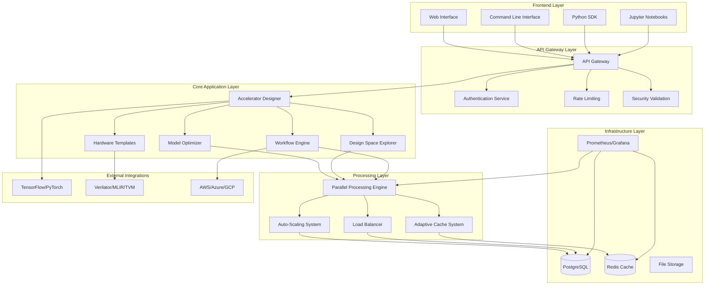
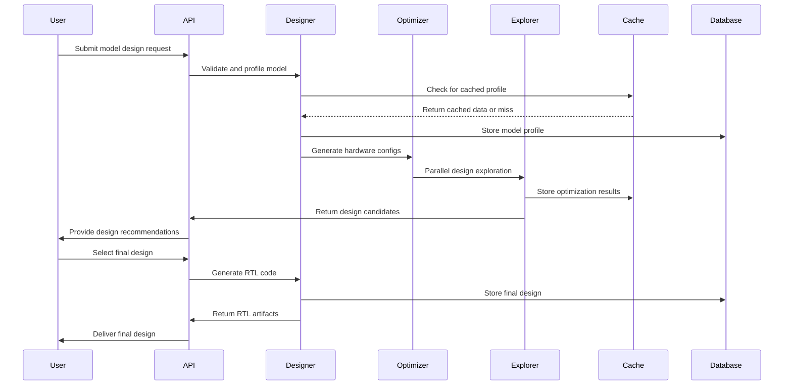
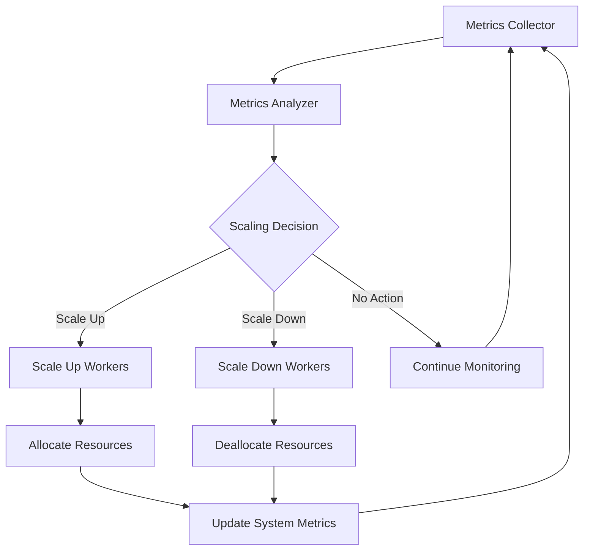
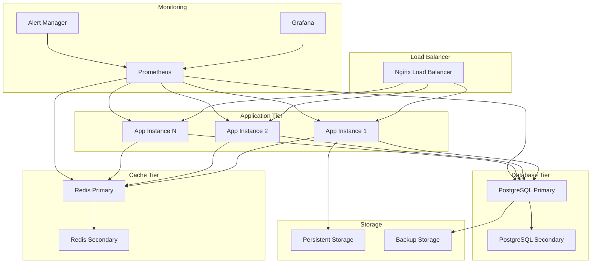
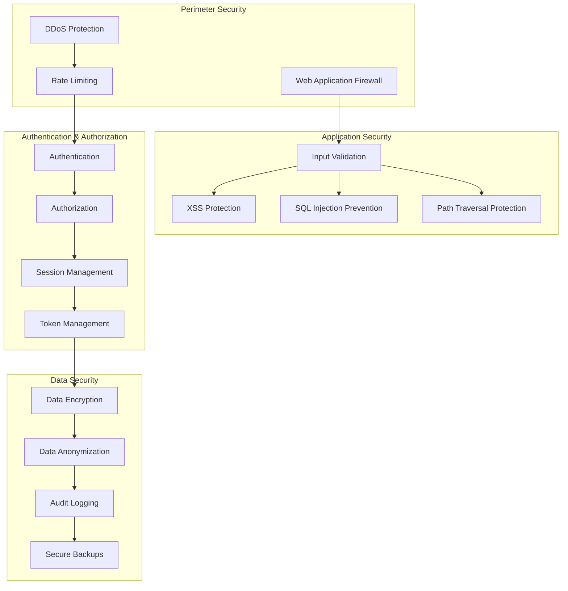
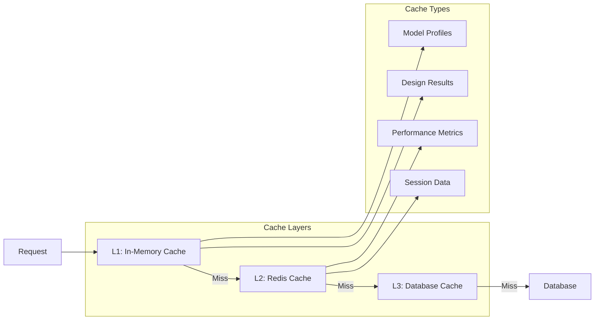

# AI Hardware Co-Design Playground - System Architecture

## Executive Summary

The AI Hardware Co-Design Playground is a comprehensive platform that enables co-optimization of neural networks and hardware accelerators. The system implements a three-generation progressive enhancement architecture (Work, Robust, Scale) with enterprise-grade features including auto-scaling, security, compliance, and global deployment capabilities.

## High-Level Architecture



## Core Components

### 1. Accelerator Designer (`accelerator.py`)

The central component responsible for neural network profiling and hardware accelerator design.

**Key Features:**
- Model profiling with computational analysis
- Hardware architecture generation
- RTL code generation
- Performance optimization
- Adaptive learning capabilities

**Architecture:**
```python
class AcceleratorDesigner:
    - ModelProfile: Analyzes neural network characteristics
    - AcceleratorConfig: Defines hardware architecture
    - RTLGenerator: Produces Verilog/VHDL code
    - PerformanceEstimator: Predicts performance metrics
```

### 2. Model Optimizer (`optimizer.py`)

Handles co-optimization of models and hardware for target performance/power metrics.

**Key Features:**
- Hardware-aware model optimization
- Quantization co-design
- Operator fusion
- Pareto frontier exploration

### 3. Design Space Explorer (`explorer.py`)

Enables parallel exploration of design configurations.

**Key Features:**
- Multi-objective optimization
- Parallel batch processing
- Pareto frontier visualization
- Design recommendation engine

### 4. Auto-Scaling System (`auto_scaling.py`)

Intelligent resource scaling based on system metrics and predictive analytics.

**Scaling Modes:**
- **Conservative**: 20% threshold, slow scaling
- **Balanced**: 50% threshold, moderate scaling
- **Aggressive**: 80% threshold, rapid scaling
- **Predictive**: ML-based predictive scaling

**Metrics Monitored:**
- CPU utilization
- Memory usage
- Queue depth
- Response time
- Throughput

### 5. Security Validation (`validation.py`)

Comprehensive input sanitization and threat protection.

**Security Features:**
- XSS prevention
- SQL injection protection
- Path traversal detection
- Code execution prevention
- Data URL blocking
- Rate limiting integration

## Data Flow Architecture

### Design Flow Process



### Auto-Scaling Flow



## Three-Generation Architecture Evolution

### Generation 1: Make It Work (Simple)

**Focus**: Core functionality and basic features

**Components:**
- Basic AcceleratorDesigner
- Simple ModelOptimizer
- Basic CLI interface
- FastAPI server
- Essential error handling
- Basic caching

**Architecture Pattern**: Monolithic with basic separation of concerns

### Generation 2: Make It Robust (Reliable)

**Focus**: Reliability, security, and error handling

**Enhancements:**
- Comprehensive security validation
- Advanced exception handling system
- Circuit breaker pattern
- Rate limiting
- Health monitoring
- Structured logging
- Input validation

**Architecture Pattern**: Layered architecture with security middleware

### Generation 3: Make It Scale (Optimized)

**Focus**: Performance optimization and scalability

**Enhancements:**
- Auto-scaling system
- Enhanced parallel processing
- Adaptive caching
- Load balancing
- Resource pooling
- Performance profiling
- Memory management
- Connection pooling

**Architecture Pattern**: Microservices-ready with distributed computing capabilities

## Deployment Architecture

### Production Deployment Stack



### Container Architecture

```dockerfile
# Multi-stage production Dockerfile architecture
FROM python:3.11-slim as base
# Security hardening and dependency installation

FROM base as development
# Development tools and debugging capabilities

FROM base as production
# Optimized production build with minimal attack surface
USER appuser
EXPOSE 8000
HEALTHCHECK --interval=30s --timeout=10s --start-period=5s --retries=3
```

### Kubernetes Architecture

```yaml
# Production Kubernetes deployment structure
apiVersion: apps/v1
kind: Deployment
metadata:
  name: codesign-playground
spec:
  replicas: 3
  strategy:
    type: RollingUpdate
    rollingUpdate:
      maxSurge: 1
      maxUnavailable: 0
```

## Security Architecture

### Multi-Layer Security Model



### Security Validation Flow

1. **Input Sanitization**: All inputs validated against security threats
2. **Authentication**: User identity verification
3. **Authorization**: Permission-based access control
4. **Session Management**: Secure session handling with expiration
5. **Audit Logging**: Comprehensive security event logging

## Performance Architecture

### Caching Strategy



### Auto-Scaling Metrics

**CPU-based Scaling:**
- Scale up: >70% CPU utilization for 5 minutes
- Scale down: <30% CPU utilization for 10 minutes

**Memory-based Scaling:**
- Scale up: >80% memory utilization
- Scale down: <40% memory utilization

**Queue-based Scaling:**
- Scale up: >10 pending requests
- Scale down: <2 pending requests

**Predictive Scaling:**
- ML model analyzes historical patterns
- Confidence-based scaling decisions
- Proactive resource allocation

## Monitoring and Observability

### Metrics Collection

**Application Metrics:**
- Request latency and throughput
- Error rates and success rates
- Design generation performance
- Cache hit/miss ratios

**System Metrics:**
- CPU, memory, disk utilization
- Network I/O and bandwidth
- Database performance
- Container resource usage

**Business Metrics:**
- Active users and sessions
- Design completion rates
- Popular design patterns
- Resource utilization efficiency

### Health Monitoring

```python
class HealthMonitor:
    def check_database_health() -> bool
    def check_cache_health() -> bool
    def check_external_services() -> bool
    def get_system_health() -> HealthStatus
```

**Health Check Endpoints:**
- `/health`: Basic liveness check
- `/health/ready`: Readiness for traffic
- `/health/detail`: Comprehensive health status

## Technology Stack

### Core Technologies

**Backend:**
- Python 3.11+
- FastAPI for REST API
- PostgreSQL for persistent storage
- Redis for caching and sessions

**Processing:**
- NumPy for numerical computations
- TensorFlow/PyTorch for model analysis
- Concurrent.futures for parallel processing

**Infrastructure:**
- Docker for containerization
- Kubernetes for orchestration
- Nginx for load balancing
- Prometheus/Grafana for monitoring

**Hardware Tools:**
- Verilator for RTL simulation
- MLIR for compiler infrastructure
- TVM for tensor compilation

### External Integrations

**Cloud Providers:**
- AWS (EC2, EKS, RDS, ElastiCache)
- Azure (AKS, Database, Cache)
- GCP (GKE, Cloud SQL, Memorystore)

**CI/CD Pipeline:**
- GitHub Actions for automation
- Docker Hub for container registry
- Automated testing and deployment

## Scalability Considerations

### Horizontal Scaling

**Stateless Design:**
- All application instances are stateless
- Session data stored in Redis
- Database handles concurrent connections

**Load Distribution:**
- Round-robin load balancing
- Health-based routing
- Geographic load balancing

### Vertical Scaling

**Resource Optimization:**
- Dynamic worker scaling (2-32 workers)
- Memory pool management
- CPU-intensive task optimization

**Performance Tuning:**
- Connection pooling
- Query optimization
- Cache warming strategies

## Compliance and Governance

### Data Privacy

**GDPR Compliance:**
- Data minimization principles
- Right to be forgotten implementation
- Consent management system
- Data processing transparency

**CCPA Compliance:**
- Consumer rights implementation
- Data disclosure procedures
- Opt-out mechanisms

### Security Governance

**Security Policies:**
- Regular security assessments
- Vulnerability management
- Incident response procedures
- Security training requirements

**Audit Requirements:**
- Comprehensive audit logging
- Regular compliance audits
- Security monitoring alerts
- Risk assessment procedures

## Future Architecture Considerations

### Emerging Technologies

**AI/ML Integration:**
- Enhanced predictive scaling
- Intelligent design optimization
- Automated performance tuning
- Anomaly detection systems

**Edge Computing:**
- Edge deployment capabilities
- Distributed processing
- Latency optimization
- Regional data processing

### Scalability Enhancements

**Microservices Evolution:**
- Service mesh integration
- Event-driven architecture
- Distributed tracing
- Circuit breaker patterns

**Global Distribution:**
- Multi-region deployments
- Data sovereignty compliance
- Global load balancing
- Regional failover strategies

## Conclusion

The AI Hardware Co-Design Playground architecture represents a comprehensive, production-ready platform that successfully implements the three-generation progressive enhancement model. The system provides enterprise-grade capabilities including auto-scaling, security, compliance, and global deployment readiness while maintaining the flexibility to evolve with emerging technologies and requirements.

The architecture's modular design, comprehensive monitoring, and robust security framework ensure the platform can scale to meet global demands while maintaining high performance, reliability, and security standards.